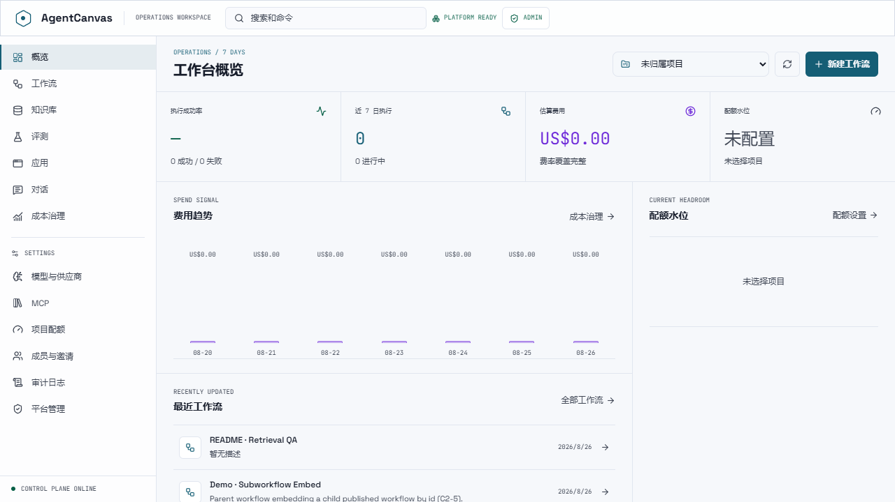
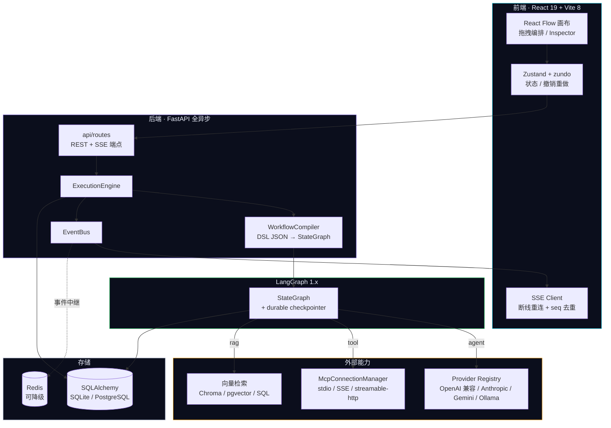
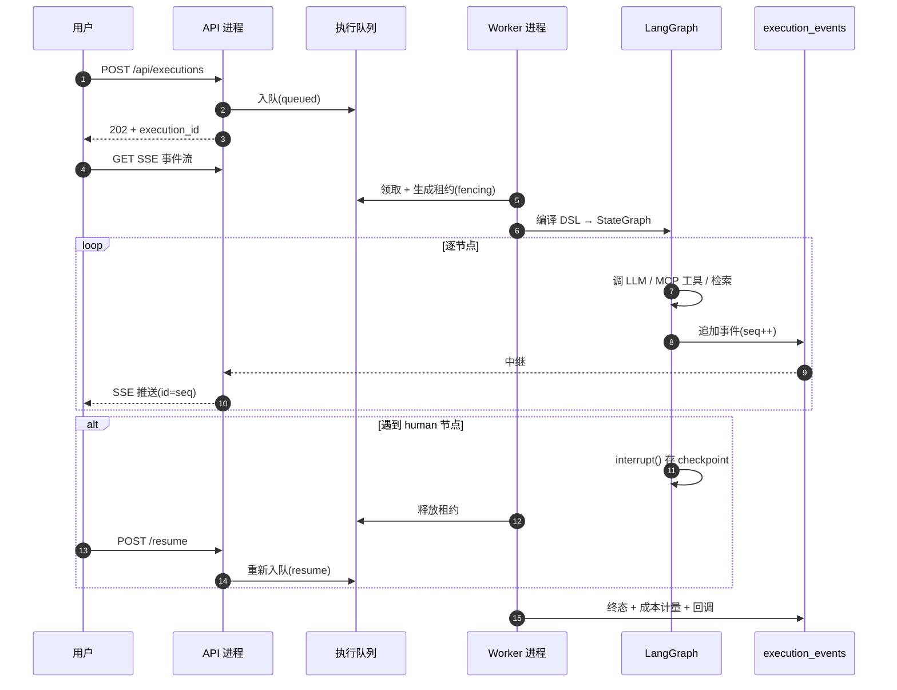
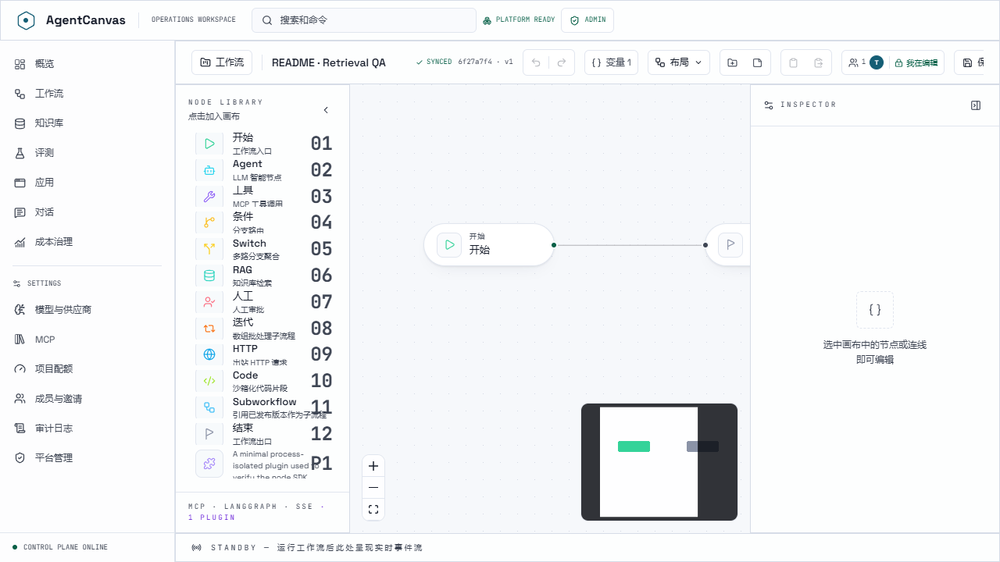
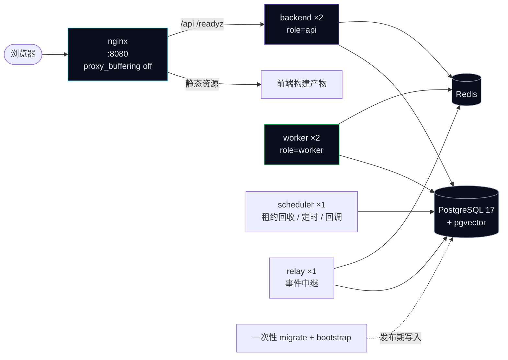

<div align="center">

# AgentCanvas

**基于 MCP 协议的可视化多 Agent 编排与执行平台**

在画布上拖拽编排多 Agent 工作流 → 后端 LangGraph 动态执行 → Agent 通过 MCP 协议调用工具 → 执行过程 SSE 实时回传

[](CHANGELOG.md)
[](backend/pyproject.toml)
[](frontend/package.json)
[](docs/plan.md)
[](docs/plan.md)
[](contracts/)

[快速开始](#快速开始) · [架构](#系统架构) · [节点类型](#节点类型) · [部署](#部署) · [文档](#文档)

</div>

---

## 这是什么

把一张可视化工作流编译成 LangGraph 状态图来跑。Agent 节点通过 MCP 协议调外部工具,执行过程以 SSE 事件流实时回传前端 —— 节点高亮、token 流式输出、工具调用、检索来源,逐步可见。

不止是能跑的演示。身份与多租户、项目配额、成本计量、审计日志、分布式执行、灾备演练都已落地并有门禁守着。

设计取向是**克制的工业语言**:操作密度优先,数据本身是主角,不做营销式的视觉堆叠。



*工作台概览:执行成功率、近 7 日执行量、估算费用与配额水位,右侧是费用趋势与最近工作流。*

## 系统架构



三个关键设计决策,理由比选择本身更重要:

**用 SSE 而不是 WebSocket。** 执行事件是纯单向流,SSE 原生带 `Last-Event-ID` 重放语义;上行操作(审批、取消)走普通 POST 就够。放弃双向低延迟换来的是断线重连不用自己造协议。

**精确一次投递靠 `execution_events` 表的自增 `seq` 兼作 SSE `id`。** 重连时先订阅实时队列,再从数据库补历史,按 `(execution_id, seq)` 去重 —— 顺序反过来会在两条流交叠处丢事件。

**checkpointer 不建在可降级组件上。** 会话记忆可以 Redis 挂了降级到 SQLite,但 checkpoint 关乎正确性:human 审批的暂停点必须可靠恢复。生产模式下 checkpointer 初始化失败会拒绝启动,而不是静默退回内存 saver 然后丢掉待审批执行。

## 执行模型



最容易被忽略的是**故障语义**。Worker 靠心跳续租,崩溃后由 scheduler 回收过期租约 —— 但**只重放可证明无副作用的工作**。已经调过 MCP 工具、发过 HTTP、或经过人工审批的执行会进 dead-letter 而不是盲目重试:分不清副作用是否已发生时,宁可停下来让人看,也不冒重复扣费或重复下单的风险。

## 节点类型



*画布:左侧 Node Library 点击即加入,顶栏是模板/版本/触发器/历史/MCP/运行,标题旁显示 SYNCED 状态、版本号与协作在线状态。*

节点类型的单一事实源在后端注册器,`GET /api/node-types` 返回每种类型的 JSON Schema,前端 `SchemaForm` 直接渲染 —— 前后端不会漂移。内置 12 种:

| 类型 | 分类 | 作用 |
|---|---|---|
| `start` | 流程 | 图入口,声明输入变量 schema |
| `end` | 流程 | 图出口,按模板组装输出 |
| `agent` | AI | LLM 推理,可绑定 MCP 工具、注入检索上下文、流式输出 token |
| `tool` | AI | 直接调用某个 MCP 工具,不经 LLM 决策 |
| `rag` | 知识 | 向量检索,发 retrieval 事件供前端渲染来源 |
| `condition` | 控制流 | 布尔分支 |
| `switch` | 控制流 | 多路分支,带显式 merge 策略 |
| `iteration` | 控制流 | 数组元素过有界子图 |
| `human` | 控制流 | `interrupt()` 暂停等人工审批,`/resume` 续跑 |
| `code` | 工具 | 沙箱内 Python 变换 |
| `http` | 工具 | 出站 HTTP 请求 + JSON 提取 |
| `subworkflow` | 组合 | 按 id 嵌入另一个已发布工作流 |

除内置类型外还可用插件扩展:版本化 manifest + schema,跑在隔离的 JSONL 子进程里,动态出现在 Node Library。仓库内含 `plugin.echo` 作为参考实现。

内置三个 stdio MCP 演示服务:`calculator`、`filesystem`、`websearch`。

## 快速开始

### 前置

- Python 3.12+(开发与 CI 实跑 3.13)
- Node 20+ / pnpm
- uv(`pip install uv`,本机用 `python -m uv` 调用)

### 环境变量

复制 `.env.example` 为 `.env`,填入 `OPENAI_API_KEY` / `OPENAI_BASE_URL` 与 `SECRET_KEY`。

生成 Fernet 密钥:

```bash
python -c "from cryptography.fernet import Fernet; print(Fernet.generate_key().decode())"
```

### 后端

```bash
cd backend && python -m uv sync && python -m uv run uvicorn app.main:app --reload --port 8000
```

就绪探针 <http://127.0.0.1:8000/readyz> 会逐项报告 database / migrations / checkpointer / config / vector_store / sandbox,任一不可用返回 503。

### 前端

```bash
cd frontend && pnpm install && pnpm dev
```

打开 <http://127.0.0.1:5173>(`/api` 与 `/healthz` 已代理到后端)。

### 灌入演示数据(可选)

```bash
cd backend && python -m uv run python -m app.services
```

会写入演示工作流;已存在的行不动。

### 密钥引用

模型 API Key 与 MCP 的 env/header 支持直接值或受限引用:`env://UPPER_CASE_NAME`、`docker://relative-file`、`external://path`。引用经 Fernet 加密保存,列表与编辑界面只返回掩码/来源,**运行时才解析** —— 所以轮换环境变量、Docker secret 或外部服务里的值都不用改库。

`docker://` 只读 `DOCKER_SECRET_DIR` 下的有界 UTF-8 文件;`external://` 需要宿主通过 `create_app(..., external_secret_resolver=...)` 显式注入适配器,默认未配置时 fail closed,不会隐式访问网络、也不把进程环境当 fallback。

## 部署



```bash
docker compose -f compose.dev.yml up --build --wait
```

生产栈先填强密钥,再构建启动:

```bash
cp .env.production.example .env.production
```

```bash
docker compose -f compose.prod.yml --env-file .env.production up -d --wait --scale backend=2 --scale worker=2
```

- 前端 <http://localhost:8080>,就绪探针 <http://localhost:8080/readyz>;生产编排不直接暴露后端与 Redis 端口
- 迁移与 seed 由**独立的一次性 service** 负责,API/worker 启动不执行发布写入 —— 多副本同时跑迁移是事故温床
- 非 root、只读运行时、资源限制、日志轮转;备份恢复与应急操作见 [operations-runbook.md](docs/operations-runbook.md)

`APP_PROCESS_ROLE` 决定进程职责:

| 角色 | 职责 |
|---|---|
| `api` | 只处理 HTTP + SSE |
| `worker` | 从队列领执行、跑图 |
| `scheduler` | 回收过期租约、定时触发、回调投递 |
| `relay` | 已提交事件中继到 Redis Stream |
| `all` | 单进程全职责(开发/单机默认) |

非 `all` 角色强制 PostgreSQL + Redis,且禁止启动迁移。

## 可插拔后端

同一份代码靠环境变量在「单机 SQLite」和「多副本 PostgreSQL」之间切换,实际生效的后端由 `/api/meta` 与 `/readyz` 暴露:

| 组件 | 选项 | 开关 |
|---|---|---|
| 数据库 | `sqlite+aiosqlite` / `postgresql+asyncpg` | `DATABASE_URL` |
| 向量存储 | `chroma`(嵌入式)/ `sql`(关系表)/ `pgvector` | `VECTOR_BACKEND` |
| 会话记忆 | Redis 首选,ping 失败降级 SQLite | `REDIS_URL` |
| checkpointer | `AsyncSqliteSaver` / `AsyncPostgresSaver` | 随 `DATABASE_URL` |
| 密钥来源 | 直接值 / `env://` / `docker://` / `external://` | `DOCKER_SECRET_DIR` 等 |

数据库驱动只接受上述两种,其他直接拒绝启动。PostgreSQL 用显式有界连接池和带超时的 Alembic advisory lock,启动日志隐藏密码。

`VECTOR_BACKEND=sql` 用关系表做全表余弦排序替代 Chroma。没有 HNSW 近似索引,但省掉整棵 chromadb 依赖树 —— **实测省约 160MB、冷启动从约 40s 降到 8s**,桌面端打包将固定用它。

跨后端迁移有可重复、带预检、fail closed 的脚本:

```bash
python -m uv run python -m app.services.migrate_checkpoints --source data/checkpoints.db
```

```bash
python -m uv run python -m app.services.migrate_vectors --source data/chroma
```

## 质量门禁

```bash
cd backend && python -m uv run pytest -q && python -m uv run mypy app && python -m uv run ruff check .
```

```bash
cd frontend && pnpm typecheck && pnpm build && pnpm test:e2e && pnpm audit --audit-level moderate
```

公共契约(OpenAPI / Workflow DSL / 执行事件)由后端模型生成并提交在 `contracts/`。改动公共 API 后:

```bash
cd backend && python -m scripts.contracts generate && python -m scripts.contracts check
```

`check` 不只防生成物漂移,还会拒绝相对当前 major 基线的 path/operation/字段/枚举删除、输入必填化和 schema 收窄。破坏性变更必须显式提升 contract major 并建新基线,**现有基线不可覆盖**。

CI 五个 job:`quality`(测试/类型/lint/覆盖率门)、`postgresql-integration`(真实 PG 17 + pgvector)、`redis-integration`(真实 Redis Streams)、`container-release`(构建生产镜像 + Trivy HIGH/CRITICAL 扫描 + 全编排 smoke)、`publish-release`(版本三方核对,拒绝覆盖已有 tag)。

## 项目状态

当前产品版本 **1.0.0**。逐阶段的实现细节、门禁数据与验收证据在 [docs/progress.md](docs/progress.md);发布变化见 [CHANGELOG.md](CHANGELOG.md)。

| 阶段 | 内容 | 状态 |
|---|---|---|
| P0–P3.1 | 骨架 → 最小闭环 → 编排加深 → MCP → 稳定化 | 已完成 |
| P4–P6 | RAG · 记忆/审批/多 Provider/Chat · 性能与部署 | 已完成 |
| D1–D2 | 工作流生命周期与复用 · 调试评测与成本治理 | 已完成 |
| D3–D4 | 身份多用户与协作 · Provider/MCP 生态与平台治理 | 已完成 |
| I1 | 分布式执行与存储(PostgreSQL / 队列 / 事件中继) | 已完成 |
| C1–C2 | 触发与集成 · 节点生态 | 已完成 |
| C3–C8 | 商用化:运营、性能与规模、安全加固 | 已完成 |
| C9 | 桌面端原生化(Tauri + 内置终端 + UI 重构) | 计划待批准 |

下一阶段 C9 让项目摆脱浏览器:Tauri 外壳 + 嵌入 Python 运行时 + xterm.js 真 PTY 终端,方案见 [c9-desktop-tauri-plan.md](docs/c9-desktop-tauri-plan.md)。

## 文档

| 文档 | 内容 |
|---|---|
| [DESIGN.md](DESIGN.md) | 视觉与交互的单一事实源(awesome-design-md / Stitch 格式) |
| [plan.md](docs/plan.md) | 总体设计与阶段规划(架构单一事实源) |
| [progress.md](docs/progress.md) | 逐阶段实现细节与门禁证据 |
| [c9-desktop-tauri-plan.md](docs/c9-desktop-tauri-plan.md) | C9 桌面化实施计划 |
| [operations-runbook.md](docs/operations-runbook.md) | 备份恢复、升级回滚、应急操作 |
| [observability.md](docs/observability.md) | 指标词典与 Prometheus/Grafana 配置 |
| [adr/](docs/adr/) | 架构决策记录 |
| [v1.0-upgrade-guide.md](docs/v1.0-upgrade-guide.md) | 升级步骤 |
| [v1.0-sqlite-to-postgresql.md](docs/v1.0-sqlite-to-postgresql.md) | 单机数据迁移到 PostgreSQL |
| [version-support-policy.md](docs/version-support-policy.md) | 版本兼容与支持窗口 |
| [contracts/](contracts/) | OpenAPI · Workflow DSL · 执行事件 schema |

设计系统的单一事实源是仓库根目录的 [DESIGN.md](DESIGN.md)(awesome-design-md / Stitch 格式,可直接交给编码智能体);[design-system/preview.html](design-system/preview.html) 是它的可视化对照页(色板 / 字阶 / 控件 / 导航 / 面板 / 投影阶梯,含深色与浅色切换),[design-system/MASTER.md](design-system/MASTER.md) 是生成摘要。改 UI 前先读 DESIGN.md。

## SDK

### Python SDK

```bash
pip install agentcanvas
```

```python
from agentcanvas import AgentCanvasClient, CreateWorkflowInput

with AgentCanvasClient(api_key="your-key", base_url="http://localhost:8000") as client:
    workflow = client.create_workflow(
        CreateWorkflowInput(name="Example", nodes=[...], edges=[...])
    )
    execution = client.start_execution(workflow.id, inputs={"query": "hello"})
    print(f"Status: {execution.status}")
```

完整文档:[sdk/python/README.md](sdk/python/README.md)

### TypeScript/JavaScript SDK

```bash
npm install agentcanvas
```

```typescript
import { AgentCanvasClient } from 'agentcanvas';

const client = new AgentCanvasClient({
  apiKey: 'your-key',
  baseURL: 'http://localhost:8000'
});

const workflow = await client.workflows.create({
  name: 'Example',
  nodes: [...],
  edges: [...]
});

const execution = await client.executions.start({
  workflowId: workflow.id,
  inputs: { query: 'hello' }
});
```

完整文档:[sdk/typescript/README.md](sdk/typescript/README.md)

### CLI 工具

```bash
pip install agentcanvas-cli
agentcanvas init my-project
cd my-project && agentcanvas dev
```

支持项目初始化、本地开发服务器、数据库迁移、备份恢复。文档:[cli/README.md](cli/README.md)

## 技术栈

**前端** React 19 · TypeScript · Vite 8 · @xyflow/react 12 · Zustand + zundo · Tailwind CSS 4 · React Router 7 · Playwright

**后端** Python 3.12+ · FastAPI · LangGraph 1.x · 官方 MCP SDK 2.x · SQLAlchemy 2 + Alembic · Chroma / pgvector · Redis · OpenTelemetry · pytest

**SDK** Python 3.9+ · TypeScript/JavaScript · CLI 工具

**LLM Provider** OpenAI 兼容协议(含 DeepSeek / vLLM 等) · Anthropic Messages API · Google Gemini · Ollama

**部署** Docker Compose · nginx · PostgreSQL 17 · GitHub Actions · Trivy

## 许可与说明

本项目作为公开技术演示与作品集项目发布。仓库仅包含代码与公开技术文档,不含内部开发规划、商业路线图或部署凭据。

