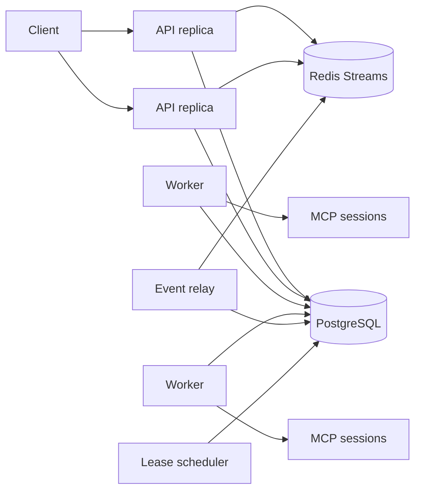

# ADR 0001: I1 Distributed Runtime and Storage Ownership

- Status: Accepted
- Date: 2026-08-09
- Scope: I1 distributed execution and storage evolution

## Context

AgentCanvas currently runs the API, execution engine, scheduler-like recovery,
SSE fan-out, collaboration hub, and MCP connections in one process. SQLite,
the embedded LangGraph checkpointer, and embedded Chroma make that ownership
explicit. Starting multiple API processes would split transient state and can
duplicate execution or expose inconsistent collaboration and event streams.

I1 must support horizontal API and worker processes without claiming
exactly-once execution. The system must instead provide durable at-least-once
delivery, fenced ownership, idempotent state transitions, and explicit rules
for side-effecting nodes.

## Decision

PostgreSQL is the durable system of record. Redis is the low-latency shared
coordination and event-tail service, but it is not the only copy of execution
state. API processes are stateless control-plane replicas. Execution runs in
separate worker processes that acquire fenced leases from a PostgreSQL queue.

### Component Ownership

| Component | Owns | Must not own |
|---|---|---|
| API/control plane | Authentication, RBAC, validation, command acceptance, query and SSE endpoints; bounded MCP connectivity probes | In-process execution tasks, durable locks, long-lived MCP sessions |
| Worker | One leased execution attempt, its LangGraph checkpoint session, and its MCP connections | API sessions, migration execution, another worker's lease |
| Scheduler | Expired-lease recovery, retry eligibility, timeout transitions, dead-letter transitions | Workflow execution or Provider calls |
| Event relay | Publish committed outbox/event rows to Redis Streams and advance a durable cursor | Invent or reorder execution sequence numbers |
| PostgreSQL | Workflows, executions, queue rows, attempts, leases, checkpoints, approvals, events, outbox, audit, tenancy | Low-latency ephemeral presence fan-out |
| Redis | Live event tails, collaboration presence/locks, shared rate/resilience coordination | Sole durable copy of execution or approval state |

### Command and Queue Transaction

An API command creates or transitions the execution and enqueues work in one
PostgreSQL transaction. Existing HTTP idempotency keys remain unique within
their documented scope. Redelivery is expected; a queue row and attempt have
stable IDs so repeated delivery cannot create a second logical execution.

Workers claim eligible rows with `FOR UPDATE SKIP LOCKED`. A successful claim
increments `lease_generation`, records `owner_id`, `attempt`, and
`lease_expires_at`, and returns the generation as a fencing token. Every
worker-owned state change must include both `owner_id` and `lease_generation`
in its conditional update. A stale worker may finish local computation but
cannot commit state, events, checkpoints, or quota changes after its lease was
reassigned.

Heartbeat extends only the currently fenced lease. The scheduler may requeue
an expired retryable attempt, cancel it, or move it to dead letter according to
the persisted retry policy. Waiting-for-approval executions release their
worker lease; approval state and resume commands remain durable across a full
restart.

### Events and SSE

Execution event sequence allocation and event/outbox insertion occur in the
same PostgreSQL transaction as the state change. The event relay publishes the
committed envelope to an execution-specific Redis Stream and records delivery
progress. Duplicate relay delivery is allowed because `(execution_id, seq)` is
the consumer identity.

An API replica serves SSE in this order:

1. Replay committed PostgreSQL events after `Last-Event-ID`.
2. Subscribe/read the Redis Stream from the last observed sequence.
3. Recheck PostgreSQL before entering the live wait, closing the subscribe gap.
4. De-duplicate by sequence and continue the Redis tail.

If Redis is unavailable, APIs use bounded PostgreSQL polling and workers keep
committing events. Redis recovery resumes the relay without losing events.

### Cancellation, Retry, and Side Effects

Cancellation is a durable requested state. The worker observes it at node and
stream boundaries, stops producing new work, and conditionally commits a
terminal state with its fencing token. The scheduler finalizes cancellation
when an owner disappears.

Automatic retry is allowed only before a node side effect or for nodes whose
idempotency contract includes a stable operation key. MCP and plugin calls are
not assumed idempotent. Their retry policy must be declared; otherwise an
ambiguous worker loss is dead-lettered for operator review rather than silently
replayed.

### Storage and Migration Boundaries

- Only `sqlite+aiosqlite` and `postgresql+asyncpg` URLs are supported.
- SQLite remains the local single-instance development backend.
- Horizontal/production mode requires PostgreSQL and Redis.
- Each process has a bounded PostgreSQL pool. Total deployment connections are
  the sum of API, worker, scheduler, and relay pools and must stay below the
  server budget.
- Alembic release migration uses a well-known PostgreSQL advisory lock. Web and
  worker processes never run migrations in the horizontal topology.
- The PostgreSQL checkpointer migration is a separate phase with a compatibility
  decision for in-flight SQLite checkpoints.
- PostgreSQL backup/restore requires `pg_dump`/`pg_restore` plus a restore drill;
  the current SQLite archive command must keep failing closed for PostgreSQL.
- Embedded Chroma is not horizontally safe. I1 will evaluate pgvector, Qdrant,
  or external Chroma behind the existing RAG adapter before enabling multiple
  RAG replicas.

### Collaboration and MCP

Collaboration presence and soft locks move to Redis with atomic scripts and
opaque lease tokens. Persistent optimistic workflow versions remain the final
conflict guard. Redis unavailability makes collaboration read-only rather than
falling back to split process-local locks.

MCP connections belong to the worker holding the execution lease. Control-plane
`tools`/`health` endpoints may open a short-lived discovery probe, but must
disconnect it before returning and may not retain it in the process-wide manager.
Resume and
retry may reconnect from persisted server configuration; live session objects
are never transferred between workers.

## Rollout

1. Validate database schemes, add bounded PostgreSQL pools, advisory migration
   locking, and a real PostgreSQL CI lane.
2. Add the PostgreSQL checkpointer and migrate waiting approvals.
3. Add queue, attempt, lease, scheduler, and worker process entrypoints.
4. Add transactional event relay plus replay/tail SSE.
5. Move collaboration and shared runtime controls to Redis.
6. Replace embedded vector ownership and run 2 API + 2 worker fault injection.

Each step preserves the existing single-instance mode until its replacement
passes focused, full-suite, migration, failure, and recovery gates.

## Consequences

- The architecture supports horizontal ownership without pretending that
  arbitrary external side effects are exactly once.
- PostgreSQL becomes a required production dependency and connection budgeting
  becomes an operational concern.
- Redis loss degrades live latency and collaboration, but does not erase
  execution history or approvals.
- Queue, relay, and lease state add operational complexity, metrics, and repair
  procedures that must be included in the I1 release gate.

## Rejected Alternatives

- Multiple Uvicorn workers over SQLite: shared transient ownership and SQLite
  write contention remain unresolved.
- Redis as the only queue/event store: approval and execution recovery would
  depend on Redis persistence and backup semantics alone.
- Holding worker ownership only in memory: stale workers cannot be fenced after
  process pauses or network partitions.
- Claiming exactly-once execution: Provider, MCP, plugin, and filesystem side
  effects cannot be atomically committed with the application database.
