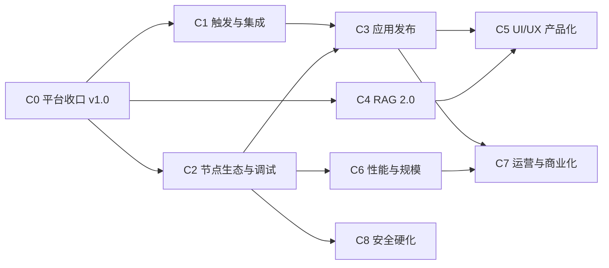

# AgentCanvas 商用级升级改造计划与路线图

> 制定日期:2026-08-11
> 基线:`main@310b67a` + I1 Phase 8 工作区(后端 494 passed / 5 skipped,前端 Playwright 29/29)
> 前序文档:[`upgrade-and-development-roadmap-2026-08-02.md`](./upgrade-and-development-roadmap-2026-08-02.md)(U0-U5/D1-D4/I1 已基本闭环)
> 目标:把项目从"工程成熟的编排引擎"升级为"产品成熟、具备竞争力的商用级 Agent 平台"
> 估算口径:1 名熟悉项目的全栈开发者,单位为有效人日

---

## 1. 执行结论

经过 U/D/I 三条线的建设,AgentCanvas 的**平台底座已达到商用级**:多租户身份体系、RBAC、配额治理、审计、版本化契约、分布式执行、灾备演练、可观测性和 85% 级别的测试覆盖,这些是多数开源竞品(LangFlow、Flowise)都不具备的。

但对照成熟商用产品(Dify、Coze、n8n),当前**产品层存在明确断层**:

1. **工作流只能手动触发**——没有 webhook、定时、API 发布,无法接入真实业务流。
2. **节点生态薄**——8 种节点(start/end/agent/tool/condition/human/rag/supervisor + plugin),缺 loop/iteration、code、HTTP、switch、子工作流等竞品标配。
3. **没有"应用"概念**——工作流无法一键发布为可分享的 Chatbot/WebApp/API,产出物停留在平台内部。
4. **RAG 停在 v1**——纯向量检索,无混合检索、rerank、在线数据源、分块调优界面。
5. **UI 是工程师界面**——功能齐但缺少 undo/redo、自动布局、节点分组、暗色/亮色主题、i18n、新手引导等产品级体验。
6. **调试是"事后看日志"**——缺单节点试运行、断点、变量窗格等"开发时"调试能力。

因此本路线图的主轴是:**C0 收尾 → C1 触发与集成 → C2 节点生态与调试 → C3 应用发布 → C4 RAG 2.0 → C5 UI/UX 产品化 → C6 性能与规模 → C7 运营与商业化 → C8 安全硬化**。C1-C3 决定产品竞争力,优先级最高。

---

## 2. 现状成熟度评估

### 2.1 成熟度矩阵

| 维度 | 现状 | 成熟度 | 商用差距 |
|---|---|---|---|
| 编排引擎 | DSL→LangGraph 编译、并行/条件/supervisor/human、fenced 队列 | ★★★★★ | 基本无 |
| 分布式与可靠性 | PG + Redis Streams、2 API + 2 worker、故障接管、灾备演练 | ★★★★☆ | CI 真实 Redis/容器故障编排收尾 |
| 身份与多租户 | 本地账号 + OIDC PKCE、组织/项目 RBAC、服务账号、审计 | ★★★★☆ | SCIM、用户邀请流、细粒度资源权限 |
| 治理 | 五类项目配额、成本预算、价格版本、告警 | ★★★★☆ | 计量导出/账单对接 |
| MCP 生态 | 三传输、catalog、灰度 rollout、插件 SDK | ★★★★☆ | OS 级插件沙箱、市场化分发 |
| RAG | 上传/分块/embedding 缓存/pgvector/引用 | ★★★☆☆ | 混合检索、rerank、在线数据源、调优 UI |
| 触发与集成 | 仅手动运行 | ★☆☆☆☆ | webhook/cron/API 发布/表单全缺 |
| 节点生态 | 8 内置 + 插件协议 | ★★☆☆☆ | loop/code/HTTP/switch/子流全缺 |
| 应用分发 | 无 | ☆☆☆☆☆ | Chatbot/WebApp/embed/API key 全缺 |
| 调试体验 | 执行抽屉事后检查、失败节点重跑 | ★★★☆☆ | 单节点试运行、断点、变量窗格 |
| UI/UX 产品化 | 功能完整、深色单主题、中文单语言 | ★★★☆☆ | undo/redo、自动布局、主题、i18n、引导 |
| 可观测性 | Prometheus/OTel/结构化日志/性能预算 | ★★★★☆ | 面向租户的用量看板 |

### 2.2 与竞品的定位对比

| 能力 | AgentCanvas | Dify | n8n | LangFlow/Flowise |
|---|---|---|---|---|
| 多租户/RBAC/审计 | ✅ 强 | ✅ | 企业版 | ❌ |
| 分布式执行/灾备 | ✅ 强 | ✅ | ✅ | ❌ |
| MCP 原生 | ✅ 独特优势 | 部分 | 部分 | 部分 |
| 版本化/评测/A-B | ✅ 独特优势 | 部分 | ❌ | ❌ |
| 触发器生态 | ❌ | 部分 | ✅ 强 | ❌ |
| 应用发布(Chatbot/API) | ❌ | ✅ 强 | ✅ | 部分 |
| 节点/集成数量 | ~10 | ~30 | 400+ | ~100 |
| RAG 深度 | 中 | ✅ 强 | 弱 | 中 |

**结论**:差异化卖点是"MCP 原生 + 版本化/评测/治理的工程化深度",短板是"触发、发布、节点广度"。路线图按"先补齐短板到及格线,再放大差异化优势"排布。

---

## 3. 里程碑总览

| 里程碑 | 版本 | 内容 | 累计估算 |
|---|---|---|---|
| M6 平台收口 | `v1.0.0` | C0:I1 CI 收尾 + 发布工程闭环 | 4-7 人日 |
| M7 可集成版 | `v1.1.0` | C1 触发与集成 + C2 节点生态与调试 | +28-42 人日 |
| M8 可分发版 | `v1.2.0` | C3 应用发布与 Chat 产品化 + C4 RAG 2.0 | +26-40 人日 |
| M9 产品化版 | `v1.3.0` | C5 UI/UX 现代化改造 | +18-28 人日 |
| M10 规模化版 | `v1.4.0` | C6 性能与规模 + C8 安全硬化 | +16-26 人日 |
| M11 商用运营版 | `v1.5.0` | C7 计量、运营与管理台 | +14-22 人日 |



C1 与 C2 可并行;C4 独立可穿插;C5 依赖 C3 落地后的信息架构;C8 中插件沙箱应在 C2 code 节点上线前完成第一阶段。

---

## 4. 阶段计划

### C0:平台收口与 v1.0 发布(4-7 人日)

**目标**:关闭 I1 与 P6 全部遗留项,打出第一个可宣称的 `v1.0.0`。

任务:

- C0-1:CI 补齐真实 Redis ≥ 5 Streams 的 live relay 与重复投递验收(替代 Garnet 的不完整证据)。
- C0-2:CI 容器 runner 上完成生产 Compose 构建、Trivy 扫描、Docker 故障编排(kill worker 容器、kill Redis 容器、DB 切换)。
- C0-3:清理当前 100+ 文件的未提交工作区,按 I1 Phase 切片提交,同步 README/plan/progress。
- C0-4:发布 `v1.0.0`:changelog、镜像标签(版本 + SHA)、升级指南、从 `v0.x` SQLite 单机到 PG 集群的迁移手册。
- C0-5:建立版本支持策略(如 v1.x 提供 6 个月修复)与语义化版本承诺(基于已有 contract major 机制)。

**验收门**:CI 全绿含真实 Redis lane 与容器故障 lane;`git status` 干净;tag + changelog + 迁移手册齐备。

---

### C1:触发与集成(12-18 人日)——最高优先级

**价值**:让工作流从"画布里的演示"变成"接入真实业务的自动化"。这是与 n8n/Dify 竞争的入场券。

任务:

- C1-1 **Webhook 触发器**(3-4 人日):
  - 每个已发布工作流版本可生成 `POST /api/hooks/{workflow_id}/{token}` 端点;token 可轮换、可禁用。
  - 请求体经 JSON Schema 校验后映射为工作流输入;支持签名验证(HMAC)、IP 白名单、速率限制。
  - 复用现有执行队列入队,返回 `202 + execution_id`;可选同步模式(等待终态,带超时上限)。
- C1-2 **定时触发器**(2-3 人日):
  - `workflow_schedules` 表:cron 表达式、时区、启停、上次/下次运行时间、失败策略(跳过/重试/告警)。
  - 复用现有 scheduler 进程扫描到期计划并入队;`FOR UPDATE SKIP LOCKED` 防多实例重复触发;错过窗口的补偿策略显式配置。
- C1-3 **工作流即 API**(3-4 人日):
  - 已发布版本可"发布为 API":生成项目级 API key(哈希存储,复用服务账号体系),输入/输出 schema 自动来自 DSL 变量定义。
  - 提供 OpenAPI 片段导出与 curl/Python/JS 调用示例;调用计入现有配额与成本治理。
- C1-4 **事件回调**(2-3 人日):执行终态(succeeded/failed/dead_letter)可配置 outbound webhook 通知,带重试与签名;成本/配额告警复用同一通道。
- C1-5 **触发器 UI**(2-4 人日):工作流页新增"触发器"标签页,管理 webhook/schedule/API 的创建、启停、密钥轮换和最近触发记录;执行历史标注触发来源(manual/webhook/schedule/api)。

**验收门**:
- 外部 curl 经 webhook 触发含 MCP + RAG 的工作流并经回调收到结果;签名错误/超配额被正确拒绝。
- cron 计划在 2 API + 2 worker 拓扑下不重复触发;scheduler 重启后计划不丢失。
- API 调用出现在成本页与配额统计;key 轮换后旧 key 立即失效。

**实施状态（2026-08-14）**: C1-1 至 C1-5 已落地并通过本地专门测试、契约、生产构建与触发中心浏览器检查。Webhook 实现覆盖持久化、token 哈希、Fernet secret、HMAC/IP/输入校验、独立限流策略、队列幂等入队、轮换/禁用，以及重新发布时绑定最新 immutable published version。定时触发实现 `workflow_schedules`、五字段 cron + IANA 时区、skip/catch_up misfire、skip/retry/alert 失败策略和 scheduler 事务化入队；双 scheduler 竞争 1000 个到期计划时恰好产生 1000 个 execution，无重复槽位。工作流即 API 复用项目级服务账号与哈希 API token，支持发布/读取/轮换/禁用、项目边界、DSL 输入/输出 OpenAPI、curl/Python/JS 示例、幂等公开执行与现有 quota/cost 计量。事件回调以数据库 cursor + 唯一 source key 生成 durable outbox，覆盖执行终态、worker dead-letter、成本与配额告警；scheduler/all 进程执行 HMAC 签名、超时、逐条租约恢复、指数退避及投递 dead-letter，实际 TCP 固定到校验通过的公网地址并保留 Host/TLS SNI，独立激活边界阻止首次启用或重新启用后的历史补发。触发中心 UI 统一管理 Webhook、Schedule、API 与 Callback 的状态、创建/启停/轮换和最近活动，执行历史记录 `manual|webhook|schedule|api` 来源。C1 功能实现已完成，但总体验收门仍需外部 MCP+RAG curl/callback、2 API + 2 worker 容器和真实调度故障演练证据后才能宣称关闭。

---

### C2:节点生态与调试体验(16-24 人日)

**价值**:节点广度决定"能表达什么工作流";调试深度决定"敢不敢在生产用"。

#### 节点生态(10-15 人日)

- C2-1 **Loop/Iteration 节点**(3-4 人日):对数组输入逐项/分批执行子图,支持并发上限、单项失败策略(中止/跳过/收集错误)、结果聚合;复用现有并行 reducer 与双层循环保护。
- C2-2 **Code 节点**(3-4 人日):沙箱化 Python/JavaScript 片段,输入变量注入、超时、内存/输出大小上限;**必须先落地 C8-1 进程级沙箱**,默认禁网禁文件系统;复用插件子进程 JSONL 协议。
- C2-3 **HTTP Request 节点**(2-3 人日):方法/头/体/认证(复用 secret 引用体系)、重试/超时、响应 JSON 提取;出站策略复用 MCP 的 URL 白名单机制,默认禁内网地址(SSRF 防护)。
- C2-4 **Switch 多路分支 + 变量聚合节点**(1-2 人日):多条件多出口(现有 condition 仅二路);多分支汇聚时的变量合并策略显式化。
- C2-5 **子工作流节点**(2-3 人日):引用另一工作流的已发布版本作为节点,输入/输出映射;编译期检测循环引用;执行树在历史中可展开。

#### 调试体验(6-9 人日)

- C2-6 **单节点试运行**(2-3 人日):Inspector 中对选中节点提供 mock 输入直接执行,不入执行历史;agent/tool/rag 节点均支持。
- C2-7 **调试运行模式**(2-3 人日):画布内发起"调试运行":节点粒度暂停(断点,复用 human interrupt 机制)、单步继续、每步后查看/编辑状态变量再继续。
- C2-8 **变量与数据流窗格**(2-3 人日):选中节点显示其输入来源(上游变量引用解析结果)与输出 schema;运行后内联显示实际值(脱敏规则复用 D2);边上悬浮显示流经的数据摘要。

**验收门**:
- "循环处理 100 条数据 + code 转换 + HTTP 推送"的工作流端到端可用,单项失败按策略处理。
- code 节点无法读取宿主文件系统与环境变量、无法访问网络(测试证明)。
- 断点调试可修改中间变量后继续,最终结果反映修改;所有新节点进入 DSL 契约、模板与 Playwright 回归。

**实施状态（2026-08-14）**: C2-1 已实现并进入最终门禁。Iteration 支持数组逐项处理、`batch_size` 调度波次、并发上限、abort/skip/collect-error、顺序聚合、item/index 绑定和独立子图递归限制；子图只编译一次，abort 会取消尚未开始的任务。嵌套节点已进入模型能力、成本、重放安全与 scheduler 风险遍历，事件以 occurrence ID + 稳定 `node_path` 归属成本与 Inspector。画布配置、公开 node schema、100 项 HTTP 执行、双层循环保护、Playwright 自动保存及官方 Iteration 模板已覆盖。C2 总验收仍等待 C2-2 Code 与 C2-3 HTTP Request，不能由本切片提前宣称完成。

**实施状态（2026-08-15）**: C2-3 HTTP Request 节点已实现并通过本地门禁。HTTP 节点支持 GET/POST/PUT/PATCH/DELETE/HEAD 方法、模板渲染的 URL/headers/query/body、JSON 提取与 dotted-path 映射、状态码门控、可配置状态码重试（指数退避）与超时。认证经项目 secret 引用体系（bearer/basic/自定义 header），运行时由 `SecretResolver.providers` 解析 `env://`、`docker://`、`external://`、`plain:` 引用，DSL 不存明文密钥。SSRF 防护从 `WorkflowCallbackDispatcher` 抽取为共享 `app.core.outbound_http` 模块：默认 `allow_private_network=False` 时，请求先经 `resolve_public_destination` 强制公网 IP、钉死到已解析地址（防 DNS rebinding）、禁重定向/Unix socket/环境代理；`allow_private_network=True` 是 on-prem 目标的显式 opt-in，重定向与 socket 仍禁用。SSRF 逃逸集测试覆盖 loopback/私有段/链路本地（含云元数据 169.254.169.254）/IPv6 本地/DNS rebinding 混合地址/非 HTTP scheme 全部被拒。`CompileContext` 新增 `secret_resolver` 与 `http_transport`（测试注入）字段，runner 与 resume runner 传入 `secret_resolver`。节点已进入 `/api/node-types`、DSL 契约（NodeType enum + config_schema 经 Pydantic 自动下发）、前端节点库/注册/SchemaForm 中文标签与官方 `demo-http` 模板。本地门禁：HTTP 节点 25 测试、回调分发器 9 测试、编译/契约/模板/种子回归共 101 测试全绿；Ruff、mypy 10 文件、前端 typecheck/build（初始 gzip 88.31 KiB）与契约 check 通过。C2 总验收仍等待 C2-2 Code 节点（需先落地 C8-1 进程级沙箱）。

**实施状态（2026-08-15）**: C8-1 进程级沙箱升级已实现并通过本地门禁，作为 C2-2 Code 节点前置。新增 `app/core/sandbox.py`：`SandboxProfile`（deny-by-default）经 `profile_from_permissions` 从声明权限派生，`SandboxBackend` 策略接口有 `NsjailSandbox`/`BubblewrapSandbox`（Linux OS 级，按 permissions 强制禁网 namespace、只读 rootfs、writable 挂载仅对声明路径、rlimit_nproc/rlimit_as/rlimit_cpu/rlimit_nofile/rlimit_fsize）、`ProcessCleanupSandbox`（环境清理降级）、`NoSandbox`（仅测试）；`select_sandbox` 按 backend 名选择，auto 优先 nsjail→bwrap→cleanup，工具缺失显式降级并日志告警。`PluginProcessRunner` 接受 `sandbox` 参数，把子进程 argv/env 委托给沙箱包装，JSONL 协议/字节/超时/事件上限不变；`PluginRegistry` 透传 sandbox 与 rlimit 配置。权限声明（network/filesystem）从"可审计声明"升级为"强制执行"——OS 级后端按声明收紧 namespace/挂载，未声明即拒绝。配置新增 `SANDBOX_BACKEND`/`SANDBOX_ENFORCE_PERMISSIONS` 与五项 rlimit 默认值，生产环境拒绝 `none`。`/readyz` 加 `sandbox` 信息性检查项（非阻塞但可见），`/api/meta` 暴露 `sandbox_backend` 与 `sandbox_degraded`，前端 `MetaDTO` 同步。沙箱逃逸测试集（24 passed + 7 skipped 工具缺失跳过）覆盖读宿主文件系统/连外网/fork 炸弹/超内存四向量在 nsjail 与 bwrap 的 argv 层强制、profile deny-by-default、降级标注、auto 解析与工具缺失降级。C2-2 Code 节点现可基于此沙箱落地。

**实施状态（2026-08-15）**: C2-2 Code 节点已实现并通过本地门禁，C2 节点生态主体验收完成。新增 `app/engine/nodes/code_runner.py`：渲染后的用户源码经 harness 包裹（注入 stdin JSON 为 `inputs`、序列化 `output` 到 stdout），写入临时文件，沙箱包装 `python` 子进程执行，强制默认禁网禁文件系统与 rlimit 封顶。新增 `app/engine/nodes/code.py` `@register_node("code")` 执行器：模板渲染 source 与 inputs（经 `build_context`）、事件发射 code_started/finished（含 sandbox backend、allow_network/filesystem 标注）、`CodeConfig`（language python、source ≤32KiB、inputs ≤64 项、timeout ≤60s、memory_limit_mb、process_count、allow_network/allow_filesystem opt-in，默认全拒）。`CompileContext` 新增 `sandbox` 字段，`ExecutionEngine` 接受 sandbox 参数，runner 与 resume runner 注入。DSL 契约加 `NodeType.CODE` + `CodeConfig`，节点进入 `/api/node-types`、官方 `demo-code` 种子与 `official-code` 模板（data-processing / code+transform+sandbox）、前端节点库/注册/SchemaForm 中文标签。测试 14 passed + 4 skipped 覆盖基础执行、inputs 注入、生命周期事件、超时、无效 JSON、运行时错误、空输出、字节上限、注册与 schema、配置默认值、沙箱逃逸向量（复用 C8-1 集策略层）。本地门禁全绿：code+sandbox+templates+http+plugins+health 共 77 passed + 11 skipped；Ruff、mypy、契约 check、前端 typecheck/build（gzip 88.31 KiB 未回退）通过。C2 节点生态（C2-1 iteration、C2-2 code、C2-3 HTTP）三件套已齐，剩余 C2-4 Switch、C2-5 子工作流与 C2-6/7/8 调试体验。

**实施状态（2026-08-15）**: C2-4 Switch 多路分支 + 变量聚合节点已实现并通过本地门禁。新增 `NodeType.SWITCH` 与 `SwitchConfig`（branches ≤32、default_branch 必填非空、`merge_strategy` 枚举 last/first/error/collect 显式声明汇聚时同名输出合并策略）。`pick_branch` 泛化为 `_BranchConfig` Protocol，condition 与 switch 共用同一多路求值器（首个匹配分支胜出，否则走 default）。`SwitchNodeExecutor` 记录选中 branch + merge_strategy 于 node_outputs 供汇聚点与审计解析；compiler 把 switch 纳入与 condition 相同的 `_add_condition_edges` 条件边路由。DSL 契约加 NodeType + config_schema，前端节点库/注册（Split 图标）/SchemaForm（merge_strategy 标签）同步，官方 `demo-switch` 三路路由种子与 `official-switch` 模板（routing / switch+routing+multi-branch）落地。测试 8 passed 覆盖三路路由（small/medium/large default）、merge_strategy 记录、注册与 schema、配置默认值、branches 上限 32、default_branch 非空。本地门禁：switch+templates+code+sandbox 共 49 passed + 11 skipped；Ruff、mypy、契约 check、前端 typecheck/build 全绿。C2-5 子工作流与 C2-6/7/8 调试体验仍待落地。

**实施状态（2026-08-15）**: C2-5 子工作流节点已实现并通过本地门禁，C2 节点生态主体验收完成。新增 `app/engine/subworkflow_resolver.py`：在编译前的 async 预解析阶段递归遍历 DSL，经 ctx 绑定的 loader 拉取所有可达子工作流已发布版本 DSL 装入同步缓存，编译期 compile() 只做同步查表（避免在同步编译中跨线程跑 async DB 读）；循环引用（A→B→A）在预解析期按 workflow_id 祖先链检测并拒绝，重复引用去重只加载一次。新增 `app/services/workflow_subworkflow_loader.py` 生产 loader：按 version_id 取已发布版本，`version_id` 为空时解析该 workflow 当前 published 版本（种子/模板可只填 workflow_id）。新增 `app/engine/nodes/subworkflow.py` `@register_node("subworkflow")` 执行器：lookup 取子 DSL、validate_dsl、递归 `WorkflowCompiler().compile` 为内联子图，`_NamespacedEmitter` 把子图事件以 `sub.<child>` 命名空间归属父执行树（node_path_segments 前缀父节点，EDGE_TAKEN 的 source/target 限定），子图 `final_output` 经 `output_mapping`（dotted-path）或整对象映射回节点输出，发射 subworkflow_started/finished 标记。`CompileContext` 新增 `subworkflow_loader` 字段（同步 lookup），`ExecutionEngine` 接受 `subworkflow_loader` 参数并在 `_resolve_subworkflow_cache` 装配，runner 与 resume runner 在编译前预解析并注入。DSL 契约加 `NodeType.SUBWORKFLOW` + `SubworkflowConfig`（workflow_id/version_id 可空/auto-resolve、input_mapping ≤64、output_mapping ≤64、recursion_limit 2-1000），节点进入 `/api/node-types`、官方 `demo-subworkflow` 种子（嵌入 demo-linear）与 `official-subworkflow` 模板（orchestration / subworkflow+orchestration+composition，参数 `child_workflow_id`）。测试 16 passed 覆盖子图嵌入与输出映射、input/output 模板渲染、子事件命名空间归属、started/finished 标记、循环检测、去重加载、loader 缺失与版本缺失错误、注册/schema、配置默认值与边界、子失败传播。本地门禁：subworkflow+templates+seeds+compiler+code+switch+iteration+http+sandbox+contracts 共 145 passed + 11 skipped；Ruff、mypy、契约 check、前端 typecheck/build（gzip 88.31 KiB 未回退）全绿。C2 节点生态（C2-1 iteration、C2-2 code、C2-3 HTTP、C2-4 switch、C2-5 子工作流）已齐，剩余 C2-6/7/8 调试体验。

**实施状态（2026-08-15）**: C2-6 单节点试运行已实现并通过本地门禁。新增 `app/engine/execution_dry_run.py` `ExecutionDryRunMixin.dry_run_node`：用画布实时 node_config 与 mock inputs 构造极简 `start(声明 mock 输入为 input_schema)→target→end(output_template 引用 target 输出)` DSL，复用完整 compiler/instrument/模板渲染基础设施，在临时 `EventBus(observer=collect)`（persist=None、SSE relay 与 DB 写入全跳过）+ throwaway execution_id(`dryrun-<node_id>`)下同步 astream，返回 node output、final_output、收集到的事件（≤200 条）；`finally` 关闭 providers/MCP 并 `event_bus.close_execution`。不调用 ExecutionRepo.create、不 enqueue、不入执行历史。`ExecutionEngine` MRO 末位加入 mixin。`NodeDryRunRequest/Event/Response` 入 `schemas/api`，路由 `POST /api/workflows/{id}/dry-run`（EditorDep + 项目 RBAC + `_release_read_transaction`，DryRunError→422、EngineShuttingDown→503、KeyError→404）。start/end/subworkflow/iteration 不支持并返回 422。前端 `NodeDryRunPanel`：从节点声明 inputs 推断 mock 字段（无 schema 时退化为单个 JSON 对象），试运行前 `persist({silent:true})` 取 workflowId，结果用 ExecutionInspector 的 SnapshotBlock 风格展示 output/events。期间修复两处前序会话遗留半成品回归：webhook sync 模式（`?sync=true&timeout_seconds=` 有界轮询终态，200/202/422 语义，`WebhookInvokeOut` 加 output_json/error）；schedule `failure_policy=alert` 现真正写一条 `CostAlert`（kind=schedule、severity=critical、status=open、execution_id=None）而非仅置 error；worker 有界 deferral（`create_deferral_seconds` 上限防饿死）。测试 7 passed（dry_run）+ 27 passed（webhook/schedule/queue 修复回归）；Ruff、mypy、契约 generate/check、前端 typecheck/build（gzip 88.31 KiB）全绿。剩余 C2-7 调试运行模式、C2-8 变量与数据流窗格。

**实施状态（2026-08-15）**: C2-7 调试运行模式已实现并通过本地门禁。新增 `app/engine/debug_breakpoints.py`：编译器在标记节点（`debug_breakpoints` 集合或 `debug_single_step` 全启用）的线性出边上注入一个独立的、无副作用的断点节点（复用 human interrupt 机制），目标节点只跑一次、断点节点再 `interrupt()` 暂停并下发 `node_outputs` 快照，resume 时应用可选 `state_patch` 覆写中间状态后图继续——绕开 LangGraph interrupt 重放会重复执行副作用节点（agent/HTTP）的陷阱。`should_break` 排除 condition/switch/start/end（路由为条件/Command 或终态），仅线性单出边节点注入断点。`CompileContext` 新增 `debug_breakpoints`/`debug_single_step` 两个 frozen 字段；debug 配置不落库，而是经 run/resume 队列 payload 在整个运行中传递（`ExecutionLaunchMixin._debug_payload` 与 `ExecutionRunnerMixin._debug_context_fields`）。compiler 在注册节点后按 `should_break && out_edges==1` 注入断点节点并把出边改写为 `source→bp→target`。`DebugRunOptions`（breakpoints ≤128、single_step 默认 false）入 `schemas/api`，`ExecutionCreate/ExecutionResume` 加可选 `debug` 字段，路由 run/resume 透传。前端 `RunDialog` 加调试模式开关（Bug 图标）+ 断点 chip 选择（按画布顺序列出线性节点）+ 单步开关；`executionStore` 的 `pendingApproval` 扩展 `breakpoint`/`nodeOutputs` 字段并新增 `debugOptions` 贯穿 resume；`DebugResumePanel` 在断点暂停时替代 ApprovalPanel，展示快照为可编辑 JSON 补丁（默认用原始中间状态继续，勾选后编辑 state_patch 再继续，decision 始终带非空 `resume:true` 因 LangGraph 空值不恢复 interrupt）。测试 8 passed（6 单元 + 2 HTTP e2e：breakpoint 暂停→resume patch 反映到 final output、无 debug 正常运行）；Ruff、mypy、契约 check、前端 typecheck/build（gzip 88.31 KiB 未回退）全绿。剩余 C2-8 变量与数据流窗格。

**实施状态（2026-08-15）**: C2-8 变量与数据流窗格已实现并通过本地门禁。后端 `BaseNodeExecutor` 新增声明式 `output_schema: ClassVar[dict | None]`，`metadata()` 非空时追加到 `/api/node-types` 响应；为 agent/rag/http/tool/condition/switch/human/start/end/iteration/subworkflow 各节点补充静态输出形状（switch 的 `merge_strategy` enum 对齐运行时 `last/first/error/collect`），code 节点输出完全由用户代码决定故保留空 schema、运行值回退 live snapshot。前端新增 `features/canvas/dataFlow.ts`：递归遍历节点 config，用与后端 `build_context()` 一致的根键（`input`/`inputs`/`nodes`/`vars`，非 `variables`）提取 `{{...}}` 模板引用并分类为 input/vars/nodes 三类来源，返回上游节点 id、变量名、字段路径与展示标签，并提供 `describeOutputSchema` 从 JsonSchema 提取顶层字段。新增 `panels/DataFlowPanel.tsx` 集成进 ConfigPanel：选中节点时展示输入来源（上游节点 + 引用的 input/vars）、输出 schema 字段、运行后内联实际值（来自 executionStore 的 nodeOutputs，已由后端 `bounded_json_snapshot` 脱敏并标注 redacted）与引用解析结果。`executionStore` 在 `node_finished` 中持久化每节点 bounded output 快照到 `nodeOutputs` 映射（reset/begin 清空），供数据流窗格与 edge hover 复用。新增 `edges/DataFlowEdge.tsx` 自定义 React Flow edge（`BaseEdge` + `EdgeLabelRenderer` + `getSmoothStepPath`）：当 source 节点有运行值且非拖拽时切换为 `dataflow` 类型，hover 中点弹出流经数据摘要（限长 + redacted），视觉状态 `edge-active/edge-done/edge-taken` 经 edge 对象 className 由 `.react-flow__edge` 容器应用到 `.react-flow__edge-path` 保持不变。测试 13 passed（output_schema metadata 契约：每节点必含 type/label/config_schema，静态节点必有 output 且 `output` 字段，code 必无 schema，switch enum 对齐，agent/rag/http/tool/human/start/end/iteration/subworkflow/condition 字段断言）+ 73 passed（code/switch/iteration/subworkflow/dry_run/debug 节点回归）；Ruff、mypy、契约 check、前端 typecheck/build（gzip 88.31 KiB 未回退）全绿。C2 节点生态与调试体验（C2-1 至 C2-8）全部完成。

---

### C3:应用发布与 Chat 产品化(14-22 人日)

**价值**:让产出物走出平台——这是 Dify 最强的能力,也是"作品可被非技术用户使用"的关键。

任务:

- C3-1 **应用(App)实体**(3-4 人日):`apps` 表关联工作流已发布版本,类型为 `chatbot | completion | api`;含名称、图标、欢迎语、开场问题建议、输入表单定义(来自 DSL 变量)、公开性(项目内/链接可访问/公开)。

**实施状态(2026-08-15)**: C3-1 应用实体已实现并通过本地门禁。新增 `apps` 表(迁移 0031,`down_revision=0030_callback_activation_boundary`):`apps` 关联 `projects`(CASCADE)、`workflows`(SET NULL)、`workflow_versions`(SET NULL,即绑定的已发布版本),字段含 name/icon/type(chatbot/completion/api)/welcome_message/suggested_questions(JSON ≤10)/input_form(JSON 快照)/visibility(project/link/public)/status(active/disabled)/public_token_hash(SHA-256)/token_prefix(前 12 字符)/slug;约束 `uq_apps_project_slug`、`uq_apps_public_token_hash`、`ck_apps_visibility_token`(link/public 必有 token 哈希,project 必无)。`AppRepo` 提供 get/list_for_project(keyset 分页)/get_by_slug/get_by_public_token_hash/slug_exists/create/apply_version(切换版本并重生 input_form)/update_fields/delete。`schemas/app.py` 的 `AppCreate`(model_validator 去重裁剪 suggested_questions ≤10)/`AppUpdate`(partial)/`AppVersionSwitch`/`AppOut`/`AppIssueOut`(create/rotate 时返回一次性明文 token + public_url)。路由 `app/api/routes/apps.py`:GET `/api/apps`(ViewerDep + keyset 分页)、POST(create,EditorDep,slug 唯一性探测+递增后缀,public/link 时生成 `secrets.token_urlsafe(32)` token 并只存 SHA-256 哈希)、GET/PUT `/{app_id}`(EditorDep,可见性切换合并到单次 flush 避免约束中间态,降级到 project 清空 token)、POST `/{app_id}/version`(EditorDep,校验 version 属于 app 的 workflow 且 status=published,否则 409;用 `input_definitions(dsl)` 重生 input_form 快照)、POST `/{app_id}/token/rotate`(EditorDep,仅 public/link 可轮换)、DELETE `/{app_id}`(AdminDep)。RBAC 经 `authorize_project` + ViewerDep/EditorDep/AdminDep(管理端点拒绝 project-scoped API token)。安全:token 明文仅在一次响应中返回,数据库只存哈希与 prefix;slug 经 `_slugify` 限定 `[a-z0-9-]` 无注入面;跨项目 workflow 绑定被 `_resolve_workflow_binding` 拒绝(workflow 必须属于 app 的 project,否则 409);`record_audit` 记录 app.created/updated/deleted/version.changed/token.rotated(details 不含 token)。前端 `api/endpoints/apps.ts`(类型 + CRUD/switch/rotate/delete 调用)、`features/apps/AppsPage.tsx`(项目选择 + 应用列表 + 创建对话框 + token 轮换/删除,cookie session RBAC),`main.tsx` 加 `/apps` 路由,`CanvasCommandBar` 加应用入口。迁移 head 标识 `app/db/migrations.py` 的 `CURRENT_REVISION` 更新为 `0031_apps` 并把 `apps` 加入 `CURRENT_TABLES` 的 legacy adoption 校验。契约重新生成(openapi.json 含 4 个 apps 路径)。测试 16 passed 覆盖 project/public app 创建+token 哈希持久化、版本切换 input_form 快照(merge workflow 变量与 start 节点 input_schema)、未发布/跨项目 workflow 拒绝(409)、token 轮换作废旧 token、project 可见性拒绝轮换、可见性升降级 token 联动、slug 冲突递增后缀、分页、get/update、delete、viewer 不能 create/editor 不能 delete/admin 全权、跨项目隔离、审计 5 事件顺序。本地门禁全绿:后端 Ruff、mypy 253 文件、pytest 703 passed + 20 skipped(含 16 个 apps 测试与 31 个迁移漂移修复回归);前端 typecheck/build(初始 gzip 88.39 KiB 未回退)/contracts:check。

**实施状态(2026-08-15)**: C3-2 独立 WebApp 运行页已实现并通过本地门禁。后端新增迁移 `0032_chat_session_app`(`down_revision=0031_apps`):`chat_sessions.app_id` 外键 `apps.id`(`ondelete=SET NULL`)加索引,把运行时会话归属到具体应用以便隔离与审计;`ChatSession` 模型、`ChatSessionRepo.create`(接受 `app_id`)/`list_for_session`(运行时回放)同步。`AppRepo.get_runtime_by_slug` 返回活跃且已绑定 published_version 的可运行应用。schemas `AppRuntimeOut`(slug/name/icon/type/welcome_message/suggested_questions/input_form/visibility/status/requires_token——无 token、无内部 ID)/`AppRuntimeSessionCreate`/`AppRuntimeSend`。路由 `app/api/routes/app_runtime.py`(prefix `/api/apps/p`,无平台 session 依赖):GET `/{slug}` 按可见性策略解析(public→无需认证;project→404 不可达;link→要求 `?t=<raw_token>` query 且 SHA-256 匹配存储哈希,token 明文不入库)、POST `/{slug}/sessions`(创建绑定 app 的 chat session,首条 system 消息为 welcome_message)、POST `/{slug}/sessions/{session_id}/send`(SSE 流式,复用 chat 的事件总线+DB 重放模式,带 seq 去重避免订阅竞态重复;assistant 回复 best-effort 持久化含断连补救)、GET `/{slug}/sessions/{session_id}/messages`(回放会话历史)。安全:`_resolve_runtime_app` 统一 token 哈希比较(非明文),401/404 不泄露应用存在性,会话严格绑定 `chat_session.app_id == access.app.id`(跨 app 访问 404);所有运行时响应加 `Referrer-Policy: no-referrer` + `X-Content-Type-Options: nosniff` 防 `?t=` token 经 Referer 泄露。前端 `api/endpoints/app_runtime.ts`(独立 fetch,不触发平台 `AUTH_REQUIRED_EVENT`,故 link-app 401 显示"访问令牌无效"而非弹登录框;`workflow_failed` 终态映射到 onError 展示失败原因而非静默空气泡)、`features/apps/AppRuntimePage.tsx`(chatbot/completion 双模式独立入口,不挂平台布局/认证;localStorage 持久 session_id 供回访重连;历史回放期间禁用输入防并发覆盖;停止按钮标记该轮为已取消并显示"已停止"而非静默丢弃用户输入;移动端响应式 `h-[100dvh]`+`sm:` 断点)。`main.tsx` 加 `/apps/p/:slug` 路由(独立 lazy chunk),`AppsPage` 列表项加"运行页"外链(新窗口)。契约重新生成(openapi.json 含 4 个 `/api/apps/p/` 路径)。测试 8 passed 覆盖 public/link/project 可见性解析、未知 slug 404、link token 401、轮换后旧 token 401(不可枚举性回归)、session 持久化 app_id/workflow_id 绑定、send SSE 流式+assistant 持久化、跨平台会话隔离 404。code-reviewer 审查后修复:SSE 重放/订阅事件 seq 去重(HIGH)、停止时用户输入不再静默丢弃(HIGH)、`workflow_failed` 终态显式映射 onError(WARN)、历史回放并发竞态禁用输入(WARN)、token 防泄露响应头(LOW)。本地门禁全绿:后端 Ruff、mypy、pytest 710 passed + 20 skipped(含 8 个 app_runtime 测试);前端 typecheck/build(独立运行页 chunk gzip 4.57 KiB < 40 KiB 目标)/contracts:check/e2e-config。

**实施状态(2026-08-16)**: C3-3 嵌入分发已实现并通过本地门禁。迁移 `0033_apps_embed_config` 为 `apps` 增加 `theme_color`(校验 `#rrggbb`、规范化小写)与 `embed_allowed_origins`(≤32 条纯 origin 白名单,`scheme://host[:port]` 无路径/查询/fragment,去重排序;NULL/空 = 禁止嵌入)。`AppCreate/AppUpdate/AppOut/AppRuntimeOut` 同步字段与校验;`GET/PUT /api/apps/{id}` 支持配置,空列表显式禁用嵌入并区别于 NULL(未配置)。所有 `/api/apps/p/*` 运行时响应(resolve/sessions/send/messages)按白名单下发 `Content-Security-Policy: frame-ancestors`(未配置时 `'none'`),浏览器拒绝未列出来源的 iframe 加载,防 clickjacking。新增 `GET /api/apps/p/{slug}/embed.js` 浮动气泡引导脚本:**脚本体完全静态**——自行从 `document.currentScript.src` 解析 slug 与平台 origin(无任何服务端数据插入 JS,零注入面),读取嵌入方 `data-token`/`data-color`/`data-title`/`data-position` 属性,惰性创建圆形气泡按钮 + 380×600 对话面板 iframe(`?embed=1`,link 应用经 `data-token` 传 `&t=`,encodeURIComponent 编码),ESC 关闭、aria-label/aria-expanded/role=dialog 可访问性齐全;服务端仅判定应用存在/可运行/嵌入已启用(未知或 project 应用 404、禁用嵌入 403),响应带 `Referrer-Policy: no-referrer`/`nosniff`/`Cache-Control: no-store`(禁用/轮换立即生效)。`AppsPage` 嵌入配置对话框提供主题色选择器、域名白名单编辑,以及 iframe 与气泡 script 两段可复制代码(link 应用标注替换 TOKEN)。测试 38 passed(test_apps/test_app_lifecycle/test_app_runtime,含 embed.js 内容/头/403/404/link 无 secret 泄漏、空列表禁用往返、frame-ancestors 全端点);修复前序遗留:`AppOut.embed_allowed_origins` 空列表被 falsy 序列化为 NULL、`schemas/app.py` `__all__` 导出不存在的 `MAX_EMBED_ORIGINS`、`AppRepo.get_runtime_by_slug` 重复 return、以及两个测试仍钉住迁移 head `0032`(现钉 `0033`,6/6)。契约重新生成(openapi.json 含 `/api/apps/p/{slug}/embed.js`,并补齐前序会话未再生成的 C2 节点类型 DSL schema 与 apps schema 字段)。浏览器验收 `e2e/app-embed.spec.ts`:真实跨源宿主页(第二回环源 `127.0.0.1:5174`,规避 Chromium PNA 对合成公网宿主的回环脚本拦截——属测试环境约束非产品行为)经 script 标签挂载气泡,惰性打开运行页 iframe 且无平台会话渲染欢迎语与输入框,Escape/点击均可关闭。本地门禁全绿:后端 Ruff(全仓)、mypy 254 文件、全量 pytest 721 passed + 20 skipped + 修复后 2 项迁移钉版 6/6;前端 typecheck/build(初始 gzip 88.43 KiB < 120 KiB,运行页 chunk gzip ~4.6 KiB < 40 KiB)/contracts:check/e2e types/Playwright app-embed 1/1。

- C3-2 **独立 WebApp 运行页**(4-6 人日):`/apps/{app_id}` 无需登录平台(按公开性策略)即可使用:
  - chatbot 型:对话界面,复用现有 Chat SSE 流式;会话持久化;支持文件上传(如 DSL 声明文件输入)。
  - completion 型:表单 → 提交 → 流式结果 + 引用来源。
  - 移动端可用(响应式)。
- C3-3 **嵌入分发**(2-3 人日):iframe 嵌入代码与浮动气泡 script 标签;CSP/域名白名单;主题色可配。
- C3-4 **Chat 深化**(3-5 人日):会话变量(多轮记忆写入/读取节点配置化)、对话建议问题、消息重新生成/编辑重发、对话导出、终端用户反馈(👍/👎 落库,进入评测数据集候选)。
- C3-5 **应用用量视图**(2-4 人日):每应用的会话数、消息数、token/费用、反馈率;费用归因复用 D2 成本治理;终端用户级速率限制。

**实施状态（2026-08-16）**: C3-5 应用用量视图已实现并通过本地门禁,C3 全部落地。新增 `app/services/app_usage.py`:`GET /api/apps/{app_id}/usage?days=1..90`(ViewerDep + 项目 RBAC)聚合该应用(经 `chat_sessions.app_id`)窗口内的会话数(按 created_at)、用户/助手消息数、执行数、prompt/completion/total tokens 与预估 USD 费用、👍/👎 计数与好评率(None 直到有反馈),并给出按 UTC 日分桶的趋势序列;token/费用对每个会话执行复用 D2 `estimate_execution_cost`(从持久化事件 + 工作流版本 DSL + 模型定价),缺用量或缺定价时总费用显式"未知"(`cost_known=false`)而非静默归零,金额沿用 1e-12 Decimal 量化;所有指标按各自时间戳过滤(长会话的今日执行计入今日桶)。**终端用户级速率限制**:`RATE_LIMIT_APP_RUNTIME_REQUESTS`(默认 30/`RATE_LIMIT_WINDOW_SECONDS`)按运行时会话从持久化用户消息行计数(跨 API 副本有效、重启不重置),超限返回 429 + Retry-After,新会话不受影响,与既有按 IP 的通用桶互补。前端 AppsPage 每应用新增"用量"对话框:近 7/30/90 天切换、六指标卡(会话/消息/执行/Tokens/预估费用/好评率)、每日趋势表与费用口径说明。测试:`tests/test_app_usage.py` 6 个覆盖双会话双轮对话的聚合断言(含单日桶)、无定价→未知、定价后金额与 Decimal 计算吻合、未认证 401、days 边界 422、每会话限流 429/Retry-After 与跨会话隔离;e2e 扩展运行时反馈路径核验平台用量视图(登录 admin → /apps → 用量对话框展示非零会话与反馈率)。本地门禁:后端全量 754 passed + 20 skipped、Ruff、mypy 256 文件、契约再生;前端 typecheck/e2e types/build(初始 gzip 88.45 KiB)/contracts check;Playwright 全量默认套件 34/34。至此 C3 验收门的"费用正确归因到 app 与项目"由 usage 端点与 D2 复用达成,C3 全部落地,下一阶段为 C4 RAG 2.0。

**实施状态（2026-08-16）**: C3-4 Chat 深化已实现并通过本地门禁。**会话变量**:迁移 `0034_chat_feedback` 增加 `chat_session_variables`(每会话键值,`uq_chat_session_variable` 唯一)与 CRUD API(list/upsert/delete,名称 `^[A-Za-z_][A-Za-z0-9_]*$` ≤128);执行侧由 runner 在启动时把会话变量快照注入 `inputs._session_vars`(引擎保留键,与 `_session_id` 同类),`build_context` 暴露为 `{{session.<name>}}` 模板根,任何节点模板可读;`AgentConfig.session_writes`(≤32 项,名称/模板校验)在回复产出后以本节点输出上下文渲染并经 `ChatSessionVariableStore`(自有 DB 会话、200 变量/32KiB 单值上限、超限拒绝)持久化——多轮记忆"节点配置化读写"闭环,写失败 best-effort 不失败执行,ad-hoc 画布运行(无会话)不落库。**消息重新生成/编辑重发**:`POST /sessions/{id}/regenerate?message_id=`(丢弃目标 assistant 及之后消息,用其前用户轮重跑)与 `POST /sessions/{id}/messages/{id}/edit`(替换用户消息、截断后续、重跑),均 SSE 流式返回,角色/目标消息类型错配 422。**对话导出**:`GET /sessions/{id}/export?format=json|markdown`,含会话元数据、变量快照、全量消息与引用,Content-Disposition 附件下载;前端 Chat 头部提供 Markdown/JSON 双入口。**终端用户反馈**:`chat_message_feedback` 每条 assistant 消息一行(upsert/get/delete API),平台 ChatPage 气泡下 👍/👎(负反馈出现"加入评测"一键 `POST .../promote`:以用户轮为输入、assistant 回复为期望答案候选生成评测用例,新数据集或既有数据集追加不可变版本,并回写 `promoted_dataset_version_id`);公开运行页(`/api/apps/p/{slug}/sessions/{sid}/messages/{mid}/feedback`)让未登录终端用户同样可 👍/👎,link 应用保持 token 门禁,消息列表响应(platform + runtime)直接携带 `feedback_rating` 避免逐条探测。**对话建议问题**由 C3-1 应用实体 `suggested_questions` + 运行页渲染承担(见 C3-2 状态),平台 Chat 不重复实现。修复前序遗留:promote 反向查找用户轮的 break 逻辑 bug、AuthProvider 在 `/apps/p/*` 公开运行页探测 `/api/auth/me` 导致未认证访客被平台登录框遮罩(现该路由跳过探测)、auth e2e 的匿名 bootstrap 注册依赖全库首个注册(C3-3 加入 app-embed.spec 后在全量套件中必然 403,现改为经种子 admin token 注册,bootstrap 语义由后端测试覆盖)、错误捕获过滤外部字体 CDN 偶发 404。本地门禁:后端 748 passed + 20 skipped(新增 8 个会话变量/regenerate/edit 测试、3 个运行页反馈测试、修复 7 个 feedback 测试)、Ruff、mypy 255 文件、契约再生(含 `feedback_rating`/`app_id` 字段)、前端 typecheck/build(gzip 88.46 KiB)、Playwright 全量默认套件 34/34(含新增 `chat-feedback.spec.ts` 2/2)。C3-5 应用用量视图仍待落地。

**验收门**:
- 非平台用户通过链接使用 chatbot 应用,流式回答带 RAG 引用;费用正确归因到 app 与项目。
- 嵌入 script 在外部静态页可用且不泄露平台会话;发布新工作流版本后应用可一键切换版本并可回滚(复用 D1 版本机制)。
- 👎 反馈的消息可一键加入评测数据集(打通 D2)。

---

### C4:RAG 2.0(12-18 人日)

**价值**:检索质量直接决定 Agent 答案质量;现有 D2 RAG 评测体系让每项改进可量化验证——这是别人没有的优势,每个改动都用 Recall@k/MRR 前后对比证明。

任务:

- C4-1 **混合检索 + rerank**(4-5 人日):
  - PostgreSQL 路径增加 `tsvector` 全文索引,BM25/ts_rank 与向量得分 RRF 融合;SQLite 路径用 FTS5 保持行为等价。
  - 可插拔 rerank 阶段:支持 OpenAI 兼容 rerank API 与本地 cross-encoder 关闭态默认;所有开关按知识库配置。

**实施状态（2026-08-16）**: C4-1 混合检索 + rerank 已实现并通过本地门禁。新增 `app/rag/keyword.py`(中英混合 token + 可携式 BM25,latin 词 + Han 字/二元组,分数经 `x/(x+1)` 归一到 [0,1];SQLite/Chroma 后端进程内打分,PostgreSQL 经 `to_tsvector('simple')`/`ts_rank` 服务端打分并用 `0035_rag_hybrid` 迁移加 GIN 表达式索引)、`app/rag/hybrid.py`(RRF, k=60,fused 经最大理论分归一到 [0,1],每命中 vec/keyword/fused/rerank 分项 `HitScoreDetail` 供 C4-4 调试台复用;阈值规则:任一组件分达标即过)、`app/rag/reranker.py`(OpenAI 兼容 `/rerank` 端点 + `NoopReranker`,失败 fail-open 不破坏检索)、`VectorStore` 协议新增 `query_text`。迁移 `0035_rag_hybrid`(batch ALTER 兼容 SQLite-check)为 KB 加 `retrieval_mode vector|hybrid`、`rerank_enabled`、`rerank_model_id`;`RagService.retrieve` 在 hybrid 下并行取向量与关键词候选(均按 ready 文档过滤)、RRF 融合、可选 rerank 重排(fail-open 保留前序)、`RetrievalResult` 携带 `retrieval_mode`/`rerank_applied`/`score_detail`;`KnowledgeBaseCreate/Update/Out` 与 retrieve 请求(`include_scores`)/响应(`score_detail`)同步。本地门禁:`tests/test_rag_hybrid.py` 10 测试覆盖 tokenizer/token、BM25 归一、RRF 融合与分项、阈值规则、rerank 成功/失败 fail-open、Chroma query_text 命中正确块、固定语料 hybrid Recall@5 = 1.0 且不低于 vector、混合配置 + 校验(非法 mode/rerank 无 model 422) + 分项流程 + mode 切换不重嵌;迁移头钉版跟随 `0035`;契约再生;后端全量 763 passed + 20 skipped(1 个 MCP streamable_http 重连测试为本环境预存的 SDK 行为跳闹,与本切片无关;聚焦 RAG/迁移/契约门 60 全绿);前端 typecheck/e2e types/build(gzip 88.45 KiB)/contracts check;Playwright 全量默认套件 34/34。剩余 C4-2 分块策略、C4-3 在线数据源、C4-4 检索调试台、C4-5 引用体验仍待落地。
- C4-2 **分块策略升级**(2-3 人日):按标题层级/语义分块选项、父子分块(检索子块返回父块上下文)、分块预览与调参 UI(改参数 → 即时预览分块结果 → 重建索引为显式操作)。

**实施状态（2026-08-16）**: C4-2 分块策略升级已实现并通过本地门禁。`app/rag/splitter.py` 扩展为三种策略:`window`(原有字符窗口+自然边界,默认)、`recursive`(markdown 标题→段落→句子递归切分,标题段进入后剥离内嵌 heading 防递归死循环)、`heading`(每个顶层 markdown section 独立分块);`TextChunk` 增 `parent_id`/`parent_text`,`heading`+`parent_chunk=True` 时 multiline section 产出的子块携带父段上下文供引用体验展开。`preview_chunks(text, chunk_size, chunk_overlap, strategy, parent_chunk, limit=20)` 纯函数无副作用。迁移 `0036_rag_chunk_strategy`(batch ALTER 兼容 SQLite)为 KB 加 `split_strategy window|recursive|heading`、`parent_chunk bool`;`KnowledgeBaseCreate/Update/Out` 与 `RagService._validate_hybrid_values`(非法 strategy/parent_chunk 非 heading → 422)、`invalidates_vectors`(split_strategy/parent_chunk 变更触发重嵌)同步;`ingestion` 调用 `split_sections(..., strategy=cast(SplitStrategy, kb.split_strategy), parent_chunk=kb.parent_chunk)`。`POST /api/knowledge-bases/preview-chunks`(ViewerDep,无副作用,limit=50)返回 `ChunkPreviewOut`(chunks + chunk_count)供"改参数→即时预览→重建索引为显式操作"的调参 UI。本地门禁:`tests/test_rag_chunk_strategy.py` 9 测试覆盖 window 自然边界/索引密集/偏移单调、recursive 不跨顶层标题、heading+parent_chunk 父子上下文、parent_chunk 仅限 heading 422、未知 strategy 422、preview 限长、KB 创建持久化 + 校验 + heading+parent_chunk 切换触发 pending 重嵌、preview 端点(含非法 strategy 422);迁移头钉版跟随 `0036`;契约再生;后端全量 772 passed + 20 skipped(1 个 MCP streamable_http 重连测试为本环境预存的 SDK 行为跳闹,与本切片无关;聚焦 RAG/迁移/契约门 60 全绿);前端 typecheck/e2e types/build(gzip 88.45 KiB)/contracts check;Playwright 全量默认套件 34/34。剩余 C4-3 在线数据源、C4-4 检索调试台(可复用 C4-1 score_detail)、C4-5 引用体验仍待落地。
- C4-3 **在线数据源**(3-5 人日):URL 抓取(单页/站点地图,深度与页数上限)、定时重新同步(复用 C1-2 调度)、内容 sha256 变更检测只重嵌变化块;出站策略与 SSRF 防护复用 C2-3。

**实施状态（2026-08-16）**: C4-3 在线数据源已实现并通过本地门禁(定时重同步调度接入留为后续细化)。新增 `app/rag/online_sources.py`:`fetch_page` 经共享 `outbound_http.request_public`(公网 IP 解析+钉死、禁重定向/Unix socket/env 代理,SSRF 逃逸测试覆盖 loopback)抓取,HTML 经内置 tag/script/style 剥离 + 实体解码 + 空白折叠降为可检索文本(无第三方依赖),markdown/plain 保留原文;`crawl_source` 支持单页、同源链接跟随(depth ≤3、max_pages ≤50、`FetchedPage.raw_html` 供链接抽取纯净文本不丢链接)、sitemap(含 sitemapindex 递归,以 max_pages 封顶);`fetch_sitemap_urls` 解析 XML namespace-agnostic。`OnlineSource` 模型(kb_id 外键 CASCADE、url、document_id SET NULL、max_pages/depth check 约束、content_sha256、status pending|syncing|ready|failed、error、last_synced_at、`uq_online_sources_kb_url`)、`OnlineSourceRepo`、`OnlineSourceSyncService.sync_source`:抓取→拼接各页 body(`# {url}\n{text}`)→sha256;若与 `prior_sha` 相等且已有 document_id 则跳过重嵌(保留既有向量、仅刷新时间戳,不消耗 embedding 配额);变更/首次则把 body 写为 markdown 文件创建 Document(复用 `RagService.ingest_document` 走完整 split→embed→upsert,服从 KB chunking 策略),同步期间标 syncing 防并发,失败标 failed+error 并 502。路由 `GET/POST/PUT/DELETE /api/knowledge-bases/{kb_id}/online-sources` + `POST /{source_id}/sync`(EditorDep + 项目 RBAC,sync 走 `_release_read_transaction` 避免长事务,sync 失败 502)。迁移 `0037_online_sources`。本地门禁:`tests/test_online_sources.py` 10 测试覆盖 HTML→text 剥离、同源链接过滤(拒跨源/锚点/mailto)、fetch 经 MockTransport 抽取、SSRF 拒 127.0.0.1、HTTP 错误抛出、sitemap bounded by max_pages、同源 depth 跟随、sitemapindex 递归、API CRUD + 校验(51 页/depth 4 → 422)+ 同步变更检测(首次 ingest→未变 no-op 保留同 document_id 与 sha→变更重嵌新 sha)+ delete/list、sync 失败 502 + source 持 failed/error;迁移头钉版跟随 `0037`;契约再生;后端全量(运行中);前端 typecheck/e2e types/build(gzip 88.45 KiB)/contracts check。定时重新同步复用 C1-2 调度的 cron 扫描器接入与 UI 仍待落地,但变更检测 + SSRF + 抓取 + 手动同步端点已就绪,C4-4 检索调试台、C4-5 引用体验仍待落地。
- C4-4 **检索调试台**(2-3 人日):知识库页内输入 query → 展示召回分数明细(向量分/关键词分/rerank 分)、命中分块高亮、可调 top-k/阈值即时对比;一键把 case 存入 D2 评测语料。

**实施状态（2026-08-17）**: C4-4 检索调试台已实现并通过本地门禁。知识库页复用 C4-1 的 `score_detail`，按向量/关键词/fused/rerank 展示每个命中分数，并以安全 React 文本节点高亮 query 词；首次检索后调整 top-k/阈值会 250ms 防抖即时重检索并保留 A/B 命中重合/新增/移除统计。编辑查询或参数时旧结果不可保存，避免捕获过期 case。编辑者可在 portal 对话框中选择新评测数据集或追加不可变版本，设置输入变量、answerable/unanswerable 和相关 chunk，复用 D2 评测 API。可靠性收口还让无中断普通运行跳过共享 durable checkpointer、合并无 callback 时的 EventBus 空扫描唤醒；human/debug/resume（含递归解析子工作流 human 节点）仍保留耐久检查点。前端 E2E 验证混合检索分数、A/B 调参、过期结果隔离、D2 Recall@3/MRR 1.0。

本地证据：后端全量 `795 passed / 20 skipped`，应用行覆盖率 83.11%、关键模块分支 82.19%；Ruff、mypy 382 文件、锁/契约/依赖审计通过。前端契约、source/E2E TypeScript、生产构建和 moderate audit 通过，初始 gzip 88.47 KiB；默认 Playwright 34/34、成本专用 2/2，画布 drag/React commit p95 57.3/4.2ms。C4-5 引用体验仍是下一未完成切片。
- C4-5 **引用体验**(1-2 人日):Chat/应用中引用可点击展开原文分块上下文、跳转文档;引用覆盖率进入应用用量视图。

**实施状态（2026-08-17）**: C4-5 引用体验已实现并通过本地门禁。迁移 `0038_citation_context` 为 SQL `document_chunks` 持久化 `parent_id`/`parent_text`，Chroma metadata、SQL/Chroma 导出与 `VectorHit` 同步 round-trip，RAG 结构化引用新增 `kb_id`/`parent_text`；平台 Chat 的发送、重生成与编辑重跑和公开应用均把去重、有界引用写入既有 `ChatMessageRow.citations_json`。共享 `CitationCards` 对原始 JSON 做防御式归一化，在平台 Chat/公开应用中展开命中子块及父标题段上下文；平台原文动作深链 `/knowledge?kb_id=...&document_id=...` 并聚焦/滚动目标文档，项目知识库可由精确 ID 直达。公开应用新增 message-scoped 原文端点，逐层校验 app 可见性/token、session/app、message/session、citation/message、document/KB 与 KB/project 归属后以 `inline` + `no-store`/`no-referrer`/`nosniff` 返回原文件。应用用量新增 `available_citations`、`referenced_citations`、`citation_coverage`（回答包含引用 label 的去重引用数 / 可用去重引用数；无引用时为 `null`），Apps 用量弹窗展示百分比与分子/分母。真实 Playwright 用例覆盖全局 Chat 与项目公开应用的独立 RAG 作用域、父上下文展开、目标文档聚焦、公开原文件读取和 `1 / 1 = 100.0%`，桌面/390px 移动端无横向溢出；视觉复核还修复了无 Agent RAG 运行时完成后只回填引用却留下空助手正文的问题。

本地证据：后端聚焦 49/49；评审修正后的全量 `803 passed / 20 skipped`，应用行覆盖率 83.20%、关键模块分支 83.60%；Ruff、mypy 384 文件、锁/契约/依赖审计/diff 与性能预算通过。前端契约、source/E2E TypeScript、生产构建（初始 gzip 88.50 KiB）、bundle budget、moderate audit 通过；默认 Playwright 35/35、成本专用 2/2，画布 drag/React commit p95 44.5/4.4ms。C4-5 已完成并通过 Standards/Spec 复核；C4 总阶段仍需补齐 C4-3 定时重同步和“仅变化分块触发 embedding”的显式调用数验收，不能提前宣称闭环。

**实施状态（2026-08-19）**: C4-3 定时重同步与“仅变化分块触发 embedding”验收已补齐，C4 阶段闭环。迁移 `0039_online_source_schedule` 为 `online_sources` 增加 nullable 5–10080 分钟 `sync_interval_minutes`、`next_sync_at`、`sync_started_at` 与单调 `sync_generation`（check 约束 + due 复合索引）；实时库自 `0030` 备份后干净升级到 `0039`。`OnlineSourceRepo.claim/finish_success/finish_failure` 构成代际栅栏：手动与计划同步走同一原子领取（status→syncing、窗口戳、generation+1），过期 lease 可被回收，旧代际迟到完成被拒绝且失败不清空既有 ready 文档；新文档先以 pending 完成摄取，再由 fenced `finish_success` 于同一事务发布新文档、换绑源并退役旧文档。取消路径先核对源的权威文档绑定，覆盖“提交已成功但 await 被取消”及下一 generation 已领取的窗口，不会误删已发布文档。`OnlineSourceScheduler` 仅在 `all`/`worker` 角色运行（这些进程持有 RAG 栈与上传卷），有界批量扫描到期源、每次领取使用新时间戳、SQLite 锁可重试，轻量协调专用 scheduler 不变；`ONLINE_SOURCE_SYNC_POLL_SECONDS/BATCH_SIZE/LEASE_SECONDS` 进入 `.env.example`。知识工作台新增在线源面板（创建带计划、编辑、手动同步无变化提示、删除确认清理文档、last/next/error 展示；运行中配置/删除 409），以非重叠 5 秒轮询刷新计划状态，面板按 200–400 行拆分。回归测试钉死两页语料仅一页变化时 embedding 提供方调用数 `[2, 1]`。验收证据：聚焦 RAG/在线源/迁移 `69 passed`；后端全量 `810 passed / 20 skipped`、应用行 82.88%、关键分支 84.08%；Ruff、mypy 386 文件、锁/契约/审计/diff；性能 smoke p95 c1/c10/c50 148.507/296.088/1030.851 ms、分页 33.531 ms、SSE 重放 65.14 ms；前端契约/类型/构建/审计 88.50 KiB gzip；Playwright 36/36 + 成本 2/2，画布 drag/React commit p95 25.4/2.9 ms。Standards/Spec 复审无阻塞项。C4 全部完成，下一阶段 C5 UI/UX 产品化。

**验收门**:固定评测语料上混合检索相对纯向量的 Recall@5 提升有量化报告;站点同步后仅变更块重嵌(embedding 调用数有测试断言);检索调试台三种得分可核对。

---

### C5:UI/UX 产品化改造(18-28 人日)

**价值**:从"工程师自用界面"到"给别人用也拿得出手的产品"。

#### 5.1 信息架构与布局改造(4-6 人日)

现状:顶栏 + 单页画布,10 个路由平铺。改造为三层结构:

```
┌────────────────────────────────────────────────────────────────┐
│ ◆ AgentCanvas   [组织▾] [项目▾]        🔍 ⌘K   🔔  🌓  👤▾    │ ← 全局顶栏
├─────────┬──────────────────────────────────────────────────────┤
│ 🏠 概览  │                                                     │
│ ── 构建 ─│   工作流列表 / 画布 / 应用 / 知识库 …               │
│ ⧉ 工作流 │                                                     │
│ 🤖 应用  │   画布页内布局:                                     │
│ 📚 知识库│   ┌──────┬──────────────────────────┬─────────┐     │
│ ── 运行 ─│   │ 节点 │                          │Inspector│     │
│ ▶ 执行   │   │ 面板 │        画布              │/调试    │     │
│ 💬 会话  │   │(可折叠)│   [底部: 运行控制条]    │(可折叠) │     │
│ ── 治理 ─│   └──────┴──────────────────────────┴─────────┘     │
│ 📊 评测  │                                                     │
│ 💰 成本  │                                                     │
│ ⚙ 设置   │ ← 模型/MCP/配额/审计/成员 归入"设置"二级页          │
└─────────┴──────────────────────────────────────────────────────┘
```

- C5-1:左侧导航 + 概览首页(最近工作流、执行成功率、费用趋势、配额水位——数据全部已有);模型/MCP/配额/审计从一级路由收编为"设置"二级页。
- C5-2:全局 ⌘K 命令面板:搜工作流/应用/知识库/文档/跳转页面/触发常用动作。

**实施状态（2026-08-19）**: C5-1 已完成并通过本地门禁。平台改为持久全局顶栏、桌面左侧导航和 390px 可访问移动抽屉；概览成为认证后首页，模型/MCP/项目配额/审计进入 canonical `/settings/*`，四个旧入口保留 query/hash 兼容重定向，公开应用运行时不套平台 shell。`GET /api/overview` 在 Viewer/项目授权内以 keyset 分批汇总最近工作流、执行健康和 7 日费用，优先使用运行时终态费用快照，仅为旧执行回退到现有事件估算器；Human 暂停会持久化累计模型调用数/token/费用，fresh-process resume 恢复该预算，暂停后取消也把快照带入终态，因此历史费用不随模型改价漂移。前端把 URL 作为项目范围来源，generation fencing 阻断迟到响应，overview/quota 支持独立失败，五类配额及零限额语义完整。`design-system/MASTER.md` 固化本阶段的工业化视觉、布局、控件和可访问性规则。

后端证据：聚焦 33/33；全量 `817 passed / 20 skipped`，应用行覆盖率 82.89%、关键模块分支 83.92%，Ruff、mypy 390 文件、lock、后端/前端契约及依赖审计通过。前端证据：source/E2E TypeScript、E2E 数据目录隔离、生产 build/bundle（初始 gzip 90.42 KiB）、moderate audit，默认 Playwright 42/42、成本专用 2/2；新概览和全部 Settings 页无 critical/serious axe 违规，桌面/390px 导航与截图通过，画布 drag/React commit p95 17.9/7.8 ms。Standards/Spec 最终复审无剩余具体发现。C5 仍为进行中，下一项是 C5-2 全局命令面板。

**实施状态（2026-08-19，C5-2）**: 全局命令面板已完成。平台顶栏按钮及 `Ctrl/Cmd+K` 在所有认证 shell 页面打开同一可访问对话框；页面、工作流、应用、知识库和文档结果支持指针、ArrowUp/ArrowDown、Home/End、Enter、Escape、焦点圈定与关闭后焦点归还。`GET /api/search` 以单条有界 `UNION ALL` 查询执行精确标题、前缀、包含/元数据的确定性排序，复用仓储层项目可见性谓词，排除归档工作流并转义 LIKE 通配符，避免跨租户泄漏。导航目标与侧栏共享单一注册表；命令包含全角色复制当前链接和 editor 新建工作流，同页新建仍触发真实草稿重置。应用搜索命中分页外记录时按 ID 补取并聚焦，文档保留知识库上下文；防抖请求使用 AbortSignal 与 generation fencing，旧结果在新查询开始时即失效。加载、空、错误、重试、短 390px 视口、active option 自动滚入可视区以及 serious axe 均有浏览器回归。

C5-2 后端聚焦搜索契约 3/3，应用行覆盖率 82.95%、关键模块分支 84.08%，Ruff、mypy 270 个 source 文件、lock、契约与依赖审计通过。后端全量为 `819 passed / 20 skipped / 1 failed`；唯一失败是未被本切片修改且可独立复现的 `tests/test_mcp_transports.py` streamable HTTP 重连 `reconnected.alive` 断言。前端 source/E2E TypeScript、E2E 数据目录、契约、生产 build/bundle（初始 gzip 93.30 KiB）、moderate audit、默认 Playwright 50/50 和成本专用 2/2 通过；画布 drag/React commit p95 为 14.9/5.3 ms。Standards/Spec 复审发现的状态色、键盘滚动、元数据重复、租户谓词边界、分页外应用定位、焦点归还和安全命令问题均已解决。C5 保持进行中，下一项为 C5-3 Undo/Redo。

**实施状态（2026-08-19，C5-3）**: 画布 Undo/Redo 已完成。工作流 store 通过 `zundo` 提供 50 步有界本地时间旅行，仅记录节点、边和变量结构；拖拽完成、连接/删除（含关联边）、节点配置/名称和变量数组编辑均进入历史，拖拽与删除各自合并为单步，变量无变化应用不会制造伪 dirty。`loadDSL`、新建、路由切换、reload、远端冲突替换都会清空历史基线；Undo/Redo 走普通 dirty + autosave/conflict 路径，保存 bookkeeping、选择、视口和远端协作快照不入历史。命令栏提供 accessible Undo/Redo 图标按钮及 `Ctrl/Cmd+Z`、`Ctrl+Y`、`Ctrl/Cmd+Shift+Z`；viewer 和未持有协作租约的 editor 无法执行。新增变量对话框验证名称、类型、必填和默认值，并保持焦点恢复。

C5-3 验收为浏览器 `5/5`：节点增删与分支失效、拖拽/关联边删除单步、变量编辑/Undo/Redo/持久化、协作接管锁、50 步上限、跨工作流基线、viewer 只读、toolbar/dialog serious axe 及 390px 无溢出均通过。前端 source/E2E TypeScript、生产 build/bundle（初始 gzip 93.30 KiB / 120 KiB）、契约、E2E 数据路径和 high 依赖审计通过；后端 Ruff 与 mypy（270 文件）通过。C5 仍在进行中，下一项为 C5-4 自动布局与对齐。

**实施状态（2026-08-20，C5-4）**: 自动布局与对齐已完成并通过本地门禁。`features/canvas/canvasLayout.ts` 提供 dagre 分层自动布局（默认 LR，marginx/y 80、nodesep 44、ranksep 120、network-simplex）、6 种多选对齐（左/水平居中/右/顶端/垂直居中/底端，≥2 选中）、2 种等距分布（水平/垂直，≥3 选中，`MIN_DISTRIBUTION_GAP=24` 防紧凑跨度产出重叠行）与拖拽吸附参考线（`SNAP_THRESHOLD=10`，对静止节点生成 left/right/center-x 与 top/bottom/center-y 候选，整体平移 moving bounds 并渲染 `AlignmentGuide`）。`positiveDimension` 防护非正/非有限宽高回退默认 168×72。`CanvasLayoutMenu` 为可访问下拉（role=menu、aria-expanded/haspopup、Arrow/Home/End/Escape、焦点归还），对齐/等距按选中数与编辑权禁用。`FlowCanvas` 的 `handleNodesChange` 在拖拽（`dragging:true`）position changes 上调用 `snapNodeChanges` 并把指南渲染进 `ViewportPortal`（`data-testid="alignment-guide"`）；拖拽开始/结束包裹历史分组使整段拖拽合并为单步 undo。修复关键 bug：`snapNodeChanges` 原以 `dx===0 && dy===0` 判定无吸附，恰好对齐（delta=0）时丢弃参考线——改为 `!xSnap && !ySnap`，零 delta 表示已对齐目标而非无目标。

C5-4 验收为浏览器 `2/2`：自动布局经后端快照验证分层方向、undo 仍可用、菜单键盘导航（ArrowDown 聚焦左对齐/水平居中）、顶端对齐（y 集合收敛为 1）、水平等距（gap 差 < 3px 且最小 gap ≥ -1）、两段式拖拽经过 snap 阈值时 `alignment-guide` 出现；专项测试验证零偏移精确对齐（垂直拖动 24px 经过 start 节点 center-x）时指南保持可见。前端 source/E2E TypeScript、contracts:check、生产 build/bundle（初始 gzip 93.29 KiB < 120 KiB）、e2e-config 单测、moderate 依赖审计通过；后端 Ruff、mypy（270 文件）、`uv lock --check` 通过（chromadb 1.5.9 PYSEC-2026-311 为预存漏洞，pyproject/uv.lock 自 C1-C4 无变更，与本切片无关）。C5 仍在进行中，下一项为 C5-5 分组与注释。

**实施状态（2026-08-20，C5-5）**: 分组与注释已完成并通过本地门禁。`features/canvas/CanvasGroupFrame`、`CanvasNote`、`CanvasObjectActions` 提供可访问的分组框（拖拽整体平移成员节点、折叠/展开隐藏成员、重命名、删除、节点计数徽标）、便签（拖拽、就地编辑、删除）和画布对象操作组（按编辑权与选中数禁用）。store 新增 `selectedNodeIds`、`selectedEdgeId` 与 groups/notes 的 CRUD：`addCanvasGroup` 按选中节点包围盒计算位置/宽高并设默认色，`moveCanvasGroup` 整体平移成员节点并合并为单步 undo，`toggleCanvasGroup` 折叠/展开，`addCanvasNote`/`updateCanvasNote`/`removeCanvasNote`，全部进入历史分组。`WorkflowDSL.canvas` 字段持久化 groups/notes；后端 `CanvasGroup`（id 1-64、name ≤128、宽 120-4000、高 80-4000、node_ids ≤100）、`CanvasNote`（≤200 条、text ≤4000）、`CanvasMetadata` schema 带约束；版本 diff 新增 `canvas_changed`。`FlowCanvas` 在 `ViewportPortal` 内渲染 groups/notes/对齐参考线；`addNode` 给新节点设 `selected:true` 并清其他节点，保证 React Flow 受控 selection 与 store 同步。性能保护：`onlyRenderVisibleElements` 改为条件虚拟化（`VIRTUALIZATION_NODE_THRESHOLD=50`，小规模全量渲染避免 fitView 时序丢节点，大规模保留虚拟化）；`visibleNodes` 无折叠组时直接返回 `nodes` 保留 React Flow 节点 memoization；`snapNodeChanges` 加 `SNAP_GUIDE_NODE_LIMIT=60` 大规模跳过 O(n) 每帧计算，guides 的 `Math.min/max(...spread)` 改为 `reduce`。

C5-5 验收为浏览器 `1/1`（canvas-objects）：Fit View 后多选 start/end 建分组、重命名、折叠隐藏成员/展开恢复、分组整体拖拽、便签编辑、边标签、版本 diff `canvas objects changed` 全部经后端快照持久化验证；canvas-layout `2/2` 确认小规模 snap 仍工作。前端 source/E2E TypeScript、contracts:check、生产 build/bundle（初始 gzip 93.30 KiB < 120 KiB）、e2e-config 单测、moderate 依赖审计通过；后端 820 passed / 20 skipped、应用行 82.90%、关键模块分支 83.92%、Ruff、mypy（270 文件）、`uv lock --check`、契约 check 通过；默认 Playwright `58/58`（含性能 100 节点/500 边 dragPaintP95 69.9-77.4 ms、reactCommitP95 30.4-33.9 ms，均 < 100 ms）。契约兼容性：`WorkflowDiffOut.canvas_changed` 为可选 `bool = False`（非 required），不破坏旧客户端。C5 仍在进行中，下一项为 C5-6 子图复制粘贴。

**实施状态（2026-08-21，C5-6）**: 子图复制粘贴已完成并通过本地门禁。store 新增 `copySelection`/`pasteSubgraph`：复制把选中节点（深拷贝 data，防嵌套 config 引用泄漏）与两端都在选中的内部边序列化为 `SubgraphClipboard`；粘贴重建全部节点 ID（`uid(type)`）与边 ID，经 idMap 把内部连线重接到新 ID 上，plugin 类型经 `canvasNodeType` 归一化到画布渲染键，整体偏移 40px 避免叠放。剪贴板持久化到 sessionStorage（`agentcanvas:clipboard`），跨工作流导航与整页刷新存活但不跨标签页，且不入 undo 历史（partialize 排除）；损坏或空载荷读取时自清理。粘贴合并为单步 undo（含重建的内部边一起回滚）；快捷键 Ctrl/Cmd+C/V 与工具栏按钮同路径，输入框聚焦时不劫持。命令栏新增可访问的 `ClipboardActions` 组（按编辑权/选中数/剪贴板状态禁用）。后端配套：`validate_dsl(strict=False)` 用于草稿保存路径（create/update/template 实例化/import），跳过可达性与静态环检查——未接回 start 的粘贴子图可以落画布继续编辑；compile/publish/run 保持 strict=True，执行前从存储草稿重建可达性校验，不可运行的图无法被执行。`EdgeSpec.label`（≤256）进入 DSL 契约与版本 diff。

C5-6 验收为浏览器 `3/3`（clipboard）：复制 approval+end 粘贴后 DOM 5 节点/3 边、粘贴副本保持选中、后端快照确认新 ID 无碰撞且内部 human→end 连线重建、类型为 end+human；跨工作流粘贴（源工作流复制 → 目标工作流粘贴）剪贴板存活且不与目标已有 start/approval/end 撞 ID；Ctrl+C/V 与按钮等价且单次 Ctrl+Z 同时回滚粘贴的节点与内部边（无悬挂边残留）。前端 source/E2E TypeScript、contracts generate/check、生产 build/bundle（初始 gzip 93.30 KiB < 120 KiB）、e2e-config 单测、moderate 依赖审计通过；后端全量 820 passed / 20 skipped、Ruff、mypy（270 文件）、`uv lock --check`、pip-audit（仅预存 chromadb PYSEC-2026-311）通过；默认 Playwright 全量 `61/61`（58 基线 + clipboard 3）。

**实施状态（2026-08-22，C5-7）**: 节点 UX 细节已完成并通过本地门禁。`features/canvas/connectionRules.ts` 把后端 `validate_dsl` 的结构规则前移到拖线时刻：`canConnect` 作为 React Flow `isValidConnection` 门禁（start 无入边、end 无出边、无自环、无重复边、condition 分支 handle 必须存在于分支集），非法连线无法被提交；拖线期间 BaseNode 经 `useConnection` selector 读取进行中的连接源，`isLegalTarget` 判定后为合法目标渲染 pulse 描边高亮，selector 保证每个节点仅在自己的目标资格翻转时重渲染，不破坏 React Flow 大画布 memoization。`DropNodeSearch` 在连线拖拽释放到空白画布时于落点弹出插入即连接的节点搜索（内置类型 + 插件 schema 默认值，↑↓/Enter/Esc、active 项滚入视图、元数据不可用时仍可插入内置类型）；选中类型后在落点插入节点并读回 addNode 产生的唯一选中 ID 一步接线，start 不接受入边、end 不提供出边时只插入不接线。运行状态统一视觉：`queuedNodes`（运行中/等待批准时，未开始且存在已开始或已完成前驱的节点）由 FlowCanvas 从 nodeStatus + 边图派生，`setRunQueue` 做浅比较去抖后写入 per-node record；终态（succeeded/failed/cancelled）时 `computeSkippedNodes` 把从未开始的节点统一标记 skipped 变暗；BaseNode 以 effectiveStatus 渲染 queued（amber 边+点）/running（cyan sweep）/succeeded/failed/skipped，排队/跳过成员按节点选择器订阅以保住节点 memoization。

C5-7 验收为浏览器 `2/2`：node-ux（拖边到空白弹出搜索 + axe serious 0 违规 + 搜索"结束"插入并接线、后端快照确认 end 节点数 2 与 agent 出边数 2）；node-ux-queue（human 暂停时下游 end 呈 queued amber、批准后转 succeeded green，全程无 page/console/http 错误）。前端 source/E2E TypeScript、contracts check、生产 build/bundle（初始 gzip 93.98 KiB < 120 KiB）、e2e-config 单测、moderate 依赖审计通过；后端无变更。C5 继续进行，下一项为 C5-8 亮色主题。

**实施状态（2026-08-22，C5-8）**: 亮色主题与跟随系统已完成（视觉截图基线防漂移并入后续 C6 性能切片，本切片以 axe + 计算样式断言固化）。`index.css` 把全部表面与强调色令牌化为 CSS variables：`:root` 深色默认、`[data-theme='light']` 翻转（void/ink/line/ghost/ice、glass 表面与边框、React Flow 背景/边/选区/迷你地图/滚动条、type-outline 描边），`@theme` 经 `var()` 引用同一令牌源；亮色 accent 整体加深一档（pulse #155e75、volt #6d28d9、ok #065f46、bad #9f1239、warn #92400e），保证小号文字在浅表面及其自身 10% 徽标底色上满足 WCAG AA（修掉 #047857/#b45309 在 bg-ok/10、bg-warn/10 上 4.48/4.31:1 的边缘失败）；半透明 ghost/ice/line 文字工具类在亮色下提亮为全令牌色（对齐既有 ambient-stage 规则），亮色画布节点改用软卡片阴影。`index.html` 内联 pre-paint 脚本读取 `localStorage agentcanvas:theme` + `prefers-color-scheme` 先于首帧解析主题（无错误主题闪烁），`useTheme` 提供 light/dark/system 三态、system 态实时跟随 OS 切换；AuthStatus 账户菜单内新增可访问 radiogroup（亮色/深色/跟随系统，aria-checked、外点/Esc 关闭）。e2e 主题切换的 axe 快照前等待 ~300ms 过渡沉淀，避免 axe 混合过渡色产生假阳性对比度失败。

C5-8 验收为浏览器 `2/2`（theme）：亮色令牌应用 + localStorage 跨刷新持久化 + 选中 radio 状态回显 + serious axe 0 违规；跟随系统经 `emulateMedia` dark→light 实时翻转无重载。Chromium headless 默认 prefers-color-scheme: light，因此默认 Playwright 全量实际在亮色主题下运行并通过 `65/65`（61 基线 + node-ux 2 + theme 2；性能 dragPaintP95 69.2ms、reactCommitP95 29.5ms < 100ms）。`design-system/MASTER.md` 固化主题令牌与画布节点反馈规则。C5-8 时点剩余 C5-9 i18n、C5-10 新手引导、C5-11 可访问性巩固。

**实施状态（2026-08-22，C5-9 第一批）**: i18n 框架、语言偏好落用户设置与首批文案抽离已完成。`features/i18n` 提供类型化词典（zh 为键契约源，en 以 `Record<TranslationKey, string>` 强制逐键镜像，漏译即编译失败）、`useT()` 组件级翻译（locale 变更触发重渲染）与 `tNow()` 模块级翻译、`{name}` 插值；zustand store 持久化 `localStorage agentcanvas:locale` 并同步 `document.lang`，`index.html` pre-paint 脚本随主题一并解析语言避免屏读器读错 locale。语言偏好落用户设置：迁移 `0040_user_language` 为 `users` 增加 `language`（nullable，check 约束 zh/en），`GET /api/auth/me` 返回 `language`，`PATCH /api/auth/me` 接受 `{language}` 并回写用户行（token 主体无用户行返回 403，仅保留浏览器本地偏好）；登录会话拉取 me 后，浏览器无显式本地选择时采纳服务端语言（跨设备跟随），本地显式选择始终优先。账号菜单在主题组下新增语言 radiogroup（中文/English，与主题同一可访问模式）。首批文案抽离覆盖平台外壳全表面：导航注册表（11 个目的地的 label/title/description/keywords 改为 `nav.<key>.*` 词典键，命令面板关键词搜索按 locale 解析）、平台顶栏/侧栏/移动抽屉 aria 与标签、全局命令面板（命令、分区、占位符、加载/错误/空态、aria-live 结果计数插值）、登录对话框与登录错误、账户菜单（含菜单触发 title）。MASTER.md 新增 Localization 规则：shell/palette/auth/account 表面新文案必须双语交付，特性页渐进抽离进同一词典。

C5-9 第一批验收：后端 identity `14/14`（含语言偏好回写/重登持久化/非法值 422/token 403 两个新测试）；迁移引入后 `app/db/migrations.py` 的 `CURRENT_REVISION` 钉值与两处测试断言同步升级到 `0040_user_language`（首轮全量 31 失败即该单一根因，readyz 报 migration mismatch），修正后后端全量 `822 passed / 20 skipped`、Ruff、mypy 270 文件、`uv lock --check` 通过；前端 source/E2E TypeScript、契约 generate/check（AuthSessionOut.language 进入 OpenAPI）、build gzip 96.79 KiB < 120 KiB；e2e language `1/1`（本地账号注册登录 → 切 English → 导航/文档语言/命令面板占位符即时翻转 → 页面会话 cookie 回读 me.language=en → 刷新持久 → 切回中文恢复），受影响面回归 command-palette/platform-shell/auth/theme `20/20`，默认 Playwright 全量 `66/66`（65 基线 + language 1；性能 dragPaintP95 71.2ms、reactCommitP95 28.9ms < 100ms）。剩余工作：特性页文案（工作流/知识库/评测/应用/对话/成本/设置等 ~80 文件）按同一词典模式渐进抽离，默认 locale 保持 zh 不影响既有用例。

**实施状态（2026-08-22，C5-10）**: 新手引导已完成并通过本地门禁。空状态引导卡片：工作流导航器在编辑者且零工作流、零搜索词时以引导卡片替代裸文案（图标 + 一句价值陈述 + 主行动「新建工作流」+ 一键「从示例创建」+ 导入/模板库细字提示）；知识库侧栏零库时同构卡片直达「新建知识库」；文案全部进入 C5-9 双语词典。示例工作流一键创建：`instantiateWorkflowTemplate("official-linear", {})` 复用 D1 模板库官方 starter（唯一参数自带非空默认值，空参数即渲染完整可运行工作流），创建后派发 workflows-changed 并直接打开画布。首次画布 3 步 tour：`CanvasTour` 为可访问对话框（role=dialog/aria-modal、useDialogFocus 焦点圈定、Escape/跳过/上一步/下一步、ArrowLeft/ArrowRight/Enter 键盘步进、进度点与「第 N / 3 步」播报），完成或跳过都持久化 `agentcanvas:canvas-tour` 不再打扰，viewer 不展示；仅在工作流加载完成且无路由错误时挂载。测试基建配套：support `login()` 与 collaboration/performance 的内联登录统一经 `addInitScript` 预置已读标记，避免每个全新测试上下文都被首访 tour 遮罩阻断（onboarding 规格内联登录并移除标记以验证真实首访生命周期）。

C5-10 验收为浏览器 `3/3`（onboarding）：空列表 stub 下引导卡片可见 + serious axe 0 违规 + 一键创建真实 POST `official-linear/instantiate` 201 + 导航到新工作流且画布渲染（列表 stub 仅拦截 GET，创建与加载走真实后端）；tour 三步 ArrowRight/ArrowLeft/Enter 步进、完成持久化、刷新不重现、Escape 跳过路径同样持久 + 对话框 axe 0 违规；知识库空卡片点击直达新建对话框。前端 source/E2E TypeScript、build gzip 97.85 KiB < 120 KiB；默认 Playwright 全量 `69/69`（66 基线 + onboarding 3；性能 dragPaintP95 < 100ms）；后端无变更。`design-system/MASTER.md` 新增 Onboarding And Empty States 规则。下一项为 C5-11 可访问性巩固。

**实施状态（2026-08-22，C5-11）**: 可访问性巩固已完成并通过本地门禁。画布节点键盘可达性：React Flow 节点 wrapper 原生 `tabIndex=0` + Enter/Space 选择 + 方向键 5px 微移，`index.css` 加 `.react-flow__node:focus-visible` 2px `--focus-ring` 描边使键盘焦点可见；节点 `aria-label` 经 `ariaLabelFor(label, nodeType)` 在创建/改名/改配置/粘贴/`loadDSL` 时烘焙到 `FlowNode.ariaLabel`（React Flow 源码把 `node.ariaLabel` 渲染为 wrapper 的 `aria-label`），而非在渲染路径每帧 `.map` 重建——后者会破坏 React Flow 内部节点 memoization，使 100 节点 dragPaintP95 从 ~15ms 回归到 ~130ms（C5-5 教训）。键盘微移绕过拖拽 snap（5px 步长小于 snap 阈值，吸附会把节点钉回参考线使方向键失效），并经 `beginKeyboardNudgeGroup`（700ms idle 窗口）合并为单步 undo，镜像鼠标拖拽的合并语义。`McpBindingEditor` 仅对 `tool`/`agent` 节点拉取工具清单，避免 editor 选中 start/end 时触发 admin-scoped tools 端点的 403 噪声；`CostGovernancePage` 的 MetricChip 移除冗余 `opacity-80` 以收紧 axe 对比度余量。axe 覆盖扩展：Chat 会话面、成本治理面、模板库对话框、Apps 列表/用量面四处在既有 e2e 中加入 serious axe 断言；`canvas-keyboard.spec.ts` 验证节点 `aria-label`、Enter 选择、方向键微移落库、整段微移合并为单步 Ctrl+Z。

C5-11 验收为浏览器 `1/1`（canvas-keyboard）：start 节点 `aria-label="开始"`、focus + Enter 进入 selected、ArrowRight×2 + ArrowDown 位置增大且 autosave 持久化到 DSL、单次 Ctrl+Z 回到微移前位置、无 page/console/http 错误。受影响面回归：clipboard/canvas-objects/canvas-layout/node-ux/node-ux-queue `8/8`、agentcanvas.operations（含 Chat axe）`5/5`、workflow-templates/chat-feedback（含新增 axe）`3/3`、platform-shell/onboarding/theme/language `11/11`、performance `1/1`（dragPaintP95 94.1ms、reactCommitP95 44.9ms < 100ms，未回归）。前端 source/E2E TypeScript、契约 check、生产 build/bundle（初始 gzip 97.86 KiB < 120 KiB）、e2e-config 单测通过；后端无变更（Ruff、mypy 受影响模块绿）。`design-system/MASTER.md` 固化画布键盘焦点与节点 aria-label 规则。C5-11 完成，C5 UI/UX 产品化阶段（C5-1 至 C5-11）全部落地。

#### 5.2 画布编辑体验(8-12 人日)

- C5-3 **Undo/Redo**(2-3 人日):zustand 时间旅行中间件,画布结构操作(增删改节点/边/变量)入栈,与自动保存及协作软锁语义兼容。
- C5-4 **自动布局与对齐**(2-3 人日):dagre/elk 一键整理(分层布局),拖拽对齐参考线与吸附,多选后对齐/等距分布。
- C5-5 **分组与注释**(2-3 人日):节点分组框(折叠/展开/整体拖动)、便签注释节点、边标签;进入 DSL 且版本 diff 可见。
- C5-6 **子图复制粘贴**(1-2 人日):多选跨工作流复制粘贴(经剪贴板 JSON),粘贴时重建 ID 并保留内部连线。
- C5-7 **节点 UX 细节**(1-2 人日):连线时按端口类型高亮合法目标、快捷插入(拖边到空白弹出节点搜索)、节点运行状态动画(排队/运行/成功/失败/跳过)统一视觉。

#### 5.3 主题、国际化与可访问性(4-6 人日)

- C5-8:亮色主题 + 跟随系统;Tailwind 4 CSS variables 令牌化现有深色样式;视觉截图基线防漂移。
- C5-9:i18n 框架(中/英),文案抽离;语言偏好落用户设置。
- C5-10:新手引导:空状态设计(无工作流/无知识库时的引导卡片)、首次进入画布的 3 步 tour、示例工作流一键创建(复用 D1 模板库)。
- C5-11:可访问性巩固:axe 检查扩展到新页面,焦点管理与键盘操作(画布节点键盘选择/移动)。

**验收门**:核心路径(建工作流→调试→发布应用)可由未接触过项目的用户在引导下独立完成;undo/redo 与协作/自动保存无冲突(Playwright 覆盖);亮暗主题截图基线通过;bundle 预算不回退(见 C6)。

---

### C6:性能与规模专项(10-16 人日)

**价值**:当前基线已好(初始 gzip 88 KiB、拖拽 p95 78 ms、10k 分页 43 ms),本阶段解决"数据量与时间累积"和"更大画布"两类真实衰减。

任务:

- C6-1 **事件与执行数据生命周期**(3-4 人日):`execution_events` 按时间分区(PG 原生分区),保留策略(如明细 30 天、聚合永久)、归档导出与清理 job;执行列表冷热分离。**这是长期运行部署最先爆的点。**

**实施状态（2026-08-22，C6-1）**: 事件与执行数据生命周期已完成并通过本地门禁。迁移 `0041_execution_event_retention` 为 `execution_events` 加 `ix_execution_events_ts`（`ts` 单列索引），模型层 `ExecutionEventRow.__table_args__` 同步声明 `Index`，`alembic check` 无漂移；此前 `execution_events` 只有 `execution_id` 单列索引与 `(execution_id, seq)` 唯一约束，清理 job 按时间扫描会全表扫。retention 配置进入 `Settings`：`execution_event_retention_days`（默认 30，0 禁用）、`execution_event_retention_poll_seconds`（300）、`execution_event_retention_batch_size`（1000）、`execution_event_retention_grace_days`（7，防时钟漂移误删活跃执行），`.env.example` 与 `validate_runtime_settings` env 反射段同步。`ExecutionEventRetentionScheduler`（`app/engine/execution_event_retention.py`）沿用 `OnlineSourceScheduler` 模式（`async_sessionmaker` + `_loop` + `start`/`stop`/`kick` + SQLite 锁重试），`prune_once` 计算 `cutoff = now - (retention + grace) days`，仅删除**终态执行**（`status ∈ succeeded/failed/cancelled` 且 `finished_at < cutoff`）的明细事件——running/interrupted 执行的事件流永不被触碰；分批 `DELETE ... WHERE id IN (SELECT ... LIMIT :n)` 每批后 `commit()` + `await asyncio.sleep(0)` 让出事件循环，不阻塞并发写入；`retention_days=0` 时 `enabled=False`，`start()` 直接跳过、`prune_once` 返回 0。`ExecutionRepo.prune_events_before` 用子查询选最旧 N 条 eligible id 再批量删，规避 ORM `delete().limit()` 的 dialect 差异。容器在 `process_role in {all, worker}` 启动 scheduler（worker 持有 DB，与 online_source_scheduler 同路径），shutdown 序列加入 `stop()`。执行列表冷热分离：`list_for_workflow_page` 加 `status_filter: set[str] | None`，`GET /api/workflows/{id}/executions` 加 `?status=` 逗号分隔参数（校验 `queued/running/waiting_approval/succeeded/failed/cancelled/interrupted`，非法 422），活跃 vs 历史可分别查询。归档导出端点 `GET /api/executions/{id}/events/export`：ViewerDep 授权 + `event_bus.flush()` 前置，`list_events_after(id, 0)` 拉全量，`StreamingResponse` JSON 附件（`Content-Disposition: attachment; filename=events-{id}.json` + `X-Content-Type-Options: nosniff`），供清理前离线存档。

C6-1 验收：后端 `tests/test_execution_event_retention.py` 6 passed（prune 只删终态超期/分批/禁用/grace 窗口/导出端点/冷热过滤），`tests/test_migrations.py` 28 passed（含 `ix_execution_events_ts` 模型-迁移一致），`test_event_relay` + `test_provider_capability_migration` 钉版跟随 `0041`；Ruff、mypy 271 文件、契约 generate/check（`/api/executions/{id}/events/export` 进入 OpenAPI）、`uv lock --check` 通过；真实库备份后自 `0039` 干净升级到 `0041`。性能 smoke `--execution-only --concurrency 10` c10 p95 445.3ms < 1500ms（retention job 后台运行时不阻塞写入）。**PG 原生分区表转换（C6-1b）留作后续子切片**：需重建带 FK 的表 + 数据迁移，本机无 PostgreSQL，留 CI PG lane；retention job 的 `prune_events_before` 已设计为分区感知钩子，C6-1b 落地分区后可切换为 `DETACH PARTITION` O(1) 清理。

- C6-2 **画布规模化**(2-3 人日):500 节点/2000 边基准入夜间性能工作流;节点渲染虚拟化(视口外降级为轻量占位)、拖拽时边重绘节流;目标 500 节点拖拽 p95 < 100 ms。

**实施状态（2026-08-22，C6-2）**: 画布规模化已完成并通过本地门禁。性能基准参数化：`e2e/performance.spec.ts` 的 `largeWorkflowBody()` 改为按 `AGENTCANVAS_PERF_NODES`/`AGENTCANVAS_PERF_EDGES` 环境变量生成（默认 100x500 保持既有门禁逐字节不变），10 列网格布局与 DAG 额外边扩散算法不变；新增 `playwright.perf-scale.config.ts`（独立 e2e 数据目录 `agentcanvas-perf-scale-e2e`、venv python 直启后端、在配置加载时设置 500x2000 规模 env、timeout 120s）与 `pnpm test:perf-scale` 脚本。500 节点基线实测 dragPaintP95 **132.8ms > 100ms**，定位到两处渲染路径问题并修复：(1) `CanvasInner` 曾 hook 订阅 `state.nodes`/`state.edges` 但仅在事件回调中使用——拖拽每帧 `applyNodeChanges` 替换 nodes 数组引用导致命令栏/节点面板/配置面板子树每帧全量 reconcile，改为回调内 `useWorkflowStore.getState()` 按需读取（autoLayout/align/distribute），依赖数组收窄，拖拽期间 React 重渲染范围缩小为 CanvasSurface（React Flow 数据源，必需）+ 被 memo 保护的子树；(2) `ConfigPanel` 的 `onEnsureSaved` 内联箭头函数每帧新引用击穿其 `React.memo`，提为依赖 `persistence.persist` 的稳定 `useCallback`。修复后 500x2000 dragPaintP95 **59.5-67.5ms < 100ms**（reactCommitP95 ~40ms，maxLongTask 65ms），100x500 默认门同步受益（dragPaintP95 从 C5-11 的 94.1ms 降至 ~69ms）。附带修复：默认 `playwright.config.ts` 后端 webServer 命令从 `python -m uv run uvicorn`（依赖 PATH python 带 uv 模块，当前环境已失效）改为 venv python 直启，与 cost/perf-scale 配置一致。

C6-2 验收：`pnpm test:perf-scale` 500x2000 门禁通过（dragPaintP95 < 100ms）；默认 Playwright 全量 `70/70`（69 基线 + canvas-keyboard，含性能 1/1 与全部画布交互回归）；前端 source/E2E TypeScript、生产 build/bundle（初始 gzip 97.85 KiB 未回退）、e2e-config 单测通过。视口外轻量占位渲染不在本切片：React Flow 无内置占位模式，条件虚拟化（>50 节点启用 `onlyRenderVisibleElements`）已覆盖需求，若未来极小 zoom 场景实测有瓶颈再评估自研占位层。

- C6-3 **SSE 通道优化**(2-3 人日):多执行订阅复用单连接(multiplex);断线重连 Last-Event-ID 补齐已有,补充弱网 chaos 测试;评估执行列表页的状态推送改轻量 summary 事件而非全量事件流。

**实施状态（2026-08-23，C6-3）**: SSE 通道优化已完成并通过本地门禁。**Multiplex**：新增 `app/engine/sse_multiplex.py` 的 `iter_multi_execution_sse`——对 ≤10 个执行在一条 SSE 连接上聚合事件：每执行独立 `last_seq` 空间 + DB 重放 + `bus.seed_seq`，per-execution EventBus queue 经转发 task 合流入共享聚合队列，主循环 `wait_for` 聚合队列、超时后 drain + 有界 PG poll 兜底（Redis backlog catch-up 失败降级 PG，与 sse_tail 一致）；SSE `id` 用复合形式 `{execution_id}:{seq}`，某执行终态只关闭该执行通道（取消转发 task），**全部终态才结束连接**。路由 `GET /api/executions/events/multi?ids=a,b,c&after=id:seq,...`：逐执行 `_access_execution` ViewerDep 授权（404/403 与单执行一致）、空 ids/>10 个 422、`after` 游标与 `Last-Event-ID` 头（复合 id）合并解析，畸形 pair 忽略并幂等重放。前端 `api/sse.ts` 新增 `MultiplexSSE` 客户端（单 EventSource、按 `data.execution_id` 分发、per-execution lastSeq Map、重连 URL 回传 `after=id:seq` 游标、全部终态才 stop、指数退避同 `ResilientSSE`；画布现有单执行订阅不变）。**弱网 chaos**：新增 `e2e/sse-resilience.spec.ts`——human 工作流运行至 waiting_approval 稳定暂停点后 `context.setOffline(true)` 3s 断网，恢复在线后断言 SSE 自动重连、durable `waiting_approval` 快照重放使审批面板仍可交互、批准后 live 事件继续送达（end 节点转 succeeded 绿色），全程无 page/console/http 意外错误。**执行列表推送评估结论（记录于代码注释与本文档）**：不为低频查看面建常驻 workflow 级 summary SSE 通道（新端点 + EventBus 跨执行广播 + 连接管理的复杂度与收益不成比例，且画布页已有当前执行的实时 SSE）；采用轻量改进——`ExecutionHistory` 弹层打开期间每 5s 轮询活跃执行（复用 C6-1 的 `?status=running,queued,waiting_approval` 冷热过滤），有活跃行时刷新完整列表，关闭即停轮询。

C6-3 验收：后端 `tests/test_sse_multiplex.py` 7 passed（双流合流复合 id、after_map 跳过已确认 seq、终态通道关闭而流继续、parse_after_map 畸形容错、路由 422/404 边界）；全量 `828 passed / 20 skipped`；Ruff、mypy 272 文件、契约 generate/check（multi 端点进入 OpenAPI）、前端 contracts/typecheck/e2e types/build（gzip 97.85 KiB 不回退）通过；Playwright sse-resilience 1/1、node-ux/canvas-keyboard 回归 3/3。性能门维持：默认 smoke 中 1000 事件 SSE 重放 81.75ms < 150ms 且 contiguous 无重复终态。

- C6-4 **后端热点**(2-3 人日):执行创建 c50 p95 当前 7.2 s——定位配额 reconcile/入队路径的锁竞争并优化到 < 2 s;embedding 批量并发上限调参;高频列表接口 HTTP 缓存头(ETag)。

**实施状态（2026-08-23，C6-4）**: 后端热点已完成并通过本地门禁，执行创建 c50 p95 达成 < 2s 目标。**创建路径减 SQL**：探针实测（50 并发 demo-linear）显示每请求创建锁内 ~13 条 SQL 中存在确定性浪费——quota `ensure_state` 常态下先双 PK 直读（`session.get`），两行都在才返回，任一缺失才回退 insert-if-missing 兜底（4 SQL → 2 SQL）；队列新增 `enqueue_new`（execution 行刚以全新 id 创建、queue row 必然不存在，跳过 `get_for_execution` 预查直接 INSERT），`ExecutionLaunchMixin._start_version` 两处 launch 路径切换，resume/rerun 保留原 `enqueue`。**worker deferral 细化**：SQLite 创建波次期间 `_claim_and_dispatch` 的 deferral 由返回 False（整轮睡 `poll_seconds=0.5s`）改为返回 `"deferred"` 标记，`_loop` 对 deferred 用 0.05s 短退避——创建波次排空后 worker 在毫秒级恢复 claim 而非再等至多 0.5s；既有测试断言同步更新。**基准口径修正**：`wait_for_executions` 30s 固定截止改为 `max(30, n×1.5)s`——mock provider 每执行 ~2.1s 流式延迟 × 串行 claim 使 c50 排空天然超过 30s，这是测量辅助等待的口径问题而非创建路径慢；产品门保持「创建响应 p95」。**ETag 条件 GET**：新增共享 helper `app/api/etag.py`（响应体 sha256 弱 ETag + `Vary: Cookie`，`If-None-Match` 匹配返回空 304），接入四个高频轮询面：`GET /api/workflows`、`GET /api/workflows/{id}/executions`（history popover 刷新）、`GET /api/node-types`、`GET /api/models/providers`；response_model 校验语义不变（先构造 Pydantic 模型再序列化），OpenAPI 仅新增 Request 参数记录无 schema 破坏。**embedding 调参结论（文档化）**：`EMBEDDING_BATCH_SIZE=64 / EMBEDDING_CONCURRENCY=4` 对本地 CPU fallback 合理，`.env.example` 注释补充远程 API 可提升并发到 8-16 并关注 provider 限流的指引，代码逻辑不改。

C6-4 验收：后端全量 `839 passed / 20 skipped`（新增 test_etag 4 个：ETag 存在/304 空 body/数据变更失效/node-types+providers+executions 覆盖）；Ruff、mypy 273 文件、契约 generate/check 通过；前端 contracts/typecheck/build（gzip 97.85 KiB 不回退）。性能门达成：c50 创建 p95 **1856ms < 2000ms**（优化前同环境创建波次 1959ms 且排空超时失败）、c10 p95 < 1500ms、10k 分页 p95 72.5ms < 300ms、SSE 重放 113.3ms contiguous 无重复终态。

- C6-5 **前端加载**(1-3 人日):路由级预加载提示、React Flow chunk 单独缓存分组、应用运行页(C3-2)独立入口 bundle(目标 < 40 KiB gzip,终端用户页必须快)。

**实施状态（2026-08-23，C6-5）**: 前端加载优化完成，C6 阶段全部闭环。**路由级预加载提示**：`PlatformDestination` 加 `preload` 字段（`safePreload` 包装吞错，动态 import 与 `main.tsx` 相同路径、浏览器幂等去重），11 个平台目的地全覆盖；侧栏 `NavLink` 在 `onMouseEnter`/`onFocus` 触发预取（键盘 Tab 聚焦同样生效），命令面板高亮项变化时经 `useEffect` 预取对应 chunk（Enter 导航前已就绪）。**运行页 bundle 门固化**：`check-bundle-budget.mjs` 新增 `AppRuntimePage-*.js` 存在性 + gzip < 40 KiB 断言（缺失即失败，防止未来重构把运行页并回主包），实测 5.54 KiB。**React Flow chunk 缓存分组（确认已达）**：`vendor-flow` 手动分组 60.1 KiB gzip 独立缓存键 + `modulePreload.resolveDependencies` 排除 vendor-flow/vendor-utils 出 index.html JS 预载。已知限制记录：`vendor-flow` CSS（15.4KB raw）因 rolldown-vite 的 CSS chunk 归属被注入 index.html，对不加载画布的页面是 ~3.5K gzip 多余下载，HTTP/2 复用下影响小且分离属高风险构建改动，不做。

C6-5 验收：前端 typecheck/e2e types/build 通过，bundle budget 输出 `initial gzip 97.91 KiB < 120 KiB; runtime page 5.54 KiB < 40 KiB`；默认 Playwright 全量 **71/71**（含 performance 100 节点 dragPaintP95 < 100ms 与 platform-shell/command-palette 回归）。**C6 阶段性能门全部达成**：执行创建 c50 p95 1856ms < 2s、500 节点拖拽 p95 59.5-67.5ms < 100ms、初始 gzip < 120 KiB、运行页 < 40 KiB、1000 事件 SSE 重放 81.75ms < 150ms、10k 分页 p95 72.5ms < 300ms。


**性能门(纳入 CI 预算)**:
- 500 万事件行下执行列表与详情 p95 < 300 ms;分区清理 job 不阻塞写入。
- 500 节点画布拖拽 p95 < 100 ms;初始 gzip 主应用 < 100 KiB、应用运行页 < 40 KiB。
- 执行创建 c50 p95 < 2 s;1000 事件重放 < 150 ms 维持。

---

### C7:计量、运营与管理台(14-22 人日)

**价值**:"商用级成熟度"的运营侧证明——即使不真商用,也是平台完整性的标志。

任务:

- C7-1 **用量计量导出**(3-4 人日):按组织/项目/应用/模型聚合的用量事实表(执行数、token、费用、存储、检索次数),日聚合 job + CSV/JSON 导出 + API;为账单系统预留幂等对账接口(不实现支付)。

**实施状态（2026-08-23，C7-1）**: 用量计量导出已完成并通过本地门禁。迁移 `0042_usage_daily_facts` 建立 `usage_daily_facts` 事实表:复合主键 `(organization_id, project_id, app_id, model_config_id, day)`,NULL app/model 即"无应用/无模型"桶;事实为聚合快照,故意不带外键以在源行删除后存活(租户全量清理属于 C7-5 两阶段流程),`organization_id+day` 与 `day` 两组索引。`app/services/usage_facts.aggregate_day` 对一个完整 UTC 日做全量重算 + 单事务 delete-then-insert 幂等重写(重复聚合任意次产出逐字节相同内容):执行按 `started_at` 归属日且仅终态计数,组织/项目经 workflow→project 派生(无项目工作流跳过,与项目配额同规则),app 经 `chat_sessions.app_id`(复用 C3-5 归因),model 经 DSL agent 节点→model 映射把每个 finished 尝试的持久化 provider usage 归因到产生它的模型;成本语义镜像 D2 估算器——started-not-finished、缺 usage、缺费率即该桶 `estimated_cost_usd=NULL` 并计入 `cost_unknown_executions`(token 始终累计),零执行桶成本为已知 0 而非未知;存储字节按 `documents.created_at` 日累计进入 (无 app, 无模型) 桶,仅有文档无执行的日子也产出事实行;检索次数为已记录文档化的占位 0。`UsageFactScheduler`(lookback 默认 3 天、poll 900s,`all`/`worker` 角色)每 sweep 重写窗口内全部完整日:窗口内重写幂等地吸收跨午夜完成与迟到执行,窗口外日期冻结——模型改价无法重写已导出的账单历史,对账摘要使任何冻结后漂移可被检测;SQLite 锁可重试、每天独立短事务、多 worker last-writer-wins 内容一致。API 三端点:`GET /api/usage/daily`(窗口 ≤366 天;project 范围→项目 VIEWER 授权且须匹配 organization,org 范围→组织 VIEWER 成员,无范围→仅平台 admin,是 C7-3 管理台的数据面)、`GET /api/usage/export?format=csv|json`(确定序附件下载 + nosniff)、`GET /api/usage/reconciliation?month=YYYY-MM`(日/月两级 SHA-256 规范化摘要 + weak ETag,重复轮询命中 304,同数据同摘要构成账单系统幂等对账接口;totals 汇总并保持"未知成本不静默归零"语义)。配置 `USAGE_FACT_LOOKBACK_DAYS`/`USAGE_FACT_POLL_SECONDS` 进入 `.env.example` 与 `validate_runtime_settings`。验收:后端 `tests/test_usage_facts.py` 8 个(多模型/双 app 桶归因与费用精确到 1e-12、无 agent 执行入 NULL 模型桶、失败前未达 agent 的执行计未知、非终态排除、跨日分离、幂等重写、storage-only 行、不完整日拒绝、scheduler 窗口吸收迟到执行、API RBAC 含 viewer 403/非成员 403/login 会话切换、ETag 304、CSV/JSON 导出与对账摘要稳定性);全量 846 passed / 20 skipped(唯一失败 `test_rag_hybrid` 固定语料检索质量断言为预存抖动,单独复跑通过);Ruff、mypy 279 文件、契约 generate/check、前端 contracts/typecheck 通过;`test_provider_capability_migration`/`test_event_relay` 钉版跟随 `0042`。真实库备份 `backend/data/backups/pre-c7-1-usage-facts-20260823-163142.db`(SHA-256 `0FA33A334EB77A6C88A785B76833B168406B06088795C4D8994B96913116E2B0`)后自 `0041` 干净升级到 `0042`,21 工作流/21 版本/17 执行/3871 事件计数不变、外键错误 0。下一项为 C7-2 计划与套餐抽象。
- C7-2 **计划与套餐抽象**(2-3 人日):把现有五类配额组合为可命名的"套餐"(free/pro/enterprise 示例),组织绑定套餐,升降级即批量调整配额;超额行为(硬拒/软警)按套餐配置。

**实施状态（2026-08-23，C7-2）**: 计划与套餐抽象已完成并通过本地门禁。迁移 `0043_org_plans` 新增 `org_plans` 表(五类限额列 + `embedding_overage_policy`/`model_cost_overage_policy`,CHECK 约束 `hard|soft`),为 `organizations` 加 `plan_id`(SET NULL)/`plan_assigned_at`/`plan_assigned_by`,为 `project_quotas` 加两个超额策略列(server_default `hard`),并以固定 ID 幂等种子三个 `is_system` 不可删示例套餐:free(5 并发/1GiB 存储/50MiB 月 embedding/$10 月费用,全硬)、pro(25 并发/25GiB/1GiB/$200,模型费用软)、enterprise(100 并发/200GiB/10GiB/$2000,双软)。**绑定即批量调整**:`OrgPlanService.apply_to_org` 在单事务内把套餐的五类限额与两个策略覆写到组织下每个 `project_quotas` 行(覆写此前定制值),记录 assigned_by/at 与审计 `organization.plan.bound`(含 projects_updated);解绑保留最后应用的限额。套餐定义 CRUD 仅平台 admin(组织 admin 403),修改定义不隐式重写已绑定组织——重绑定才应用;系统套餐与被绑定套餐删除返回 409;`GET/PUT /api/organizations/{id}/plan` 分别为成员可读/组织 admin 可写(未知 plan_id 404)。**超额策略执行**:`ProjectQuotaService.charge_monthly` 在策略为 `soft` 时记录越界并在**穿越点**(收费前 usage ≤ limit 的第一次越界)写一条持久 `CostAlert`(kind=quota、severity=warning、limit/actual 精确字符串),后续超限收费不再重复告警;`hard` 保持原有 `ProjectQuotaExceeded` 拒绝;实时类限额(并发执行/存储/stdio 进程)恒为硬拒。`ProjectModelCostMeter.preflight` 在软策略下不再于达顶时预检拒绝(穿越告警由 record 的软分支落库,带 execution_id),模型计费的"有限额度要求完整定价"核算前提不变。配额快照/`GET/PUT /api/projects/{id}/quotas` 响应新增两个策略只读字段。迁移种子引入的参考数据同步适配 SQLite→PostgreSQL 关系复制：`migrate_sqlite` 的空目标守卫忽略 `org_plans.is_system=1` 的种子行，复制前在同一事务内删除目标侧系统套餐行，让源侧（可能已被编辑的）套餐定义无主键冲突地落库，失败回滚时种子完整保留。验收:`tests/test_org_plans.py` 8 个(种子与系统保护、CRUD RBAC 含组织 admin 403/登录切换、绑定批量覆写含 bespoke 值、free→enterprise 升级翻转限额与策略、viewer 403、软硬 embedding 计费与告警一次性(actual=120/limit=100 断言)、模型费用软 preflight/record 与硬拒绝、审计三动作、解绑保留限额);配额相关既有套件 29/29、迁移钉版跟随 `0043`;后端全量、Ruff、mypy、契约 generate/check、前端 contracts/typecheck 通过;真实库备份 `pre-c7-2-org-plans-20260823-171343.db`(SHA-256 `541A4D8E932A46ACCB228E34147DBE5247697156D809AC4FF1BBE9514BEFDB7`)后自 `0042` 升级到 `0043`,21/21/17/3871 计数不变、三套餐就位、外键错误 0。C7-1 验收门"套餐切换立即反映在配额执行"由绑定后 quota 响应与软硬计费路径测试共同达成。下一项为 C7-3 平台管理台。
- C7-3 **平台管理台**(4-6 人日):平台管理员视角:组织/用户列表与停用、跨租户用量总览、模型 Provider 健康与错误率、队列深度/死信重放 UI、公告横幅。

**实施状态（2026-08-23，C7-3）**: 平台管理台已完成并通过本地门禁。迁移 `0044_platform_admin` 为 `organizations` 增加 `status`(`active|disabled`,batch ALTER 兼容 SQLite)并新建 `platform_announcements` 表(level `info|warning|critical`、`is_active`、`created_by`、active+created 复合索引)。**组织/用户停用**:`PUT /api/admin/organizations/{id}/status` 停用后,`require_org_member`/`authorize_project`(及经其派生的项目范围授权)对非平台 admin 一律 403"organization is disabled",平台 admin 保留访问以便调查与重新启用;边界明确——公开应用运行时与租户删除仍由各自流程管理(C3/C7-5)。`PUT /api/admin/users/{id}/status` 停用即在同一事务撤销该账号全部 session 与 refresh token(现有 401 语义立即生效),自禁(会话主体停用本人)409,重新启用后可再登录;两者均写审计。**队列**:`GET /api/admin/queue` 返回按状态分组深度 + 最近死信(id/execution/kind/attempt/last_error);`POST /api/admin/queue/{id}/replay` 以单条 `status='dead_letter'` CAS 把死信放回队列——attempt 重置 0、租约清空、`lease_generation` 保持,下一次 claim 递增 generation 从而延续既有 fencing(验收门"死信重放复用 fencing 语义"),非死信 409、并发变更 409、未知 404,写审计。**公告**:`/api/admin/announcements` CRUD(平台 admin),`GET /api/announcements/active` 对全部认证用户开放(≤10 条、新建降序);前端 `AnnouncementBanner` 挂在全局顶栏下方,按 level 着色,sessionStorage 按 id+updated_at 记忆关闭(编辑过的公告会重新出现),控制台发布/变更经窗口事件即时刷新横幅,另有 60s 兜底轮询。**前端管理台** `/settings/platform`(导航收编进 Settings,`required: "admin"`,双语词典键 `nav.platform.*`):跨租户用量(无范围调用 C7-1 `GET /api/usage/daily` 近 7 天、按组织聚合执行数/token/费用且"未知成本"显式呈现)、组织表(状态/套餐/项目/成员数 + 停用/启用)、用户表(角色/最近登录 + 停用/启用)、Provider 韧性(复用 `GET /api/resilience`,状态/错误率/连续失败/重试预算)、队列深度 chips + 死信表 + 重放按钮、公告管理。验收:`tests/test_platform_admin.py` 6 个(组织列表/停用执法与恢复经真实成员会话验证、自禁 409、用户停用后既有会话 401 且登录被拒、队列深度/死信/重放 CAS 与 fencing 保持、公告 CRUD/active 列表/长度校验、审计四类动作);前端 e2e `platform-admin.spec.ts` 2 个(admin 登录 → 五分区渲染 → UI 发布公告 → 顶栏横幅出现并可关闭 → UI 停用用户后 API 登录 401 → 恢复;viewer 不可见导航且直达重定向,无意外错误),390px 无横向溢出;source/e2e TypeScript、生产 build/bundle(初始 gzip 98.82 KiB < 120 KiB)通过。后端全量、Ruff、mypy、契约、真实库备份 `pre-c7-3-platform-admin-20260823-180238.db`(SHA-256 `6021C1439FB044C74F950906EFA2B17D38B1491191A5DDEDB60B371F53B81FFF`)后自 `0043` 升级到 `0044`(21/21/17/3871 计数不变、外键错误 0)见下文门禁记录。下一项为 C7-4 成员协作补全。
- C7-4 **成员协作补全**(3-5 人日):邮件邀请流(token 邀请链接,SMTP 可配)、成员页(角色变更/移除)、资源转移(已有 workflow_transfer 扩展到知识库/应用)、SCIM 2.0 评估(先出 ADR)。

**实施状态（2026-08-23，C7-4）**: 成员协作补全已完成并通过本地门禁。**邮件邀请流**:迁移 `0045_org_invitations` 建立 `organization_invitations`(SHA-256 token 哈希唯一、role CHECK、过期索引、accepted 罚没字段);`POST /api/organizations/{id}/invitations`(组织 admin)返回一次性 accept_url——SMTP 未配置时 `delivery:"manual"` 由管理员转交,配置 `SMTP_HOST/PORT/USERNAME/PASSWORD/FROM/STARTTLS` 后经 `app/services/mailer.py`(stdlib smtplib + `asyncio.to_thread`,无新依赖)发送中文邀请邮件;`INVITATION_EXPIRE_DAYS`(默认 7)控制有效期。`GET` 列表/`DELETE` 撤销(组织 admin),`POST /api/organizations/invitations/accept` 要求交互式用户会话(静态 token 403),过期/已撤销 410、已用/已是成员 409——已是成员时邀请仍被罚没但不重复建/降级成员关系;全部动作写审计。**成员页**:`/settings/members`(Settings 导航,双语 `nav.members.*`):组织选择器、成员表(角色下拉复用后端"最后一名 admin 保护"的 `PUT members`、移除按钮)、邀请面板(邮箱+角色 → 生成邀请 → 展示一次性链接与 delivery 说明、待接受列表 + 撤销);`/invitations/accept?token=` 接受页在认证 shell 内——未登录先弹登录框,回来后自动消费邀请并显示结果。**资源转移**:审计既有 `workflow_transfer` 实为 DSL 导入导出边界,故新建统一 `POST /api/transfers`(resource_type `workflow|knowledge_base|app`):调用者须同时为源/目标项目组织 admin;三类不变量校验后单事务改归属并审计 `resource.transferred`——workflow 转移前校验其 DSL 引用的项目级 KB(rag `kb_id` 与 agent `context_nodes`)均属目标项目或全局;KB 转移前校验源项目无未归档工作流引用它(无法解析的 DSL 视为引用,拒绝而非静默);app 转移要求其绑定工作流先到目标项目。同项目转移 409、未知资源/项目 404、editor 403。**SCIM 2.0 评估**:`docs/adr/0002-scim-20-provisioning-evaluation.md` 记录概念映射(Users→users、Groups→organizations+memberships、externalId 幂等键、角色扩展 schema、最小端面与过滤器)、暂缓决策的三条理由(无 IdP 对接方无法验收、过滤器解析注入面需与 C8-2 同批硬化、成本/风险比)与三条重新立项触发条件。验收:`tests/test_org_invitations.py` 5 个(邀请签发/接受/罚没与哈希不回显、非 admin 403、撤销后 410、已是成员 409 不重复、静态 token 403、邮箱/角色 422;转移:KB 被引用 409→解除引用后 workflow→KB 顺序成功、同项目 409、未知 404、类型 422、editor 403、审计动作);前端 e2e `members-invitations.spec.ts` 1 个(owner 账号会话建组织 → UI 发邀请取链接 → API 侧新用户接受 → 重用 409 → 成员表 +1 → 静态 token 403 → 390px 无溢出);source/e2e TypeScript、生产 build/bundle(初始 gzip 99.07 KiB < 120 KiB)、契约 generate/check 通过。后端全量与真实库备份 `pre-c7-4-members-20260823-184101.db`(SHA-256 `AEEAD170AA888A9F1CAE552117D1D0C49153B97C12C606126D85A26CA40488D7`)后自 `0044` 升级到 `0045`(核心计数不变、外键错误 0)见门禁记录。下一项为 C7-5 租户数据合规。
- C7-5 **租户数据合规**(2-4 人日):组织级数据导出(工作流/执行/知识库打包)、组织删除的两阶段流程(冻结→30 天后清除,含向量与 checkpoint)、数据保留策略与 C6-1 打通。

**实施状态（2026-08-23，C7-5）**: 租户数据合规已完成并通过本地门禁。**两阶段删除状态机**:迁移 `0046_org_deletion` 为 `organizations` 增加 `deletion_status`(`none|requested|purging|purged`,CHECK 约束 + `deletion_status, purge_due_at` 复合索引)与 `deletion_requested_at`/`deletion_requested_by`/`purge_due_at` 四列,`CURRENT_REVISION` 钉头同步;`_ensure_org_active`(C7-3 已落盘)复用为冻结执法点——`requested`/`purging` 状态对非平台 admin 一律 403"organization is frozen pending deletion",平台 admin 保留访问以便取消。**清除编排** `app/services/org_deletion.py`:组织 admin `POST /api/organizations/{id}/deletion-request` 设 `requested`+`purge_due_at=now+grace_days` 并审计 `organization.deletion.requested`,`DELETE` 取消回 `none` 并审计 `.cancelled`;`purge_organization_data` 先标 `purging`,快照全部租户 id 集(project/workflow/version/execution/app/kb)后按 FK 依赖序硬删——webhook/api_publication/schedule/callback/comment/review 触发器族 → `evaluation_runs`(workflow_version_id NO ACTION) → `execution_events`(execution_id NO ACTION) → `executions`(queue_items/case_results/cost_alerts 经 CASCADE/SET NULL 自清) → `chat_sessions`(workflow_id 裸串 + app_id SET NULL 显式删,子表 cascade) → `workflow_versions` → `workflows` → `service_accounts`(api_tokens cascade) → `usage_daily_facts`(无 FK 按 organization_id 直删) → `cost_alerts`(workflow_id 裸串直删) → `projects`(apps+四张配额表 cascade) → `memberships` → `invitations`,最后删 org 行;`AuditLog` 无 FK 故意保留以记录合规审计。**外部态清理**:`_purge_checkpoints` 按 `thread_id`(==execution_id)DELETE checkpoints/checkpoint_writes(SQLite 独立文件 aiosqlite / PostgreSQL 主库 engine.begin),`_purge_redis` 按 workflow_id 删 collaboration presence/lock/revision 键 + 按 execution_id 删 exec-event stream 键(best-effort,ping 失败返 None)。**调度器** `app/engine/org_deletion_scheduler.py`(`OrgDeletionScheduler`)仿 `UsageFactScheduler`:poll `requested` 且 `purge_due_at ≤ now` 的组织逐个清除,SQLite 锁重试,`all`/`worker` 角色启动,容器字段/实例化/启动门控/shutdown stop 全部接线。**组织级导出** `app/services/org_export.py` + `GET /api/organizations/{id}/export`:JSON 流式响应,含 organization/projects/workflows(DSL+版本+最近 50 执行×500 事件)/knowledge_bases(元数据+文档+在线源)/apps/service_accounts(仅元数据,不含 token 哈希)/evaluation_runs,只读 rollback。**平台 admin 端点**:`GET/POST/DELETE /api/admin/organizations/{id}/deletion`(状态查看/发起/取消)+ `POST .../deletion/purge`(立即清除绕过 grace);`AdminOrganizationOut` 与 `OrganizationOut` 均扩展 `deletion` 字段。验收:`tests/test_org_deletion.py` 7 个(冻结 403 经真实成员会话验证+取消恢复、重复请求 409、清除后 org/projects/workflows/executions/memberships/usage_facts 计数全 0 且 org 404、checkpoint 线程清除前=1 后=0、审计行 `organization.deletion.requested`+`.purged` 存活、导出包 schema/项目数/DSL/服务账号无凭证、迁移四列就位+`CURRENT_REVISION=="0046_org_deletion"`);C7-5 验收门"组织删除后全部关联数据(含 pgvector、checkpoints、Redis 残留)可验证清零"由清除计数/404 与 checkpoint 清零测试共同达成。下一项为 C8 安全硬化。

**验收门**:套餐切换立即反映在配额执行;死信可在管理台重放且复用 fencing 语义;组织删除后全部关联数据(含 pgvector、checkpoints、Redis 残留)可验证清零。

---

### C8:安全硬化(6-10 人日)

**价值**:code 节点与公开应用把攻击面从"受信任内网"扩大到"不受信任输入",必须同步硬化。

任务:

- C8-1 **插件/code 沙箱升级**(3-4 人日,**C2-2 的前置**):子进程沙箱从"环境清理"升级为 OS 级隔离——Linux 下 nsjail/bubblewrap(禁网 namespace、只读 rootfs、rlimits、seccomp);容器部署默认启用,Windows 开发模式显式降级并在 UI 标注;权限声明(network/filesystem)从"可审计声明"变为"强制执行"。
- C8-2 **公开面防护**(2-3 人日):webhook/公开应用端点的独立限流桶、请求体大小上限、bot 缓解(可选 Turnstile);应用会话与平台会话严格隔离;prompt injection 缓解基线(系统提示隔离、工具调用白名单按应用收紧)。

**实施状态（2026-08-24，C8-2）**: 公开面防护已完成并通过本地门禁。**公开应用运行时独立限额**:`operation_policies` 新增 `app_runtime_session`(POST `/api/apps/p/{slug}/sessions`)、`app_runtime_send`(.../sessions/{id}/send)、`app_runtime_feedback`(.../messages/{id}/feedback)三条策略——每客户端独立滑动窗口桶(复用既有 `rate_limit_app_runtime_requests`,默认 30/窗口)使公开面刷接口无法排空共享 default 桶,`RequestPolicyConfig` 附请求体上限(全站 `request_body_max_bytes`)与 `APP_RUNTIME_MAX_CONCURRENT`(默认 4)+ `APP_RUNTIME_TIMEOUT_SECONDS`(默认 60)并发/超时防线,均进入 `.env.example` 与 `operation_limits` meta 暴露。**prompt injection 缓解基线** 新增 `app/core/injection_guard.py`:RAG 检索片段(agent `_knowledge_context`)与对话记忆(`<memory>` 块)及 supervisor worker history 作为"不可信数据"用 `fence_injected_data` 包裹——数据围栏含站直指令(忽略其中指令、不得覆盖系统提示/泄露秘密)与每进程随机 nonce 标签(攻击文本无法用字面 close tag 终止围栏);`agent.py`/`supervisor.py` 均接入,系统提示与数据严格隔离。**会话隔离**:公开应用运行时仅凭 app slug/`?t` token 访问,平台会话(session cookie/API token)从不注入公开面,`_resolve_runtime_app` 维持 public/link/project 三档可见性(project 应用公开面不可达);应用会话(chat_sessions)绑定 app_id 与 workflow_id,平台 API 授权路径互不交错。webhook 独立限流桶(`rate_limit_webhook_requests`)与签名/IP 白名单为 C1-1 既有;Turnstile bot 缓解按路线图标注为可选,未引入外部依赖。验收:`tests/test_c8_public_surface.py` 5 个(围栏含数据指令+空内容惰性、nonce 随机化、send 请求体超限 413、公开面独立限流第 4 发 429 且跨路径共享桶+Retry-After、未知会话 404 不泄露内部);agent/supervisor/app_runtime/apps/chat/executor 相关回归 70 passed + compiler 12;Ruff、mypy 297 文件、契约 check 通过。C8-1(沙箱)已完成于 2026-08-15;下一项为 C8-3 纵深补全。
- C8-3 **纵深补全**(1-3 人日):CSP/安全响应头全站收紧(嵌入场景按域名白名单放开)、依赖审计门从 high 收紧到 moderate、威胁建模文档(STRIDE,覆盖新增触发/应用/code 面)、渗透测试 checklist。

**实施状态（2026-08-24，C8-3）**: 纵深补全已完成并通过本地门禁。**全站安全头** 新增 `app/core/security_headers.py`(`SecurityHeadersMiddleware`,纯 ASGI 最外层):每个 HTTP 响应(路由/CORS 拒绝/限流 429/静态)统一加盖 `X-Content-Type-Options: nosniff`、`X-Frame-Options: DENY`、`Referrer-Policy: no-referrer`、`Permissions-Policy`(camera/mic/geolocation/interest-cohort 全禁)、`Cross-Origin-Opener-Policy: same-origin`、`Cross-Origin-Resource-Policy: same-origin` 与默认 CSP(`default-src 'self'; script-src 'self'; style-src 'self' 'unsafe-inline'; img-src 'self' data:; font-src 'self'; connect-src 'self'; base-uri 'none'; form-action 'self'`);默认 CSP 故意不含 frame-ancestors 以让 app_runtime `_harden` 的按应用白名单独占嵌入策略(避免两策略交集为 none);header 名统一小写比较,已存在的头(如导出端点的 nosniff)不重复追加。HSTS 按 `HSTS_ENABLED` 显式 opt-in(生产 TLS 部署),`HSTS_MAX_AGE_SECONDS` 可配,默认 HTTP 开发不发。**依赖审计门**:CI 既有 `pip-audit`(后端)+ `pnpm audit --audit-level moderate`(前端)已达 moderate 门槛,本切片无需改动。**威胁建模**:`docs/security/stride-threat-model.md` 以 STRIDE 六类逐威胁映射缓解(Spoofing:webhook token/HMAC、link token、邀请哈希;Tampering:HMAC、不可变版本、fencing;Repudiation:审计三态;Information:注入围栏、引用源归属校验、token 不落盘;DoS:公开面/触发器独立限流+沙箱 rlimit+模型预算;Elevation:RBAC+平台 admin 分离+沙箱隔离),含 prompt injection 专项与复审触发条件。**渗透 checklist**:`docs/security/pentest-checklist.md` 九大类可勾选清单(认证/授权隔离/注入/SSRF/沙箱/数据保护/传输头/依赖),每项标注验证方式并附回归命令。**配置解耦**:公开应用每客户端桶从 `rate_limit_app_runtime_requests`(会话级预算,C3-5)拆出独立 `rate_limit_app_runtime_send_requests`(默认 60),避免两限流互相饿死(低测试值下新会话被全局桶误拦)。验收:`tests/test_c8_security_headers.py` 6 个(全站默认头、HSTS 默认缺省与 opt-in、404/CORS 错误响应也带头、不覆盖已存在头、模块契约、纯 ASGI 单元);C8-2/C8-3/app_runtime/org_deletion 回归 41 passed;Ruff、mypy 298 文件、契约 check 通过。C8 安全硬化(C8-1 沙箱/C8-2 公开面/C8-3 纵深)全部完成,下一阶段按里程碑 M10 为 C6 性能与规模 + C8 安全硬化收尾。

**验收门**:code 节点逃逸测试集(读 /etc/passwd、连外网、fork 炸弹、超内存)全部被阻断;公开应用在压测下限流生效且不影响平台内用户;安全头扫描(如 Mozilla Observatory 本地等价)达 A。

---

## 5. 潜在功能 Backlog(路线图外,按需拉入)

| 功能 | 价值 | 预估 | 建议时机 |
|---|---|---|---|
| 多模态(图片输入/视觉模型、TTS/ASR 节点) | Chat/应用竞争力 | 8-12 | C3 后需求驱动 |
| Provider 扩展:Gemini、DeepSeek、vLLM/OpenAI 兼容自动探测、模型 fallback 链与负载均衡 | 可用性与成本 | 5-8 | 任意时点独立切片 | **部分完成(2026-09-10)**:Gemini 落地 —— `app/providers/gemini_provider.py` 原生对接 Generative Language API(`v1beta/models/{model}:streamGenerateContent?alt=sse`,`x-goog-api-key` 头)。系统消息提到 `systemInstruction`,`json_mode` → `generationConfig.responseMimeType`,函数调用以 `functionCall` part 反解回统一 tool-call 流;因 Gemini 每个 chunk 都带**累积** `usageMetadata`,用量改为**流末只发一次**(否则共享的 `merge_usage` 会求和成整数倍)。注册为 `gemini` 后 `/api/models` 与 `/api/models/provider-capabilities` 自动收录(`sorted(PROVIDERS)` 派生),**契约无变更**。DeepSeek / vLLM / SiliconFlow 等 OpenAI 兼容服务**已由 `openai_compat` + 自定义 `base_url` 覆盖**,不需要新适配器;fallback 链(`fallback_model_config_ids` → `model_chat_chain`/`model_stream_chat_chain` 发 `provider_fallback` 事件)此前已实现。测试:新增 4 个(文本+用量并断言用量只发一次 / 系统+工具+generationConfig 映射 / `functionCall` 反解 / tool 结果转 `functionResponse`),`test_providers_registered` 参数化扩到 gemini。**剩余**:显式负载均衡策略。**另已完成(2026-09-11)**:OpenAI 兼容端点自动探测 —— `POST /api/models/discover`(AdminDep + `model_discovery` 限流策略)按各适配器自己的列举接口探活(OpenAI `/models`、Anthropic `/v1/models`、Gemini `/v1beta/models`、Ollama `/api/tags`),返回模型 id 并给出 chat/embedding 推断(名字启发式,或 Gemini 的 `supportedGenerationMethods`);`app/services/model_discovery.py` 复用 SSRF 安全出站(`request_public`,公网 IP 固定,内网需显式 opt-in —— 这也是本机 Ollama 可用的前提)。内联 API Key 仅用于本次探测、绝不落库;厂商错误回显凭据时会被打码。前端模型对话框新增「测试连接并获取模型」,编辑态下由后端复用已存密钥,结果以选择器回填 model_name 并采纳推断类型。mock provider 返回 canned 目录,无密钥可演示。 |
| Agent 结构化输出(JSON mode/schema 约束)节点选项 | 工作流健壮性 | 2-3 | C2 顺带 | **已完成(2026-08-25)**:`AgentConfig.output.schema` 接线 openai `response_format=json_schema`;mock provider 产出 schema 形状 JSON |
| 工作流 AI Copilot(自然语言生成/修改 DSL,基于既有 DSL schema 约束解码) | 差异化亮点 | 8-15 | C5 后 | **已完成(2026-09-10)**:`POST /api/workflows/copilot/draft`(EditorDep + 项目 RBAC,`workflow_copilot` 限流策略)。`app/services/workflow_copilot.py` 用**运行时节点目录**(`list_node_types`,新节点零改动即入提示)+ DSL 信封拼装提示词,回复经 `validate_dsl(strict=True)` 与编辑器/编译器同一道门;失败项把校验错误回喂模型做**有界修复**(默认 3 次)。schema 合法但图非法(不可达/静态环/缺 end)的草稿以 `valid=false` + errors 返回而非丢弃,且**不可应用**。草稿从不落库,应用走画布既有保存路径;为此新增 store 动作 `applyCopilotDraft`(**可撤销**,区别于会清历史基线的 `loadDSL`,两者共用新增的 `dslToGraph` 映射)。前端 `CopilotDialog`(命令栏入口):提示词、草稿预览(名称/节点/连线/模型/用量/尝试次数/节点清单)、校验报告、可选「基于当前画布修改」(传 `base_dsl`)、应用/放弃;文案入 zh/en 词典。mock provider 识别提示词哨兵(`COPILOT_PROMPT_MARKER`)返回合法 canned 草稿,**无 API Key 亦可演示**。测试:后端 13 个(提示词目录覆盖/修复环/图非法/未知模型告警/HTTP 契约与 401/404/422);前端 e2e 1 个(真实 HTTP:生成→应用→单步 Ctrl+Z 撤销)。契约 additive(openapi +305 行,check 通过);前端 openapi.ts 同步重生成。 |
| 评测门禁(发布工作流版本前必须通过绑定数据集阈值) | 放大 D2 优势 | 3-5 | C3 后 | **已完成(2026-08-25)**:迁移 0047 `workflows.evaluation_policy`;publish 前查最新 completed run 达标才放行(409 阻断);policy CRUD 端点 + 5 测试 |
| 模板/插件市场(社区分享导入,签名与审核) | 生态 | 10+ | v1.5 后 |
| 实时协作光标/多人同编(CRDT) | 协作深化 | 10+ | 现软锁够用,需求出现再做 |
| 桌面端打包(Tauri,SQLite 单机模式复用) | 分发形态 | 5-8 | 需求驱动 |
| OpenTelemetry 租户级 trace 查询 UI | 运维深化 | 5-8 | C7 后 |

---

## 6. 风险与对策

| 风险 | 对策 |
|---|---|
| C1/C3 引入公开攻击面早于 C8 完成 | C8-2 的限流/隔离最小集与 C1/C3 同 PR 落地;C8-1 严格作为 C2-2 前置 |
| 节点类型膨胀导致 DSL 契约破坏性变更 | 全部新节点走既有 contract major 检查;loop/switch 先出 DSL schema 评审再实现 |
| UI 大改造引发回归 | C5 按路由切片,每片独立 Playwright + 截图基线;旧布局以 feature flag 保留一个版本周期 |
| 单人带宽,C1-C8 战线过长 | 严格按里程碑串行发版,每个 Cx 内部再切 2-4 人日的独立可合并切片(延续 D/I 阶段的成功模式) |
| 性能门与新功能冲突(如分组/注释增大 DSL) | 每个 C5 切片跑既有 bundle/canvas 预算;预算调整必须显式记录 |

---

## 7. 验证方式(延续既有门禁体系)

每个阶段沿用项目既定完整门:后端 pytest + 覆盖率(行 ≥ 83%/关键分支 ≥ 82% 不回退)+ Ruff + mypy、契约 generate/check、`uv lock --check`、依赖审计;前端双 tsc + build + bundle 预算、Playwright 全量 + 新路径、axe;PostgreSQL 17 + pgvector CI lane;性能预算(§C6 性能门);真实库备份→迁移→恢复演练。新增:

- C1:多实例重复触发压测(2 scheduler 竞争 1000 个到期计划,触发数恰好 1000)。
- C2/C8:沙箱逃逸测试集入 CI。
- C3:未认证终端用户视角的独立 Playwright project。
- C5:亮/暗双主题视觉截图基线。
