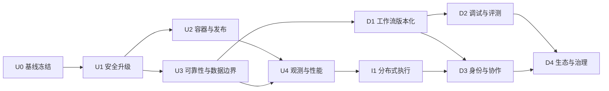

# AgentCanvas 升级改进与后续开发路线图

> 审计日期：2026-08-02  
> 基线：`main@38ba5e1`（`v0.2`）及当前未提交工作区  
> 适用范围：P3-P6 收口、可发布单机版、规模化演进与后续产品开发  
> 估算口径：1 名熟悉项目的全栈开发者，单位为有效人日；外部服务审批、等待评审和模型响应时间不计入

## 1. 执行结论

AgentCanvas 的核心产品链路已经超过原有 `v0.2`：当前代码具备工作流编排、MCP、RAG、记忆、人工审批、多 Provider、模型管理和 Chat，自动化质量基线也较好。现阶段真正的问题不是继续堆节点类型，而是已完成能力尚未形成可审阅、可发布、可运维的版本。

当前建议按以下顺序推进：

1. **立即止血**：冻结并拆分 P3-P6 的巨大未提交工作区；修复依赖安全问题和容器启动缺陷。
2. **形成可发布单机版**：补齐 P5 浏览器回归、真实 Docker 验证、备份恢复、就绪检查、优雅关闭、审计和基本限流。
3. **建立性能与可观测基线**：先量化再优化，解决前端单包、事件逐条事务、同步 ingest 和无界列表。
4. **先深化产品，再横向扩展**：优先工作流版本化、调试和评测；只有出现明确并发/可用性需求后再实施多 worker。
5. **最后进入多用户平台化**：OIDC、用户/组织/项目、资源归属、配额和租户隔离必须作为完整纵向切片，不能只在静态 token 上继续加角色。

在完成 U0-U2 前，不应把当前版本直接暴露到公网，也不应宣称 P6 已完成。

## 2. 当前状态与证据

### 2.1 已验证能力

| 范围 | 当前判断 | 证据 |
|---|---|---|
| P0-P3 编排与 MCP | 已实现 | 现有编译器、SSE、三传输 MCP、tool/Agent 工具链及测试 |
| P3.1 稳定化 | 已实现 | Alembic、恢复、RBAC、密钥加密、工作流深链/自动保存、CI/Playwright |
| P4 RAG | 已实现 | `0003_rag`、上传/摄取/检索、rag 节点、引用 UI 与固定语料测试 |
| P5 | 已实现 | `0004_chat`、MemoryStore、human resume、Anthropic/Ollama、模型管理、Chat |
| P6 容器与性能 | 部分实现 | Dockerfile/Compose/seeds 存在，但未完成真实构建、性能、备份、观测和发布验证 |
| 后端质量 | 当前通过 | `80 passed`；Ruff 通过；mypy 覆盖 app+tests 共 95 文件；锁文件通过 |
| 前端质量 | 当前通过但有性能警告 | 两套 TypeScript 检查与构建通过；主 JS 549.74 kB，触发 Vite 大包警告 |
| 浏览器主路径 | 当前通过 | 4 条 Chromium 路径全部通过，耗时 51.4 秒 |
| 容器运行 | 未验证 | 当前机器没有 Docker，不能用静态文件替代运行证据 |

### 2.2 版本基线问题

- `main` 只有 3 个提交，最新是 `v0.2`/P2。
- 当前工作区包含 50 个已修改文件和 93 个未跟踪文件。
- P3-P6 的多个纵向切片叠在同一工作区，缺少独立回滚点、变更说明和里程碑标签。
- `README.md`、`docs/progress.md`、`docs/plan.md` 与旧 `task_plan.md` 对 P4/P5 状态存在时序差异。

这不是文档美观问题，而是后续安全升级、回归定位和发布管理的首要风险。

### 2.3 立即处理的高风险项

| ID | 风险 | 影响 | 当前证据 | 优先级 |
|---|---|---|---|---|
| R-01 | LangGraph/checkpoint 依赖存在已知漏洞 | checkpoint 反序列化、SQLite checkpointer 与持久状态安全 | `pip-audit`：6 个包、11 条公告 | P0 |
| R-02 | Vite 5.4.21 存在高危公告 | Windows 共享开发服务器文件边界 | `pnpm audit`：1 high、6 moderate | P0 |
| R-03 | Dockerfile 中 Alembic 配置复制目标错误 | 后端镜像可能无法执行迁移启动 | `COPY alembic.ini mcp_servers ./mcp_servers` | P0 |
| R-04 | P3-P6 未形成 Git 基线 | 任何升级都难以审阅和回滚 | 50 modified + 93 untracked | P0 |
| R-05 | checkpointer 失败时静默降级 MemorySaver | 审批恢复和持久执行语义可能无提示丢失 | `checkpoint.py` 捕获所有异常并继续 | P1 |
| R-06 | 执行任务与事件总线完全进程内 | 多 worker 下取消、SSE、seq 和任务归属不一致 | `_tasks`/EventBus/MCP 均在内存 | P1 |
| R-07 | 关闭流程不等待或取消执行任务 | 部署重启可能产生不完整执行 | container shutdown 未处理 executor tasks | P1 |
| R-08 | 仅有存活检查，无依赖就绪检查 | DB/checkpointer/向量库故障仍报告健康 | `/healthz` 固定返回 ok | P1 |
| R-09 | 无界列表与同步知识摄取 | 数据增长后响应变慢、请求超时、无法可靠重试 | list API 无分页；ingest 在请求内 await | P1 |
| R-10 | 静态共享 token 不是用户系统 | 无身份撤销、资源归属和租户隔离 | admin/editor/viewer 三个共享 token | P2 |

### 2.4 依赖升级边界

当前依赖漂移跨越多个主版本：

- 后端：LangGraph `0.3 -> 1.x`、checkpoint `2.x -> 4.x`、MCP `1.x -> 2.x`。
- 前端：React `18 -> 19`、Router `6 -> 7`、Tailwind `3 -> 4`、Vite `5 -> 8`。

安全修复与平台现代化要分开：

- U1 只升级到能够关闭已知高风险且兼容性可验证的最小版本集合。
- React 19、Router 7、Tailwind 4、Vite 8、MCP 2 分别建立迁移分支和回滚点。
- 不允许一次 PR 同时升级 LangGraph、MCP、React、Router 和 Tailwind。

## 3. 目标状态与里程碑

| 里程碑 | 目标状态 | 必须完成 | 建议版本 |
|---|---|---|---|
| M0 可审阅基线 | P3-P6 每个纵向切片可追溯、工作区干净 | U0 | `v0.6.0-alpha.1` |
| M1 安全候选版 | 高危依赖已修复或有正式隔离/接受记录 | U1 | `v0.6.0-rc.1` |
| M2 可发布单机版 | Docker、迁移、备份、恢复、P5 E2E 和运维文档闭环 | U2-U3 | `v0.6.0` |
| M3 可观测高质量版 | 覆盖率、指标、日志、性能基线和前端拆包达标 | U4 | `v0.7.0` |
| M4 产品深化版 | 工作流版本化、调试与评测成为闭环 | D1-D2 | `v0.8.0` |
| M5 可扩展平台版 | Postgres、耐久队列、多 worker、共享事件和租户体系 | I1 + D3 | `v1.0.0` |

推荐把 `v0.6.0` 定义为“受信任网络内可部署的单实例版本”，把 `v1.0.0` 定义为“具备明确多用户和横向扩展语义的生产版本”。

## 4. 依赖关系



U2 与 U3 可以在 U1 完成后并行；D1 可在单机版稳定后与 U4 并行；I1 必须等待可靠性语义和性能数据明确。

## 5. 升级改进计划

### U0：冻结并重建可审阅基线

**目标**：把当前 P3-P6 工作区转为可回滚的历史，不改变业务行为。  
**估算**：2-4 人日。  
**阻塞**：后续全部阶段。

任务：

- U0-1：创建保护分支并记录当前 `HEAD`、完整状态、数据库迁移头和质量门结果。
- U0-2：按纵向能力拆分提交，建议顺序为 P3/MCP、P3.1/迁移安全、P4/RAG、P5/记忆审批 Provider、P5/Chat、P6/容器 seeds、文档。
- U0-3：每个提交只包含自身代码、迁移、测试和文档；禁止把格式化噪声混进功能提交。
- U0-4：同步 `README.md`、`docs/plan.md`、`docs/progress.md`，将旧审计标记为历史，并链接本路线图。
- U0-5：补 `.gitattributes`，统一 Markdown/源码换行策略，清理当前 CRLF 警告来源。
- U0-6：建立 Conventional Commits、变更日志和里程碑标签规则。

验收门 G0：

- `git status --short` 为空。
- 从干净 clone 执行后端、前端和 4 条 E2E 全绿。
- `alembic upgrade head` 可从空库升级到 `0004_chat`。
- 每个 P3-P6 能力至少有一个可识别提交和对应验收证据。
- 打 `v0.6.0-alpha.1` 标签，并生成首份 changelog。

回滚点：保留原保护分支和数据库只读备份；任何拆分失败不重写该保护分支。

### U1：安全依赖与运行边界升级

**目标**：关闭已知高风险依赖问题，避免 checkpoint 安全升级破坏执行语义。  
**估算**：7-12 人日。  
**依赖**：U0。

任务：

- U1-1：为 LangGraph 1.x 编写兼容性清单，覆盖 compile、parallel、condition、supervisor、tool loop、interrupt/resume、checkpoint replay。
- U1-2：升级到能覆盖审计修复版本的兼容组合；最低安全目标包括 LangGraph `>=1.0.10`、checkpoint `>=4.1.1`、checkpoint-sqlite `>=3.0.1`，最终以锁文件求解和官方兼容矩阵为准。
- U1-3：显式配置严格 serializer/allowlist；生产禁止 checkpoint 初始化失败后静默回退内存。
- U1-4：定义旧 checkpoint 迁移策略：可迁移则做离线迁移；不可兼容则阻止有 `waiting_approval` 执行时升级，并明确废弃旧运行状态。
- U1-5：升级 Vite 到已修复高危公告的兼容版本；此阶段不同时迁移 React 19/Tailwind 4。
- U1-6：评估 Chroma 公告在 embedded `PersistentClient` 模式下的可达性；禁止启动其远程 HTTP API，记录临时风险接受和替换/升级观察项。
- U1-7：将 `pip-audit`、`pnpm audit`、Dependabot/Renovate 和 SBOM 生成加入 CI。
- U1-8：对 MCP stdio、上传、检索、模型 base URL 增加输入与出站策略复核；为登录和高成本执行端点加入速率限制设计。
- U1-9：引入 secret 扫描，并验证日志、SSE、异常响应不泄露 token/API key/header/env。

验收门 G1：

- 对实际安装环境扫描不再包含未豁免的 critical/high；豁免必须写明可达性、补偿控制、负责人和到期日。
- LangGraph 全部原有后端测试、4 条 E2E 和新增审批恢复迁移测试通过。
- 使用升级前数据库副本完成迁移、运行、暂停、重启和 resume。
- 生产模式下 checkpointer 初始化失败必须启动失败或 readiness 失败，不能无声继续。
- 锁文件与升级说明可在 Windows 和 CI Linux 重现。

回滚点：安全升级独立分支；保留升级前 DB/checkpoint 副本；schema 迁移必须提供 downgrade 或明确的前向恢复步骤。

### U2：容器、发布与灾备闭环

**目标**：把“存在 Dockerfile”升级为“可重复构建、可验证、可恢复的单机发布”。  
**估算**：6-10 人日。  
**依赖**：U1。

任务：

- U2-1：修正 Alembic 配置复制路径；CI 必须实际执行 `docker compose build` 和 `up`，不能只做 YAML 静态检查。
- U2-2：后端改为多阶段镜像，固定 uv 版本；运行阶段移除编译器、git、curl 等非必需工具，并使用非 root 用户。
- U2-3：前端与 CI 统一 Node/pnpm 版本，在 `package.json` 固定 `packageManager`；统一 Node 20/24 的选择。
- U2-4：将数据库迁移与 Web 服务拆成显式 release step，避免多个副本同时启动时竞争迁移。
- U2-5：新增 `/livez` 与 `/readyz`；readiness 检查数据库、迁移头、checkpointer、向量存储和配置安全，Redis 降级需在响应中可见。
- U2-6：提供 `compose.dev.yml` 与 `compose.prod.yml`，生产默认启用 token auth、只从 secret/env-file 注入密钥、不暴露 Redis 端口。
- U2-7：为 SQLite app DB、checkpoint DB、Chroma、uploads 和 Redis AOF 制定一致性备份；实现带校验的 backup/restore 命令。
- U2-8：编写升级、回滚、密钥轮换、磁盘扩容、损坏恢复和紧急停机 runbook。
- U2-9：镜像扫描、最小权限、只读根文件系统可行性、资源限制和日志轮转进入发布门。
- U2-10：新增容器 smoke：登录、种子工作流、SSE、Calculator MCP、RAG ingest、human pause/resume、Chat。

验收门 G2：

- 全新 Linux runner 上一条命令构建并启动；`readyz` 通过后才能接流量。
- 空卷启动与上一版本数据卷升级均成功。
- 备份在另一空目录恢复后，工作流、聊天、文档、向量和可恢复审批状态一致。
- 容器进程非 root，镜像无未豁免 high/critical。
- 故意破坏 DB/checkpointer 配置时 readiness 失败，日志给出可操作原因。
- 发布 `v0.6.0-rc.1` 镜像，镜像标签使用版本和 commit SHA，禁止只依赖 `latest`。

### U3：执行可靠性、API 边界与测试完善

**目标**：使单实例在重启、重复请求、数据增长和失败条件下具有明确语义。  
**估算**：8-12 人日。  
**依赖**：U1；可与 U2 并行。

任务：

- U3-1：ExecutionEngine 增加 `shutdown(grace_period)`：停止接收新任务、等待进行中任务、超时取消、flush 终态事件，再关闭 checkpointer/DB。
- U3-2：启动、resume、cancel 和 ingest 增加幂等键与状态机约束；并发 resume 只能有一次成功。
- U3-3：事件持久化改为真正批量事务，保证同 execution 的 seq 唯一、单调并可在失败后重试。
- U3-4：知识摄取改为耐久 job：请求返回 `202 + job_id`，worker 更新进度，重启后可继续/重试，取消和删除有一致性规则。
- U3-5：工作流、执行、知识库、文档、会话接口统一 cursor pagination、搜索、排序和最大 page size。
- U3-6：为执行、模型调用、上传、检索和登录设置分级限流、并发上限、请求大小和超时。
- U3-7：补 P5 E2E：human pause/resume、模型 CRUD 权限、Chat SSE/停止/刷新持久化、Redis 不可用时 SQLite fallback。
- U3-8：补 MCP SSE/streamable HTTP 契约测试、断线重连、超时、schema 变化和服务退出测试。
- U3-9：增加迁移矩阵：空库、`0001`、`0002`、`0003`、`0004`、真实脱敏样本；检查 ORM drift。
- U3-10：引入覆盖率门，先记录基线，再要求 engine/events/mcphub/rag/security 分支覆盖率 `>=80%`，全项目行覆盖率 `>=75%`。
- U3-11：修复 Dialog 焦点圈定/归还、键盘导航、ARIA 和 reduced-motion；加入 axe 自动检查。

验收门 G3：

- SIGTERM 下新请求被拒绝，已有执行在宽限期内完成或得到一致的 cancelled/failed 终态。
- 同一 resume/idempotency key 并发 10 次只产生一次状态迁移。
- 10 万执行记录下列表仍分页响应，不加载全表。
- 摄取进程在 processing 时重启后能恢复或明确重试，无永久僵尸状态。
- E2E 至少 8 条纵向路径，覆盖 P3-P5；覆盖率门与迁移矩阵进入 CI。
- 无严重键盘可访问性和焦点管理问题。

完成 U0-U3 后发布 `v0.6.0`。

### U4：可观测性与性能工程

**目标**：把规划中的性能亮点转成可重复测量的指标，并建立生产诊断能力。  
**估算**：8-12 人日。  
**依赖**：U2、U3。

任务：

- U4-1：定义指标词典：execution 成功率/耗时、节点耗时、TTFT、token/费用、MCP latency/error、ingest throughput、retrieval latency、SSE 连接/重放、队列深度。
- U4-2：结构化 JSON 日志加入 request_id、execution_id、workflow_id、node_id、provider、error_code；集中脱敏。
- U4-3：接入 OpenTelemetry traces/metrics，提供 Prometheus scrape 或 OTLP；建立最小 dashboard 和告警。
- U4-4：前端按 workflow/knowledge/models/chat 路由动态 import，拆分 React Flow、编辑器和知识库依赖。
- U4-5：以 100 节点、500 边、持续 token 流为场景测 React commit、长任务、内存和交互延迟；使用 selector/memo/rAF 证据驱动优化。
- U4-6：后端建立 1/10/50 并发执行基准，分别测无 LLM mock、MCP、RAG 和 SSE；记录 CPU、内存、DB lock 和 p95/p99。
- U4-7：检查 SQLite WAL 写竞争、事件批量大小、Chroma `to_thread` 池和 embedding 并发；为每项设可回滚参数。
- U4-8：加入 bundle budget、API benchmark smoke 和性能回归阈值；完整负载测试夜间运行，不阻塞普通 PR。
- U4-9：拆分超过约 400 行且职责混杂的模块：ExecutionEngine、ChatPage、ModelsPage、E2E suite；仅在测试保护下实施。

暂定性能门 G4（首次基线后可调整一次）：

- 首屏初始 JS gzip `<120 kB`，任一输出 chunk 原始大小 `<350 kB`。
- 100 节点画布拖拽交互延迟 p95 `<100 ms`，无持续横向溢出或明显掉帧。
- 本地 mock 执行创建 p95 `<500 ms`；事件 publish 到浏览器 p95 `<250 ms`。
- 1,000 连续事件重放无 gap、无重复，终态可达。
- 10,000 条资源记录分页 API p95 `<300 ms`（单机开发基准环境）。
- 每个失败请求可通过 request_id 关联到 execution/node/provider trace。

完成 U4 后发布 `v0.7.0`。

### U5：非安全性主版本现代化

**目标**：在产品稳定后逐项消除平台代际债，不改变业务范围。  
**估算**：每个切片 2-6 人日，总计 10-20 人日。  
**依赖**：U3；可以穿插但不得阻塞 `v0.6.0`。

独立切片：

1. MCP 1.x -> 2.x：三传输、owner-task、tool schema、错误映射和断线恢复全部跑契约测试。
2. React 18 -> 19：先解决 StrictMode/副作用，再升级渲染层；不同时改 Router。
3. Router 6 -> 7：保留 deep link、未保存保护、登录重定向和测试 URL。
4. Tailwind 3 -> 4：先建立视觉截图基线，避免全局 CSS 与移动布局漂移。
5. Vite 兼容版 -> 8：在安全修复版稳定后实施，核对 Node 版本、插件和构建产物。
6. Python 3.11 -> 3.12/3.13：先验证 Chroma、MCP、LangGraph 和二进制 wheels，再扩 CI 矩阵。

每个切片必须独立 PR、独立 lock diff、完整质量门和可直接回滚的前一标签。

## 6. 后续产品开发计划

### D1：工作流生命周期与复用

**价值**：让工作流从“自动保存的一份可变 JSON”成为可发布、可比较、可复用的资产。  
**估算**：10-15 人日。  
**依赖**：U3。

- 增加 `workflow_versions`：draft、published、archived；execution 永远引用不可变 version_id。
- 提供发布、克隆、回滚、版本 diff、变更说明和当前生产版本。
- 支持 DSL 导入/导出、schema 版本迁移和向后兼容验证。
- 建立模板库：官方种子、用户模板、参数化创建、标签/搜索。
- 执行历史展示使用的 workflow version，避免当前草稿改变旧运行解释。

验收：发布后修改草稿不影响已有运行；任意历史 execution 可还原其 DSL；旧 DSL 经过迁移后语义测试一致。

**状态（2026-08-05）**：已完成。`0006`/`0007`、版本与模板 API/UI、0.9→1.0 兼容夹具、真实数据备份迁移及 186 tests/12 条 Playwright 全量门均通过。下一项切换为 D2。

### D2：调试、评测与成本治理

**价值**：把“能运行”升级为“能解释、能比较、能持续改进”。  
**估算**：12-18 人日。  
**依赖**：D1、U4。

- 节点级输入/输出/耗时/token/费用/错误检查器，默认脱敏敏感字段。
- 从失败节点重新运行，明确上游快照复用和副作用节点禁止规则。
- 数据集与评测运行：exact/contains、JSON schema、LLM-as-judge、自定义 Python 禁止默认启用。
- 模型/提示词/工作流版本 A/B 对比，输出质量、时延、费用和失败率。
- RAG 指标：Recall@k、MRR、citation coverage、无答案率；保存固定回归语料。
- 预算、token 上限、并发上限和成本告警；模型调用记录价格版本。

验收：同一数据集可重放两个已发布版本并生成可复核报告；失败样本可定位到节点和输入；费用误差有定义和测试。

**状态（2026-08-07）**：Phase 1-6 已完成。节点检查器、安全重跑、版本化数据集、基础评测、同一数据集的双已发布版本 A/B 与固定语料 RAG 指标均已落地；`0010` 持久化对比，样本保留双执行溯源，模型价格版本/费用覆盖率/`1e-12` 误差边界有明确实现和测试。RAG 回归从持久事件重建有序检索与显式引用证据，Recall@k、MRR、citation coverage 与无答案率族进入运行汇总和 A/B 差值；语料以知识库、embedding 模型身份、分块参数和文档 `content_sha256` 的 SHA-256 指纹固定，排队后语料变化的评测直接失败，且 embedding 模型的删除/改 kind 被依赖阻断、行为字段变更会失效对应索引。Phase 6 成本治理落地：`ModelCallBudget` 按 execution 累计 token/费用（Decimal 精确到 `1e-12`），并发/调用数/token/费用四类上限可在超过时中止执行；多 chunk usage（Anthropic 将 prompt/completion 拆成两个 usage chunk）增量累计，中途放弃的 stream 仍计入成本；durable `cost_alerts` 表（`0011_cost_alerts`）持久化告警并支持确认；预算在 human pause/resume 间存活。budget 已从 `request_policy.py` 拆分到 `app/core/model_budget.py`（400 行规则），原模块保留中间件与再导出。**Phase 7 完成**：migration 门 14/14 无漂移、后端 227 tests（应用行 84.3%、分支 82.6%）、mypy 119 文件、前端 build/bundle（78.67 KiB）、Playwright 全套 14/14 + 成本页 2/2；真实库已 checksum 备份（`backend/data/backups/pre-d2-phase6-20260807-111458.tar.gz`）并从 `0010` 升级到 `0011`，11 工作流/11 版本/17 执行/3871 事件全部保留、`cost_alerts` 为空、零外键错误。D2 全部完成。

### I1：分布式执行与存储演进

**价值**：解除单进程所有权限制；只有实际并发或可用性需求出现时启动。  
**估算**：18-30 人日。  
**依赖**：U4；建议先完成 D1。

- 先写 ADR，明确 API/control plane、worker、scheduler、event relay 和租约边界。
- 落地 PostgreSQL：增加 `asyncpg`、连接池、迁移锁、真实集成测试；删除“配置写了 PG 即支持”的文档假设。
- checkpointer 切 AsyncPostgresSaver 或等价耐久实现；迁移 waiting approval 状态。
- 执行请求进入耐久队列；worker 用 lease/heartbeat/attempt 领取，支持幂等、超时、重试、取消和死信。
- EventBus 接口实现 Redis Streams 或等价耐久事件通道；SSE 任意 API 实例可 replay + tail。
- MCP 连接归 worker 所有；任务路由保证同一 execution 的 owner 一致或支持显式重连。
- 评估 embedded Chroma 的多实例限制，选择外部 Chroma、Qdrant 或 pgvector，并通过 RAG adapter 迁移。
- 进行 2 API + 2 worker 故障注入：kill worker、kill Redis、切 DB、SSE 重连、重复投递。

验收：任意 API 实例均可查询/订阅同一执行；worker 崩溃后任务按策略恢复且不重复副作用；审批在全栈重启后可续跑。

**状态（2026-08-10）**：I1 Phase 1-6 已实现。ADR 0001 明确 API/control plane、worker、scheduler、event relay、PostgreSQL/Redis 归属，以及 lease generation fencing、at-least-once、取消、重试和非幂等副作用规则。运行配置仅接受 `sqlite+aiosqlite` 与 `postgresql+asyncpg`；PostgreSQL 使用显式有界 SQLAlchemy pool，Alembic 迁移通过带超时的 session advisory lock 串行化。Checkpointer 现按数据库 backend 选择 strict-serde `AsyncSqliteSaver` 或有界 Psycopg `AsyncPostgresSaver`，PostgreSQL saver setup 也由独立 advisory lock 串行化；旧 SQLite checkpoint 父链/pending writes 可用显式命令幂等迁移，启动会逐条验证 `waiting_approval`，缺失即 fail closed。Phase 4 增加 `0022_execution_queue` 与 fenced worker lease：start/resume/rerun 入队，PostgreSQL `FOR UPDATE SKIP LOCKED` / SQLite CAS claim，运行中 heartbeat，retry_wait/dead-letter/cancel，waiting_approval 同事务释放租约，配额 reconcile 计入 queued+running；Phase 8 已将 `InProcessExecutionWorker` 复用于专用 worker，并改为启动不触碰 leased work、由独立 scheduler 分类过期租约。Phase 5 增加 `0023_event_relay` 与共享 SSE tail：`EventRelay` 以 `execution_events.id` 为 cursor 将已提交事件 XADD 到执行级 Redis Stream，persist 后 kick；`iter_execution_sse` 按 ADR 顺序完成 PG replay、Redis backlog、PG gap fill 与 live bus/Redis/PG poll，并用 `(execution_id, seq)` 去重；无 Redis 时降级为有界 PG 轮询。CI 的 PostgreSQL 17 lane 收集并要求并发升级、schema drift、租户 CRUD、SQLite checkpoint 导入以及全应用重启续批。当前本机聚焦证据为 relay/SSE/migration head 测试与 ruff/mypy 触及模块通过；真实 PostgreSQL、多 owner claim 与多 API Redis live tail 仍等待 CI，不能以 skip 冒充通过。Phase 6 已实现共享协作与 worker-owned MCP：无 `REDIS_URL` 时 process-local memory；有 URL 且可达时 Redis 共享 presence/soft-lock/revision；URL 配置但不可达时 fail closed 只读（HTTP 503），不回退分裂本地锁。快照暴露 `backend`/`read_only`。MCP live session 归持有 execution lease 的 worker（`McpManager.for_execution`）；控制面 probe 后释放；resume 从持久配置重连，不在 worker 间转移 live session。本地聚焦协作 Redis 与 MCP isolation 测试通过；多 API live Redis 协作等待 CI。下一步为 Phase 7 多实例安全向量存储（VectorStore 协议；SQLite 默认 Chroma；PostgreSQL 共享 SQL/pgvector 路径）。

**Phase 7 更新（2026-08-10）**：`VectorStore` 协议已成为 RAG 唯一存储边界；SQLite 默认 embedded Chroma，PostgreSQL 默认 `0024_document_chunks` + pgvector，并在数据库内按 query dimension 做 cosine 排序。写入锁定 durable document row，且在删除旧索引前拒绝非法、非有限、零范数或混合维度向量。显式 `migrate_vectors` 命令先完整预检旧 Chroma 的所有 ready 文档，再幂等写入 pgvector；readiness/meta 暴露实际 backend 与 extension version。CI PostgreSQL lane 固定 pgvector 0.8.6/PostgreSQL 17。最新宿主机以隔离 PostgreSQL 16.14 + pgvector 0.8.3 运行真实 marker 5/5，覆盖并发迁移/ORM drift、checkpoint 重启与导入、数据库侧排名/跨 store 可见性，以及 multi-owner claim/scheduler/stale fencing；恢复库还以 2 个 vector chunks 通过数据库探针和 RAG 首位命中。Phase 7 的真实 PostgreSQL/pgvector 行为已在本机得到补充证明，容器镜像版本仍由 CI lane 验收。

**Phase 8 更新（2026-08-10）**：水平运行时已拆为 `api|worker|scheduler|relay`，并以 PostgreSQL/Redis、禁用启动迁移和一次性 migrate/bootstrap 作为强制边界。worker 的状态/事件写入均校验 owner/generation，scheduler 独占过期租约分类并对副作用不明的工作 fail closed；Redis 中断时 SSE 回退 PostgreSQL。生产 Compose 固定 2 API + 2 worker、单 scheduler/relay、PostgreSQL 17/pgvector 与 Redis。宿主机隔离拓扑现已证明：跨 API enqueue/query/SSE、两个 worker 排他并发领取、kill worker 后由 peer 以 generation 2 / attempt 2 接管，以及全运行时重启后的 waiting approval 续跑。Redis-compatible Garnet 证明跨 API presence/lock、Lua 协调、后端中断时协作 snapshot/mutation 均 HTTP 503、原进程动态重连，以及中断期间 518 条有序事件经 PostgreSQL fallback 完成；Garnet 不支持 `XADD`/`XREAD`，因此这些结果不冒充 Redis Streams live relay 或重复投递证据。quiesced PostgreSQL 备份（SHA-256 `37894d498e87f884b93c628007d0c602574971f7b1f2366127db116918558820`）已恢复到不同空数据库和独立空数据目录；restore drill 比对迁移 `0024`、全部应用/checkpoint 表、9 executions、3167 events、2 pgvector chunks，并通过恢复 API readiness、RAG 首位命中与审批续跑。实测还修复了协作 snapshot 在共享后端中断时误报 500 的缺陷，现与 mutation 一致返回 503。最终后端门为 494 passed / 5 skipped，应用行 83.17%、关键分支 82.09%、Ruff、format、mypy 309 文件；独立真实 PostgreSQL marker 为 5/5。Phase 8 仅对真实 Redis >= 5 Streams 重复投递/live relay 和 Docker 容器故障编排保持进行中。

### D3：身份、多用户与协作

**价值**：从共享 token 演示升级为真正的多用户产品。  
**估算**：18-30 人日。  
**依赖**：D1；公开 SaaS 场景还依赖 I1。

- OIDC/OAuth2 登录、短期 session、刷新/撤销、服务账号和 API token 哈希存储。
- `organizations/projects/memberships` 领域模型；所有资源增加 project_id/owner_id。
- 资源级 RBAC：viewer/editor/admin 作用于项目，而不是全局共享 token。
- 所有 Repository 默认带 tenant scope；跨租户访问做负向测试和数据库约束。
- 工作流软锁/存在感、评论、变更审阅；冲突从“整体覆盖”升级为版本 diff/merge。
- 管理审计日志：谁在何时修改模型、密钥、MCP、工作流、审批和权限。
- 项目配额：并发执行、存储、embedding、模型费用、MCP 进程数。

验收：跨租户 ID 猜测、列表、SSE、下载、引用和审计均无法越权；成员撤销后 session/token 在规定时间内失效。

**状态（2026-08-07）**：D3 Phase 1（本地用户账户与会话）与 Phase 2（组织/项目/成员 + 项目级 RBAC）已完成。Phase 1 迁移 `0012_multi_user_identity` 新增 `users`/`sessions`：密码用 stdlib PBKDF2-HMAC-SHA256（`pbkdf2_sha256$iter$salt$hash`，迭代数随行保存），会话仅存不透明 32 字节 token 的 SHA-256 且带过期/吊销，数据库泄露也无法重放会话。新增 register（首账号自举为 admin、之后需 admin）、login（token 或 email+password 二选一）、logout（吊销会话）、me（token/会话双主体验证）。Phase 2 以 `0013_organization_tenancy` 新增 `organizations`/`projects`/`memberships` 并为工作流增加可空 `project_id`；成员管理按组织内 admin，执行与全部工作流版本端点按归属工作流校验项目角色，负向测试覆盖跨租户 IDOR。Phase 2 门禁 247/247，真实库迁移后 11/11/17 数据完整。Phase 3 已在后续状态中完整关闭。

**状态（2026-08-07）**：D3 Phase 3 已完整完成并通过安全复审。`0014_service_accounts` 提供只保存 SHA-256 的服务账号 API Token；`0015_refresh_oidc` 增加刷新令牌族与 OIDC 身份。数据库访问/刷新会话默认 15 分钟/30 天且受配置安全边界约束；刷新令牌每次单次轮换，消费重放和退出都会撤销整族。OIDC Authorization Code + PKCE 使用加密 state Cookie、nonce、discovery、非对称 JWKS 签名、未知 `kid` 强制刷新一次，以及 issuer/audience/`azp`/expiry/verified-email 严格验证；生产环境 issuer/callback 强制 HTTPS，缺失 token auth metadata 时默认 confidential-client 语义并对 public client fail-closed。`0016_identity_hardening` 以数据库单例原子化首管理员自举，并把升级前长访问会话封顶到迁移后 15 分钟；前端以同页操作队列和 Web Locks 串行化 refresh/login/logout，并以会话代次阻止旧 401 在导航边界旋转新凭据。复审同时拆分 OIDC 配置、repository、schema 和 operation policy，修复异常 lifespan 未清理资源、性能波次 sibling 逃逸和并发执行启动嵌套占用连接池。最终门禁为 286/286 后端测试、84.21% 应用行、85.39% 关键分支、Ruff、mypy 199 文件、lock/audit、前端类型/构建/bundle（初始 gzip 79.38 KiB）、Playwright 18/18 + 成本专用 2/2；画布拖拽/React commit p95 为 63.8/32.4 ms，完整后端性能门 c1/c10/c50 为 126.1/1000.6/13437.8 ms，10k 分页 68.2 ms，SSE 135.7 ms。备份 `pre-d3-phase3-hardening-20260807-164620.tar.gz`（SHA-256 `E5B6E3B417D06BCADAD68CA47D1E6EE75E859E76522B07EC7AC3B0C2A0730800`）通过隔离恢复演练；真实库从 `0015` 升至 `0016` 后保留 11 工作流、11 版本、17 执行、3871 事件且外键错误为 0。下一步为 Phase 4 协作：先工作流软锁/presence，再评论、变更审阅和版本 diff/merge；其后为 Phase 5 审计日志与 Phase 6 项目配额。

**状态（2026-08-07）**：D3 Phase 4a 已完成。新增可注入时钟的单进程 `WorkflowCollaborationHub`、项目 RBAC 的 snapshot/heartbeat/lock/leave/SSE API，以及页面级稳定 client ID、私有 lease、TTL 自动失效和明确接管。前端只有在角色允许、协作在线且持有自己的租约时才开放编辑、自动保存和运行；锁丢失立即只读，退出登录先完成 presence/lock 清理，持久写入仍由版本乐观锁兜底。跨租户负向测试覆盖全部协作表面，两编辑器浏览器回归覆盖阻塞、接管、离开和 version 409 冲突恢复。完整门禁为 295/295 后端测试、84.15% 应用行、85.06% 关键分支、Ruff、mypy 204 文件、依赖审计、前端 types/build/bundle（初始 gzip 79.43 KiB），以及 Playwright 19/19 + 成本 2/2。当前协作状态有意只支持单 API 进程；I1 将其迁移到 Redis 或等价共享通道后才能水平扩展。下一步为 Phase 4b 租户隔离评论、变更审阅和可恢复版本 diff/merge。

**状态（2026-08-07）**：D3 Phase 4b 已完成。`0017_workflow_reviews` 持久化版本评论线程、回复/解决状态与一版本一审阅，复合 workflow/version/parent 外键在数据库层阻止跨聚合历史；稳定 actor 身份覆盖用户、服务账号、静态 token 与开发模式。viewer 可评论，editor 可解决、发起和决定审阅；requester 不可自审，终态由原子条件更新保护。冲突恢复改用不可变 base version ID，对 local/remote 做结构化三方合并，稳定 ID 节点/边/变量的离散修改可自动保存，重叠修改返回精确路径且不写入。完整门禁为 310/310 后端测试、84.29% 应用行、85.06% 关键分支、Ruff、mypy 214 文件、锁/依赖审计、前端 types/build/bundle（79.44 KiB 初始 gzip）、Playwright 20/20 + 成本 2/2；真实库经 checksummed 备份和隔离恢复后从 `0016` 升至 `0017`，11 工作流、11 版本、17 执行、3871 事件全部保留且外键错误为 0。下一步为 Phase 5 管理审计日志。

**状态（2026-08-07）**：D3 Phase 5 已完成。`0018_audit_logs` 提供只追加管理审计，复制稳定的组织、项目、actor、action 和 resource 归属，并以六组复合索引支持时间和筛选查询。模型/密钥、MCP、服务账号/Token、组织/项目/成员、工作流生命周期、审阅和 human 审批变更均在成功事务中写入；统一服务只接受 8 KiB 内有限 JSON，递归拒绝秘密字段，明确排除凭据、Token 材料、MCP env/header、DSL、正文和原始审批载荷。全局 admin-only `/api/audit-logs` 和懒加载 `/audit` 支持完整过滤、搜索和绑定游标，viewer 无法发现或打开。最终门禁为 315/315 后端测试、84.52% 应用行、85.06% 关键分支、Ruff、mypy 226 文件、锁/依赖审计、前端 types/build/bundle（79.48 KiB 初始 gzip）、Playwright 22/22 + 成本 2/2；真实库经 SHA-256 归档和隔离恢复后从 `0017` 升至 `0018`，11/11/17/3871 核心数据不变、审计表为空且外键错误为 0。下一步为 Phase 6 项目配额。

**状态（2026-08-07）**：D3 Phase 6 已完成，D3 全部关闭。`0019_project_quotas` 为知识库/MCP 增加可空项目归属，并以独立限额、实时计数、UTC 月用量和幂等 reservation 覆盖并发执行、文档存储、embedding 输入、模型费用与项目 stdio MCP 进程。执行/重跑/resume/评测、RAG、模型和 MCP 生命周期均做原子 reserve/release/charge，启动从权威状态修复漂移；有限模型费用按 `1e-12 USD` 精确计量并在价格或 usage 不完整时 fail closed。项目工作流只能使用同项目或全局知识/MCP 资源，成员可读、组织 admin 可改配额，变更进入安全审计。最终门禁为 346/346 后端测试、85.00% 应用行、84.86% 关键分支、Ruff、mypy 243 文件、锁/依赖审计、前端 types/build/bundle（79.71 KiB 初始 gzip）、Playwright 23/23 + 成本 2/2；四视口无溢出。真实库经 SHA-256 归档和隔离恢复后从 `0018` 升至 `0019`，11/11/17/3871 核心数据不变且零外键错误。下一项为 D4 Provider/MCP 生态与平台治理。

### D4：Provider/MCP 生态与平台治理

**价值**：让扩展能力可控、可测试，而不是继续在核心模块中堆分支。  
**估算**：12-20 人日。  
**依赖**：D2；多用户场景依赖 D3。

- Provider capability matrix：stream、tools、vision、JSON mode、reasoning、usage/cost；工作流保存时静态校验。
- Provider/MCP 健康检查、熔断、重试预算、fallback chain 和故障演练。
- MCP catalog：版本、来源、权限、网络/文件/命令能力声明、管理员批准和升级记录。
- 节点插件 SDK：schema、executor、UI hints、事件协议和兼容版本；插件进程隔离优先于同进程任意代码。
- Secret provider adapter：环境变量、Docker secret、云密钥服务；支持轮换和引用，不复制明文。
- OpenAPI/DSL/事件 schema 版本化，生成客户端并做契约兼容检查。

验收：新增 Provider 或节点不修改 ExecutionEngine 主流程；不兼容能力在保存/发布前被阻止；插件权限可审计。

**状态（2026-08-09）**：D4 Phase 1-6 已完成。Phase 1 由 `0020_provider_capabilities` 提供 Provider 能力默认值、模型级安全收窄和保存/发布前 Agent DSL 校验；执行/resume 按精确模型 ID 建立 Provider 映射。Phase 2 新增 Provider/MCP 共用 resilience registry、健康检查、熔断、重试预算、首 chunk 前 fallback 和故障注入。Phase 3 由 `0021_mcp_catalog` 提供 approved 版本、权限声明、审批/撤销/升级历史、绑定校验、diff、预检和幂等 rollout。Phase 4 通过版本化 manifest/schema、动态 `plugin.*` Node Library 和新进程 JSONL 执行器接入节点。Phase 5 增加有界 `env://`、`docker://`、显式注入 `external://` 引用。Phase 6 发布 API `1.0.0`、DSL/event `1.0` 契约，生成确定性 OpenAPI/JSON Schema 与前端类型，并以不可覆盖的 major baseline 和 CI 漂移/兼容性命令保护公共接口。ExecutionEngine 主流程始终没有 Provider-specific 分支。

完整证据：后端 413/413、应用行覆盖率 85.11%、关键分支 84.27%、Ruff、mypy 275 文件、`uv lock --check`、契约检查与性能 smoke 通过；前端 source/E2E typecheck、生产 build/bundle 初始 gzip 79.84 KiB、默认 Playwright 27/27、成本 2/2。执行创建 c1/c10/c50 p95 为 107.2/749.0/7158.5 ms，10k 分页 42.9 ms，1000-event replay 82.2 ms 且连续；画布 drag/React commit 60.2/3.6 ms。`pypdf 6.15.0`、`js-yaml 4.3.1` 与 `nanoid 3.3.17` 关闭已记录 high 风险；后端无未豁免漏洞、前端 high 审计为 0。真实库备份 `backend/data/backups/pre-d4-phase3-20260808-170218.tar.gz` 的 SHA-256 为 `06865E79302A35A08F0BAA4749DF4F1E58BC5B5D5153BE473BD91F6A25C80E2A`，从 `0020` 升至 `0021` 后 11/11/17/3871 核心行数不变。下一项为 I1 分布式基础设施。

## 7. 建议排期

### 单人主线

| 周期 | 主任务 | 输出 |
|---|---|---|
| 第 1 周 | U0 + U1 兼容性测试 | 干净基线、安全迁移分支 |
| 第 2-3 周 | U1 完成 | `v0.6.0-rc.1` 依赖候选 |
| 第 4 周 | U2 容器/发布 | 可构建镜像、readyz、release job |
| 第 5-6 周 | U3 可靠性/API/E2E | 单机发布候选 |
| 第 7 周 | 灾备演练与修复 | `v0.6.0` |
| 第 8-9 周 | U4 观测/性能 | `v0.7.0` |
| 第 10-12 周 | D1 工作流版本化 | `v0.8.0-alpha` |
| 第 13-16 周 | D2 调试评测 | `v0.8.0` |

I1 与 D3 不建议在单人主线中同时启动。若有 2-3 人，可在 `v0.6.0` 后拆为“平台可靠性/分布式”和“工作流产品/评测”两条线。

### 前两个 Sprint 的可直接执行清单

Sprint 1（5-7 人日）：

1. U0-1 至 U0-4：保护、拆分、文档同步、alpha 标签。
2. 为 LangGraph 升级先补 5 条契约：普通运行、并行、tool loop、interrupt/resume、重启 replay。
3. 修 Dockerfile Alembic 路径并在 CI 构建镜像。
4. 将 Python/Node/pnpm/uv 版本统一为仓库声明。
5. 提交安全公告清单与临时风险接受表。

Sprint 1 完成定义：干净 clone 全绿；镜像至少能迁移空库并通过 `healthz`；安全升级不与其他功能混合。

Sprint 2（7-10 人日）：

1. 完成 LangGraph/checkpoint 安全升级和旧 checkpoint 策略。
2. 完成 Vite 安全升级和 bundle 基线。
3. CI 加 `pip-audit`、`pnpm audit`、镜像扫描、SBOM。
4. 增加 human resume 与 Chat E2E。
5. 实现生产 checkpointer fail-closed 和 `/readyz`。

Sprint 2 完成定义：无未豁免 high/critical；审批跨重启验证通过；发布 `v0.6.0-rc.1`。

## 8. CI/CD 目标矩阵

| Gate | 每个 PR | main/nightly | Release |
|---|---:|---:|---:|
| pytest/Ruff/mypy app+tests | 是 | 是 | 是 |
| 覆盖率与 migration drift | 是 | 是 | 是 |
| 前端 type/build/bundle budget | 是 | 是 | 是 |
| Playwright 核心 8 路径 | 是 | 是 | 是 |
| 依赖与 secret 扫描 | 是 | 是 | 是 |
| Docker build + smoke | 是 | 是 | 是 |
| 镜像扫描/SBOM | 否 | 是 | 是 |
| SQLite 各迁移起点矩阵 | 否 | 是 | 是 |
| 性能/故障注入 | 否 | 是 | 发布候选必须 |
| 备份恢复演练 | 否 | 周期性 | 发布候选必须 |
| 签名镜像/changelog/provenance | 否 | 否 | 是 |

本地统一入口建议封装为 `make verify` 或跨平台脚本，内部执行：

```text
backend: uv lock --check -> pytest+coverage -> ruff -> mypy -> pip-audit
frontend: frozen install -> typecheck -> typecheck:e2e -> build -> pnpm audit
integration: migrations -> Playwright -> Docker smoke -> diff check
```

## 9. 风险与决策点

| 风险 | 触发信号 | 应对 | 决策截止 |
|---|---|---|---|
| LangGraph 1.x 破坏 interrupt/checkpoint | 契约测试失败或旧状态无法读取 | 兼容适配层；明确废弃旧 in-flight 状态；保留升级前镜像/DB | U1 第 3 天 |
| Chroma 公告无可用修复 | embedded 模式也被证明可达 | 网络隔离；切换 adapter 后端；停止公网发布 | U1 结束 |
| SQLite 写锁成为瓶颈 | p95 激增、lock error、事件 backlog | 优化批量事务；提前启动 I1/Postgres | U4 基线后 |
| 同步 ingest 迁移扩大范围 | job 状态与向量一致性设计复杂 | 先 DB job + 单 worker，不立即引入完整分布式队列 | U3 设计评审 |
| 多用户需求提前 | 需要公开邀请/团队资源 | 提前 D3，但不能跳过 project_id/tenant scope | 产品承诺前 |
| 大版本升级同时发生 | lock diff 无法归因 | 每个主版本独立 PR 和标签；强制变更预算 | 持续 |
| 容器静态修复仍不可运行 | CI Docker smoke 失败 | 以实际构建日志为准，禁止更新 P6 状态 | U2 第 1 天 |

## 10. 暂不实施

以下内容在 `v0.6.0` 前明确不做：

- 新增更多节点类型、模型供应商或装饰性页面。
- 在进程内 EventBus 上直接把 Uvicorn worker 数改为大于 1。
- 只增加 `asyncpg` 就宣称 PostgreSQL 已支持。
- 在共享静态 token 上叠加“用户列表”而不做资源归属和租户隔离。
- 把 LangGraph、MCP、React、Router、Tailwind 主版本合并升级。
- 用提高 Vite chunk warning 阈值代替代码拆分。
- 在没有恢复演练的情况下把“存在 volume”当成备份方案。

## 11. 完成定义

一个阶段只有同时满足以下条件才可标记完成：

1. 代码、迁移、配置、测试和文档处于同一提交/PR。
2. 验收标准有可重复命令或自动化测试，不依赖口头确认。
3. 安全、数据和兼容性风险已关闭或有带到期日的正式接受记录。
4. 新增运行配置进入 `.env.example`，生产默认值安全。
5. 有升级与回滚步骤；数据变更有备份和恢复验证。
6. CI 与本地主要环境均通过，容器能力必须由容器运行证明。
7. `docs/plan.md`、`docs/progress.md`、README、changelog 和 tag 状态同步。

## 12. 下一步决策

当前不需要重新设计核心编排引擎。最合理的下一项实施工作是 **U0：冻结并拆分现有 P3-P6 基线**；紧随其后是 **U1：LangGraph/checkpoint 与 Vite 安全升级**。这两项完成前，其他功能开发都应暂停或放在隔离分支。

## 13. 实施状态更新（2026-08-04）

上述“下一步决策”保留为路线图制定时的基线记录。当前仓库已完成 U0、U1 与 U3 全部任务。U3 的幂等状态机、批量事件、耐久 ingest、游标分页、运行时边界、P5/MCP E2E、迁移矩阵、覆盖率和无障碍均有自动化门禁；最新证据为 170 个后端测试、82.37% 应用行覆盖率、84.35% 关键模块分支覆盖率及 9/9 Playwright。

U2 的发布实现已完成：多阶段非 root 镜像、独立迁移、dev/prod Compose、安全默认值、带校验的一致性 backup/restore、runbook、Trivy 与跨 P3-P5 容器 smoke CI 门均已落地；同一公开 HTTP smoke 已在本地 production 配置通过。本机没有 Docker CLI，故 G2 的实际镜像构建/扫描/运行证据仍等待 CI Linux runner，不能在此处口头宣称容器验收完成。

U4 的九项任务现已完成并通过本地门禁：结构化脱敏日志、request/trace 关联、OpenTelemetry + Prometheus/OTLP、Grafana/告警、前端动态拆包与 bundle budget、100×500 画布性能门、1/10/50 后端并发/MCP/RAG/SSE/10k 分页基准、SQLite/Chroma 可回滚参数，以及 ExecutionEngine/RAG/Chat/Models/E2E 职责拆分。最新证据为 177 个后端测试、82.65% 应用行覆盖率、84.54% 关键分支覆盖率和 Playwright 10/10；前端初始 gzip 76.04 KiB，画布拖拽 p95 40.5 ms、React commit p95 8.0 ms。完整后端基准中 SQLite c50 execution create p95 为 11.896 s，虽低于当前单机预算 15 s，但已确认 I1/PostgreSQL 是继续扩并发的正确边界。U5 或 D1 可在不虚构 G2 容器证据的前提下继续。

下一项实施工作已由 D1 切换为 D2 调试、评测与成本治理。跨多 worker 的共享计数器、事件总线和执行所有权仍属于 I1，不并入单机版声明。

## 14. 实施状态更新（2026-08-05）

U5 已完成四个可独立回滚的现代化切片：React/React DOM 19.2.8、Vite 8.2.0、Python 最低 3.12 且本地/CI 覆盖 3.13、Tailwind CSS 4.3.3。Tailwind 迁移使用 CSS-first theme 和官方 PostCSS 插件，并在 workflow/knowledge/models/chat 的桌面与移动视觉基线上验证无布局漂移。

当前前端门禁为 source/E2E TypeScript、production build、high audit 与 Playwright 10/10；初始 JS gzip 78.57 KiB、最大 raw chunk 242.03 KiB，100×500 画布稳态拖拽绘制 p95 32.5 ms、React commit p95 16.5 ms。性能测试将计时放在浏览器 `pointermove` 到双 RAF 内，避免把自动化协议往返误计为绘制时间，100 ms 预算未放宽。

MCP 1.x -> 2.x 已完成：SDK 2.0.0 的 `Client(mode="auto")` 在 owner task 内协商 2026-07-28 并回退旧服务器，MCPServer、snake_case 类型、httpx2 和 Streamable HTTP v2 生命周期均完成迁移；21 条聚焦契约覆盖 stdio、SSE、streamable HTTP、tool schema/错误、超时、重连与服务退出。完整门禁为 177 个后端测试、82.64% 应用行覆盖率、84.87% 关键分支、Playwright 10/10，依赖审计无新增豁免。

Router 7 切片在 2026-08-05 的首次独立评估中因当时依赖图的 high 审计结果回退到 6.30.4。2026-08-10 重新评估后，7.18.2 的当前锁文件已通过 moderate 审计，因此完成升级并关闭这项历史风险。deep link、登录重定向、刷新、测试 URL、未保存导航的留在/放弃路径均有浏览器回归；完整前端门为类型、契约、production build/bundle、Playwright 29/29 与成本治理 2/2。U5 六个切片至此全部完成。

D1 已完成：工作流版本快照、精确执行绑定、发布/diff/回滚/克隆、DSL 导入导出与版本迁移、官方/用户模板、参数化创建、标签/搜索及执行历史版本均已落地。真实库在 checksummed 备份后升级至 `0007_workflow_templates`，11 个工作流与 17 个执行全部保留。完整门为 186 tests、82.91% 应用行覆盖率、85.20% 关键分支和 Playwright 12/12；下一实施流为 D2。
